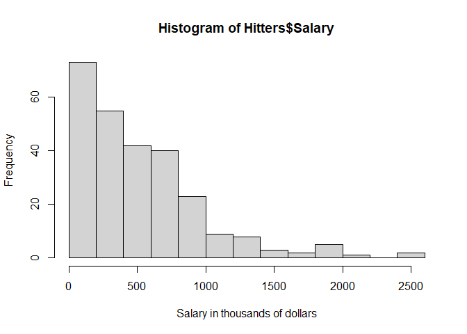
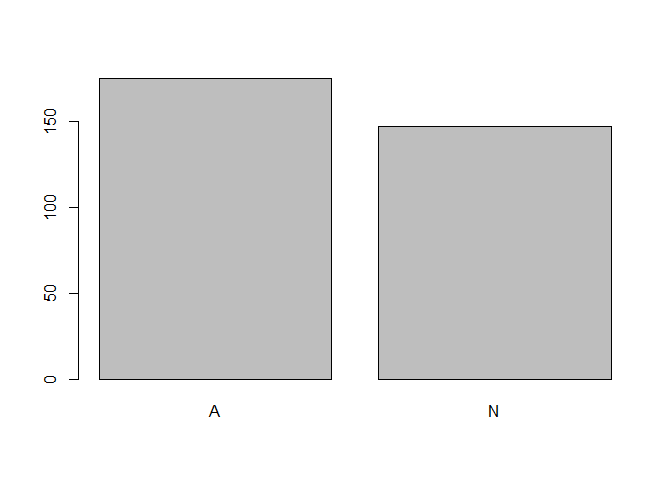
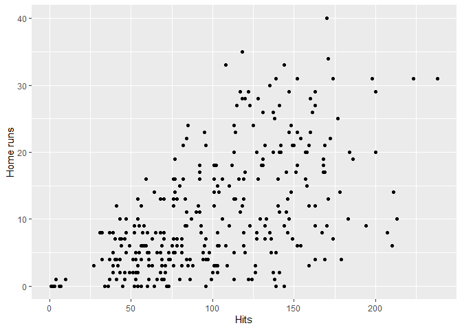
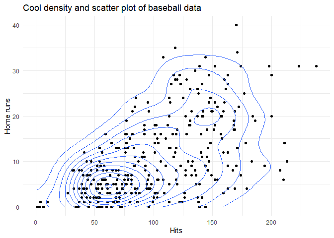

Exercises\_1
================
Hans Franke

    library(tidyverse)

    ## -- Attaching packages ------------------------------------------------------- tidyverse 1.3.0 --

    ## v ggplot2 3.3.2     v purrr   0.3.4
    ## v tibble  3.0.3     v dplyr   1.0.2
    ## v tidyr   1.1.2     v stringr 1.4.0
    ## v readr   1.3.1     v forcats 0.5.0

    ## -- Conflicts ---------------------------------------------------------- tidyverse_conflicts() --
    ## x dplyr::filter() masks stats::filter()
    ## x dplyr::lag()    masks stats::lag()

    library(ISLR)

General Graph Grammar
=====================

ggplot(data = <DATA>) +  
<GEOM_FUNCTION>(  
mapping = aes( &lt; MAPPINGS &gt; ),  
stat = &lt; STAT &gt; ,  
position = &lt; POSITION &gt;  
) +  
&lt; COORDINATE\_FUNCTION &gt; +  
&lt; FACET\_FUNCTION &gt;

Question 1:
===========

Name the aesthetics, geoms, scales, and facets of the above visualisation. Also name any statistical transformations or special coordinate systems.
---------------------------------------------------------------------------------------------------------------------------------------------------

    head(Hitters)

    ##                   AtBat Hits HmRun Runs RBI Walks Years CAtBat CHits CHmRun
    ## -Andy Allanson      293   66     1   30  29    14     1    293    66      1
    ## -Alan Ashby         315   81     7   24  38    39    14   3449   835     69
    ## -Alvin Davis        479  130    18   66  72    76     3   1624   457     63
    ## -Andre Dawson       496  141    20   65  78    37    11   5628  1575    225
    ## -Andres Galarraga   321   87    10   39  42    30     2    396   101     12
    ## -Alfredo Griffin    594  169     4   74  51    35    11   4408  1133     19
    ##                   CRuns CRBI CWalks League Division PutOuts Assists Errors
    ## -Andy Allanson       30   29     14      A        E     446      33     20
    ## -Alan Ashby         321  414    375      N        W     632      43     10
    ## -Alvin Davis        224  266    263      A        W     880      82     14
    ## -Andre Dawson       828  838    354      N        E     200      11      3
    ## -Andres Galarraga    48   46     33      N        E     805      40      4
    ## -Alfredo Griffin    501  336    194      A        W     282     421     25
    ##                   Salary NewLeague
    ## -Andy Allanson        NA         A
    ## -Alan Ashby        475.0         N
    ## -Alvin Davis       480.0         A
    ## -Andre Dawson      500.0         N
    ## -Andres Galarraga   91.5         N
    ## -Alfredo Griffin   750.0         A

    # histogram of the distribution of salary
    hist(Hitters$Salary, xlab = "Salary in thousands of dollars")

<!-- -->

1.  Aesthetic
2.  Geoms
3.  Scales
4.  Facets

<!-- -->

    # barplot of how many members in each league
    barplot(table(Hitters$League))

<!-- -->

1.  Aesthetic
2.  Geoms
3.  Scales
4.  Facets

<!-- -->

    homeruns_plot <- 
      ggplot(Hitters, aes(x = Hits, y = HmRun)) +
      geom_point() +
      labs(x = "Hits", y = "Home runs")

    homeruns_plot

<!-- -->

    homeruns_plot + 
      geom_density_2d() +
      labs(title = "Cool density and scatter plot of baseball data") +
      theme_minimal()

<!-- -->
