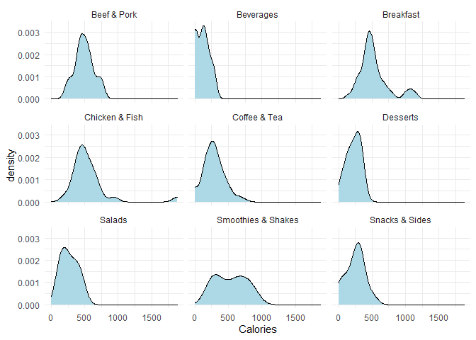

Assignment\_1
================
Hans Franke
September 28, 2020

Importing libraries

``` r
library(tidyverse)
```

    ## -- Attaching packages ------------------------------------------------------------------------------------------- tidyverse 1.3.0 --

    ## v ggplot2 3.3.2     v purrr   0.3.4
    ## v tibble  3.0.3     v dplyr   1.0.2
    ## v tidyr   1.1.2     v stringr 1.4.0
    ## v readr   1.3.1     v forcats 0.5.0

    ## -- Conflicts ---------------------------------------------------------------------------------------------- tidyverse_conflicts() --
    ## x dplyr::filter() masks stats::filter()
    ## x dplyr::lag()    masks stats::lag()

``` r
library(ISLR)
```

## Question 1

## Question 2:

### Run the code below to generate data. There will be three vectors in your environment. Put them in a data frame for entering it in a ggplot() call using either the data.frame() or the tibble() function. Give informative names and make sure the types are correct (use the as.<type>() functions). Name the result gg\_students

``` r
set.seed(1234)
student_grade  <- rnorm(32, 7)
student_number <- round(runif(32) * 2e6 + 5e6)
programme      <- sample(c("Science", "Social Science"), 32, replace = TRUE)
```

Converting to DataFrame:

``` r
gg_students <- tibble( 
                        student_grade = student_grade, 
                        student_number = student_number, 
                        programme = programme
                        )
```

Print Head of DF:

``` r
head(gg_students)
```

    ## # A tibble: 6 x 3
    ##   student_grade student_number programme     
    ##           <dbl>          <dbl> <chr>         
    ## 1          5.79        5478051 Social Science
    ## 2          7.28        6412989 Science       
    ## 3          8.08        5616190 Social Science
    ## 4          4.65        6017095 Social Science
    ## 5          7.43        5103293 Social Science
    ## 6          7.51        6129140 Science

## Question 2

### Plot the first homeruns\_plot again, but map the Hits to the y-axis and the HmRun to the x-axis instead.

``` r
homeruns_plot <- 
  ggplot(Hitters, aes(x = HmRun, y = Hits)) +
  geom_point() +
  labs(x = "HmRun", y = "Hits")

homeruns_plot
```

<!-- -->

## Question 4:

### Recreate the same plot once more, but now also map the variable League to the colour aesthetic and the variable Salary to the size aesthetic.

``` r
homeruns_plot2 <- 
  ggplot(Hitters, aes(x = HmRun, y = Hits, colour = League, size = Salary)) +
  geom_point() +
  labs(x = "HmRun", y = "Hits")

homeruns_plot2           
```

    ## Warning: Removed 59 rows containing missing values (geom_point).

<!-- -->

## question 5:

### Look at the many different geoms on the reference website.

<https://ggplot2.tidyverse.org/reference/#section-layer-geoms>

## Question 6:

### Use geom\_histogram() to create a histogram of the grades of the students in the gg\_students dataset. Play around with the binwidth argument of the geom\_histogram() function.

``` r
 gg_students_plot <- 
  ggplot(gg_students, aes(x = student_grade))+
  geom_histogram() +
  stat_bin(binwidth = NULL)
  
gg_students_plot 
```

    ## `stat_bin()` using `bins = 30`. Pick better value with `binwidth`.
    ## `stat_bin()` using `bins = 30`. Pick better value with `binwidth`.

<!-- -->

``` r
gg_students_plot <- 
  ggplot(gg_students, aes(x = student_grade))+
  geom_histogram() +
  stat_bin(binwidth = 1)
  
gg_students_plot 
```

    ## `stat_bin()` using `bins = 30`. Pick better value with `binwidth`.

<!-- -->

## Question 7

### Use geom\_density() to create a density plot of the grades of the students in the gg\_students dataset. Add the argument fill = “light seagreen” to geom\_density()

``` r
gg_students_plot_3 <- 
  ggplot(gg_students, aes(student_grade))+
 
  geom_density(fill = "light seagreen")


  
gg_students_plot_3 
```

<!-- -->

## Question 8:

### Add rug marks to the density plot through geom\_rug(). You can edit the colour and size of the rug marks using those arguments within the geom\_rug() function.

``` r
gg_students_plot_3 <- 
  ggplot(gg_students, aes(student_grade))+
 
  geom_density(fill = "light seagreen")+
  geom_rug(colour='red', size=2)


  
gg_students_plot_3
```

<!-- -->

## Question 9:

Increase the data to ink ratio by removing the y axis label, setting the
theme to theme\_minimal(), and removing the border of the density
polygon. Also set the limits of the x-axis to go from 0 to 10 using the
xlim() function, because those are the plausible values for a student
grade.

``` r
gg_students_plot_4 <- 
  ggplot(gg_students, aes(student_grade))+ 
 
  xlim(0,10)+
  labs(y = NULL) + 
  geom_density(fill = "light seagreen", outline.type = "lower")+
  geom_rug(colour='red', size=2)+
  theme_minimal()

  
gg_students_plot_4
```

<!-- -->

# Boxplot

## Question 10

Create a boxplot of student grades per programme in the gg\_students
dataset you made earlier: map the programme variable to the x position
and the grade to the y position. For extra visual aid, you can
additionally map the programme variable to the fill aesthetic

``` r
students_box_plot <-
  ggplot(gg_students, aes( x = programme, y = student_grade, fill = programme ))+
  geom_boxplot()

students_box_plot
```

<!-- -->

## Question 11

What do each of the horizontal lines in the boxplot mean? What do the
vertical lines (whiskers) mean?

Answer: Summary statistics The lower and upper hinges correspond to the
first and third quartiles (the 25th and 75th percentiles). This differs
slightly from the method used by the boxplot() function, and may be
apparent with small samples. See boxplot.stats() for for more
information on how hinge positions are calculated for boxplot().

The upper whisker extends from the hinge to the largest value no further
than 1.5 \* IQR from the hinge (where IQR is the inter-quartile range,
or distance between the first and third quartiles). The lower whisker
extends from the hinge to the smallest value at most 1.5 \* IQR of the
hinge. Data beyond the end of the whiskers are called “outlying” points
and are plotted individually.

In a notched box plot, the notches extend 1.58 \* IQR / sqrt(n). This
gives a roughly 95% confidence interval for comparing medians. See
McGill et al. (1978) for more details

font:
<https://ggplot2.tidyverse.org/reference/geom_boxplot.html?q=boxplot>

# Two Densities

## Question 12:

Comparison of distributions across categories can also be done by adding
a fill aesthetic to the density plot you made earlier. Try this out. To
take care of the overlap, you might want to add some transparency in the
geom\_density() function using the alpha argument.

``` r
gg_students_plot_4 <- 
  ggplot(gg_students, aes(student_grade, colour = programme ))+
 
  geom_density(fill = "light blue" , alpha = 0.1 ) 


  
gg_students_plot_4 
```

<!-- -->

# BarPlots

## Question 13:

Create a bar plot of the variable Years from the Hitters dataset.
