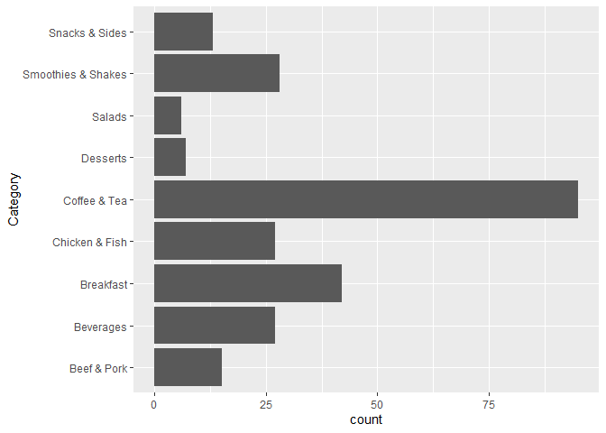
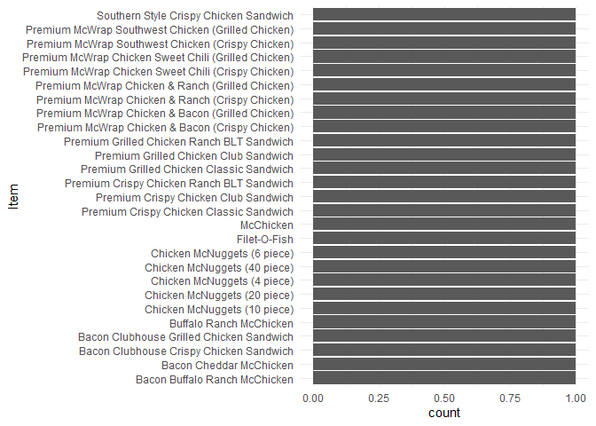

Assignment\_1
================
Hans Franke
September 28, 2020

Importing libraries

``` r
library(tidyverse)
```

    ## -- Attaching packages ------------------------------------------------------------------------------------------- tidyverse 1.3.0 --

    ## v ggplot2 3.3.2     v purrr   0.3.4
    ## v tibble  3.0.3     v dplyr   1.0.2
    ## v tidyr   1.1.2     v stringr 1.4.0
    ## v readr   1.3.1     v forcats 0.5.0

    ## -- Conflicts ---------------------------------------------------------------------------------------------- tidyverse_conflicts() --
    ## x dplyr::filter() masks stats::filter()
    ## x dplyr::lag()    masks stats::lag()

``` r
library(ISLR)
```

## Question 1

## Question 2:

### Run the code below to generate data. There will be three vectors in your environment. Put them in a data frame for entering it in a ggplot() call using either the data.frame() or the tibble() function. Give informative names and make sure the types are correct (use the as.<type>() functions). Name the result gg\_students

``` r
set.seed(1234)
student_grade  <- rnorm(32, 7)
student_number <- round(runif(32) * 2e6 + 5e6)
programme      <- sample(c("Science", "Social Science"), 32, replace = TRUE)
```

Converting to DataFrame:

``` r
gg_students <- tibble( 
                        student_grade = student_grade, 
                        student_number = student_number, 
                        programme = programme
                        )
```

Print Head of DF:

``` r
head(gg_students)
```

    ## # A tibble: 6 x 3
    ##   student_grade student_number programme     
    ##           <dbl>          <dbl> <chr>         
    ## 1          5.79        5478051 Social Science
    ## 2          7.28        6412989 Science       
    ## 3          8.08        5616190 Social Science
    ## 4          4.65        6017095 Social Science
    ## 5          7.43        5103293 Social Science
    ## 6          7.51        6129140 Science

## Question 2

### Plot the first homeruns\_plot again, but map the Hits to the y-axis and the HmRun to the x-axis instead.

``` r
homeruns_plot <- 
  ggplot(Hitters, aes(x = HmRun, y = Hits)) +
  geom_point() +
  labs(x = "HmRun", y = "Hits")

homeruns_plot
```

<!-- -->

## Question 4:

### Recreate the same plot once more, but now also map the variable League to the colour aesthetic and the variable Salary to the size aesthetic.

``` r
homeruns_plot2 <- 
  ggplot(Hitters, aes(x = HmRun, y = Hits, colour = League, size = Salary)) +
  geom_point() +
  labs(x = "HmRun", y = "Hits")

homeruns_plot2           
```

    ## Warning: Removed 59 rows containing missing values (geom_point).

<!-- -->

## question 5:

### Look at the many different geoms on the reference website.

<https://ggplot2.tidyverse.org/reference/#section-layer-geoms>

## Question 6:

### Use geom\_histogram() to create a histogram of the grades of the students in the gg\_students dataset. Play around with the binwidth argument of the geom\_histogram() function.

``` r
 gg_students_plot <- 
  ggplot(gg_students, aes(x = student_grade))+
  geom_histogram() +
  stat_bin(binwidth = NULL)
  
gg_students_plot 
```

    ## `stat_bin()` using `bins = 30`. Pick better value with `binwidth`.
    ## `stat_bin()` using `bins = 30`. Pick better value with `binwidth`.

<!-- -->

``` r
gg_students_plot <- 
  ggplot(gg_students, aes(x = student_grade))+
  geom_histogram() +
  stat_bin(binwidth = 1)
  
gg_students_plot 
```

    ## `stat_bin()` using `bins = 30`. Pick better value with `binwidth`.

<!-- -->

## Question 7

### Use geom\_density() to create a density plot of the grades of the students in the gg\_students dataset. Add the argument fill = “light seagreen” to geom\_density()

``` r
gg_students_plot_3 <- 
  ggplot(gg_students, aes(student_grade))+
 
  geom_density(fill = "light seagreen")


  
gg_students_plot_3 
```

<!-- -->

## Question 8:

### Add rug marks to the density plot through geom\_rug(). You can edit the colour and size of the rug marks using those arguments within the geom\_rug() function.

``` r
gg_students_plot_3 <- 
  ggplot(gg_students, aes(student_grade))+
 
  geom_density(fill = "light seagreen")+
  geom_rug(colour='red', size=2)


  
gg_students_plot_3
```

<!-- -->

## Question 9:

Increase the data to ink ratio by removing the y axis label, setting the
theme to theme\_minimal(), and removing the border of the density
polygon. Also set the limits of the x-axis to go from 0 to 10 using the
xlim() function, because those are the plausible values for a student
grade.

``` r
gg_students_plot_4 <- 
  ggplot(gg_students, aes(student_grade))+ 
 
  xlim(0,10)+
  labs(y = NULL) + 
  geom_density(fill = "light seagreen", outline.type = "lower")+
  geom_rug(colour='red', size=2)+
  theme_minimal()

  
gg_students_plot_4
```

<!-- -->

# Boxplot

## Question 10

Create a boxplot of student grades per programme in the gg\_students
dataset you made earlier: map the programme variable to the x position
and the grade to the y position. For extra visual aid, you can
additionally map the programme variable to the fill aesthetic

``` r
students_box_plot <-
  ggplot(gg_students, aes( x = programme, y = student_grade, fill = programme ))+
  geom_boxplot()

students_box_plot
```

<!-- -->

## Question 11

What do each of the horizontal lines in the boxplot mean? What do the
vertical lines (whiskers) mean?

Answer: Summary statistics The lower and upper hinges correspond to the
first and third quartiles (the 25th and 75th percentiles). This differs
slightly from the method used by the boxplot() function, and may be
apparent with small samples. See boxplot.stats() for for more
information on how hinge positions are calculated for boxplot().

The upper whisker extends from the hinge to the largest value no further
than 1.5 \* IQR from the hinge (where IQR is the inter-quartile range,
or distance between the first and third quartiles). The lower whisker
extends from the hinge to the smallest value at most 1.5 \* IQR of the
hinge. Data beyond the end of the whiskers are called “outlying” points
and are plotted individually.

In a notched box plot, the notches extend 1.58 \* IQR / sqrt(n). This
gives a roughly 95% confidence interval for comparing medians. See
McGill et al. (1978) for more details

font:
<https://ggplot2.tidyverse.org/reference/geom_boxplot.html?q=boxplot>

# Two Densities

## Question 12:

Comparison of distributions across categories can also be done by adding
a fill aesthetic to the density plot you made earlier. Try this out. To
take care of the overlap, you might want to add some transparency in the
geom\_density() function using the alpha argument.

``` r
gg_students_plot_4 <- 
  ggplot(gg_students, aes(student_grade, colour = programme ))+
 
  geom_density(fill = "light blue" , alpha = 0.1 ) 


  
gg_students_plot_4 
```

<!-- -->

# BarPlots

## Question 13:

Create a bar plot of the variable Years from the Hitters dataset.

``` r
bar_plot <- 
  ggplot(Hitters, aes(Years))+
  stat_count()+
  geom_bar()

bar_plot
```

<!-- -->

``` r
bar_plot <- 
  ggplot(Hitters, aes(Years, fill = League))+
  stat_count()+
  geom_bar()

bar_plot
```

<!-- -->

# Line Plot

## Question 14:

Use geom\_line() to make a line plot out of the first 200 observations
of the variable Volume (the number of trades made on each day) of the
Smarket dataset. You will need to create a Day variable using mutate()
to map to the x-position. This variable can simply be the integers from
1 to 200. Remember, you can select the first 200 rows using
Smarket\[1:200, \].

``` r
head(Smarket)
```

    ##   Year   Lag1   Lag2   Lag3   Lag4   Lag5 Volume  Today Direction
    ## 1 2001  0.381 -0.192 -2.624 -1.055  5.010 1.1913  0.959        Up
    ## 2 2001  0.959  0.381 -0.192 -2.624 -1.055 1.2965  1.032        Up
    ## 3 2001  1.032  0.959  0.381 -0.192 -2.624 1.4112 -0.623      Down
    ## 4 2001 -0.623  1.032  0.959  0.381 -0.192 1.2760  0.614        Up
    ## 5 2001  0.614 -0.623  1.032  0.959  0.381 1.2057  0.213        Up
    ## 6 2001  0.213  0.614 -0.623  1.032  0.959 1.3491  1.392        Up

``` r
# Select only first 200 apperances:
firsts200 <- select(Smarket[1:200,],
                    Volume

)
firsts200
```

    ##      Volume
    ## 1   1.19130
    ## 2   1.29650
    ## 3   1.41120
    ## 4   1.27600
    ## 5   1.20570
    ## 6   1.34910
    ## 7   1.44500
    ## 8   1.40780
    ## 9   1.16400
    ## 10  1.23260
    ## 11  1.30900
    ## 12  1.25800
    ## 13  1.09800
    ## 14  1.05310
    ## 15  1.14980
    ## 16  1.29530
    ## 17  1.11880
    ## 18  1.04840
    ## 19  1.01300
    ## 20  1.05960
    ## 21  1.15830
    ## 22  1.10720
    ## 23  1.07550
    ## 24  1.03910
    ## 25  1.07520
    ## 26  1.15030
    ## 27  1.15370
    ## 28  1.25720
    ## 29  1.11220
    ## 30  1.20850
    ## 31  1.36590
    ## 32  1.23130
    ## 33  1.13080
    ## 34  1.11410
    ## 35  1.22530
    ## 36  1.29490
    ## 37  1.29400
    ## 38  0.92920
    ## 39  1.09180
    ## 40  1.13220
    ## 41  1.11410
    ## 42  1.08590
    ## 43  1.22900
    ## 44  1.36090
    ## 45  1.39740
    ## 46  1.25950
    ## 47  1.54356
    ## 48  1.12620
    ## 49  1.23590
    ## 50  1.34630
    ## 51  1.72395
    ## 52  1.36490
    ## 53  1.11400
    ## 54  1.31420
    ## 55  1.33340
    ## 56  1.23450
    ## 57  1.28080
    ## 58  1.25490
    ## 59  1.38610
    ## 60  1.42559
    ## 61  1.36800
    ## 62  1.26680
    ## 63  1.06280
    ## 64  1.34960
    ## 65  1.29030
    ## 66  1.10200
    ## 67  0.91390
    ## 68  1.10960
    ## 69  1.91890
    ## 70  1.48680
    ## 71  1.33870
    ## 72  1.01260
    ## 73  1.21650
    ## 74  1.20360
    ## 75  1.34520
    ## 76  1.09130
    ## 77  1.26680
    ## 78  1.18130
    ## 79  1.34220
    ## 80  1.13790
    ## 81  1.08210
    ## 82  0.94900
    ## 83  1.00630
    ## 84  1.13240
    ## 85  1.05670
    ## 86  0.90620
    ## 87  0.85820
    ## 88  1.07180
    ## 89  1.40530
    ## 90  1.35560
    ## 91  1.13080
    ## 92  1.17490
    ## 93  1.26040
    ## 94  1.13480
    ## 95  1.10070
    ## 96  0.82810
    ## 97  1.02600
    ## 98  1.15860
    ## 99  1.22660
    ## 100 1.01500
    ## 101 0.83650
    ## 102 1.11680
    ## 103 1.06190
    ## 104 1.08960
    ## 105 0.72620
    ## 106 0.87010
    ## 107 1.13650
    ## 108 1.06360
    ## 109 1.24290
    ## 110 1.63555
    ## 111 1.11160
    ## 112 1.18490
    ## 113 1.35010
    ## 114 1.54682
    ## 115 1.18920
    ## 116 1.05010
    ## 117 1.19890
    ## 118 1.16210
    ## 119 1.32730
    ## 120 1.83236
    ## 121 1.12830
    ## 122 0.62211
    ## 123 0.93490
    ## 124 1.05670
    ## 125 1.04570
    ## 126 1.26380
    ## 127 1.38410
    ## 128 1.39400
    ## 129 1.12170
    ## 130 1.03980
    ## 131 1.23810
    ## 132 1.31630
    ## 133 1.34350
    ## 134 1.17090
    ## 135 0.98690
    ## 136 1.19870
    ## 137 1.28070
    ## 138 1.21390
    ## 139 1.01530
    ## 140 0.90910
    ## 141 1.12920
    ## 142 1.34030
    ## 143 1.21830
    ## 144 0.93990
    ## 145 0.81170
    ## 146 1.01200
    ## 147 1.12460
    ## 148 1.10420
    ## 149 0.96090
    ## 150 0.83760
    ## 151 0.96460
    ## 152 1.06560
    ## 153 1.05540
    ## 154 0.97430
    ## 155 0.89710
    ## 156 1.04160
    ## 157 1.11080
    ## 158 0.98620
    ## 159 1.04360
    ## 160 0.84260
    ## 161 0.98710
    ## 162 0.96370
    ## 163 1.15700
    ## 164 0.92010
    ## 165 1.17830
    ## 166 1.38450
    ## 167 1.35970
    ## 168 1.42430
    ## 169 1.27660
    ## 170 2.33083
    ## 171 1.65041
    ## 172 2.12055
    ## 173 2.00480
    ## 174 2.31730
    ## 175 1.74660
    ## 176 1.61380
    ## 177 1.51910
    ## 178 1.46700
    ## 179 1.63150
    ## 180 1.17560
    ## 181 1.28980
    ## 182 1.65060
    ## 183 1.60910
    ## 184 1.30170
    ## 185 0.97900
    ## 186 1.22780
    ## 187 1.31240
    ## 188 1.70458
    ## 189 1.33140
    ## 190 1.02470
    ## 191 1.21050
    ## 192 1.45220
    ## 193 1.26290
    ## 194 1.29490
    ## 195 1.10570
    ## 196 1.31730
    ## 197 1.33620
    ## 198 1.36440
    ## 199 1.24450
    ## 200 1.10610

``` r
#Creating the x-positions (Days)
firsts200 <- mutate ( firsts200, days = 1:200 )

firsts200
```

    ##      Volume days
    ## 1   1.19130    1
    ## 2   1.29650    2
    ## 3   1.41120    3
    ## 4   1.27600    4
    ## 5   1.20570    5
    ## 6   1.34910    6
    ## 7   1.44500    7
    ## 8   1.40780    8
    ## 9   1.16400    9
    ## 10  1.23260   10
    ## 11  1.30900   11
    ## 12  1.25800   12
    ## 13  1.09800   13
    ## 14  1.05310   14
    ## 15  1.14980   15
    ## 16  1.29530   16
    ## 17  1.11880   17
    ## 18  1.04840   18
    ## 19  1.01300   19
    ## 20  1.05960   20
    ## 21  1.15830   21
    ## 22  1.10720   22
    ## 23  1.07550   23
    ## 24  1.03910   24
    ## 25  1.07520   25
    ## 26  1.15030   26
    ## 27  1.15370   27
    ## 28  1.25720   28
    ## 29  1.11220   29
    ## 30  1.20850   30
    ## 31  1.36590   31
    ## 32  1.23130   32
    ## 33  1.13080   33
    ## 34  1.11410   34
    ## 35  1.22530   35
    ## 36  1.29490   36
    ## 37  1.29400   37
    ## 38  0.92920   38
    ## 39  1.09180   39
    ## 40  1.13220   40
    ## 41  1.11410   41
    ## 42  1.08590   42
    ## 43  1.22900   43
    ## 44  1.36090   44
    ## 45  1.39740   45
    ## 46  1.25950   46
    ## 47  1.54356   47
    ## 48  1.12620   48
    ## 49  1.23590   49
    ## 50  1.34630   50
    ## 51  1.72395   51
    ## 52  1.36490   52
    ## 53  1.11400   53
    ## 54  1.31420   54
    ## 55  1.33340   55
    ## 56  1.23450   56
    ## 57  1.28080   57
    ## 58  1.25490   58
    ## 59  1.38610   59
    ## 60  1.42559   60
    ## 61  1.36800   61
    ## 62  1.26680   62
    ## 63  1.06280   63
    ## 64  1.34960   64
    ## 65  1.29030   65
    ## 66  1.10200   66
    ## 67  0.91390   67
    ## 68  1.10960   68
    ## 69  1.91890   69
    ## 70  1.48680   70
    ## 71  1.33870   71
    ## 72  1.01260   72
    ## 73  1.21650   73
    ## 74  1.20360   74
    ## 75  1.34520   75
    ## 76  1.09130   76
    ## 77  1.26680   77
    ## 78  1.18130   78
    ## 79  1.34220   79
    ## 80  1.13790   80
    ## 81  1.08210   81
    ## 82  0.94900   82
    ## 83  1.00630   83
    ## 84  1.13240   84
    ## 85  1.05670   85
    ## 86  0.90620   86
    ## 87  0.85820   87
    ## 88  1.07180   88
    ## 89  1.40530   89
    ## 90  1.35560   90
    ## 91  1.13080   91
    ## 92  1.17490   92
    ## 93  1.26040   93
    ## 94  1.13480   94
    ## 95  1.10070   95
    ## 96  0.82810   96
    ## 97  1.02600   97
    ## 98  1.15860   98
    ## 99  1.22660   99
    ## 100 1.01500  100
    ## 101 0.83650  101
    ## 102 1.11680  102
    ## 103 1.06190  103
    ## 104 1.08960  104
    ## 105 0.72620  105
    ## 106 0.87010  106
    ## 107 1.13650  107
    ## 108 1.06360  108
    ## 109 1.24290  109
    ## 110 1.63555  110
    ## 111 1.11160  111
    ## 112 1.18490  112
    ## 113 1.35010  113
    ## 114 1.54682  114
    ## 115 1.18920  115
    ## 116 1.05010  116
    ## 117 1.19890  117
    ## 118 1.16210  118
    ## 119 1.32730  119
    ## 120 1.83236  120
    ## 121 1.12830  121
    ## 122 0.62211  122
    ## 123 0.93490  123
    ## 124 1.05670  124
    ## 125 1.04570  125
    ## 126 1.26380  126
    ## 127 1.38410  127
    ## 128 1.39400  128
    ## 129 1.12170  129
    ## 130 1.03980  130
    ## 131 1.23810  131
    ## 132 1.31630  132
    ## 133 1.34350  133
    ## 134 1.17090  134
    ## 135 0.98690  135
    ## 136 1.19870  136
    ## 137 1.28070  137
    ## 138 1.21390  138
    ## 139 1.01530  139
    ## 140 0.90910  140
    ## 141 1.12920  141
    ## 142 1.34030  142
    ## 143 1.21830  143
    ## 144 0.93990  144
    ## 145 0.81170  145
    ## 146 1.01200  146
    ## 147 1.12460  147
    ## 148 1.10420  148
    ## 149 0.96090  149
    ## 150 0.83760  150
    ## 151 0.96460  151
    ## 152 1.06560  152
    ## 153 1.05540  153
    ## 154 0.97430  154
    ## 155 0.89710  155
    ## 156 1.04160  156
    ## 157 1.11080  157
    ## 158 0.98620  158
    ## 159 1.04360  159
    ## 160 0.84260  160
    ## 161 0.98710  161
    ## 162 0.96370  162
    ## 163 1.15700  163
    ## 164 0.92010  164
    ## 165 1.17830  165
    ## 166 1.38450  166
    ## 167 1.35970  167
    ## 168 1.42430  168
    ## 169 1.27660  169
    ## 170 2.33083  170
    ## 171 1.65041  171
    ## 172 2.12055  172
    ## 173 2.00480  173
    ## 174 2.31730  174
    ## 175 1.74660  175
    ## 176 1.61380  176
    ## 177 1.51910  177
    ## 178 1.46700  178
    ## 179 1.63150  179
    ## 180 1.17560  180
    ## 181 1.28980  181
    ## 182 1.65060  182
    ## 183 1.60910  183
    ## 184 1.30170  184
    ## 185 0.97900  185
    ## 186 1.22780  186
    ## 187 1.31240  187
    ## 188 1.70458  188
    ## 189 1.33140  189
    ## 190 1.02470  190
    ## 191 1.21050  191
    ## 192 1.45220  192
    ## 193 1.26290  193
    ## 194 1.29490  194
    ## 195 1.10570  195
    ## 196 1.31730  196
    ## 197 1.33620  197
    ## 198 1.36440  198
    ## 199 1.24450  199
    ## 200 1.10610  200

``` r
#Finally Plotting
smart_line <- 
  ggplot(firsts200, aes(x = days, y = Volume)) + 
  geom_line()

smart_line
```

<!-- -->

## Question 15:

Give the line a nice colour and increase its size. Also add points of
the same colour on top.

``` r
smart_line2 <- 
  ggplot(firsts200, aes(x = days, y = Volume)) + 
  geom_line(colour = "blue" ) +
  geom_point(colour = "blue")


smart_line2
```

<!-- -->

## Question 16:

Use the function which.max() to find out which of the first 200 days has
the highest trade volume and use the function max() to find out how
large this volume was.
