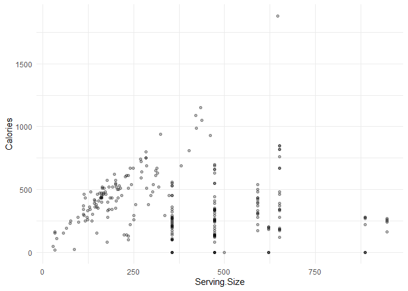
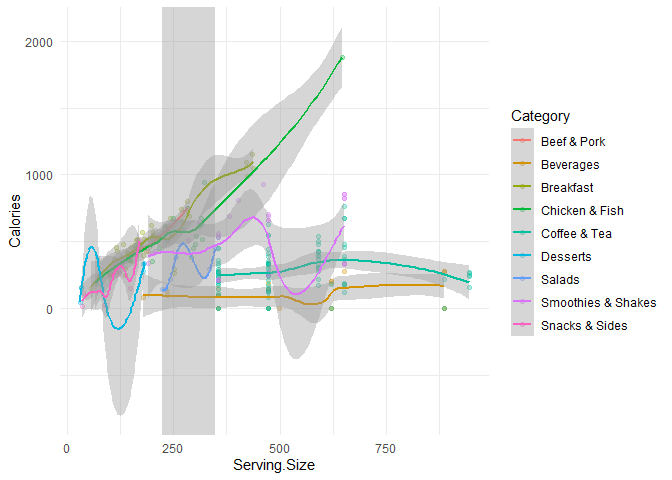
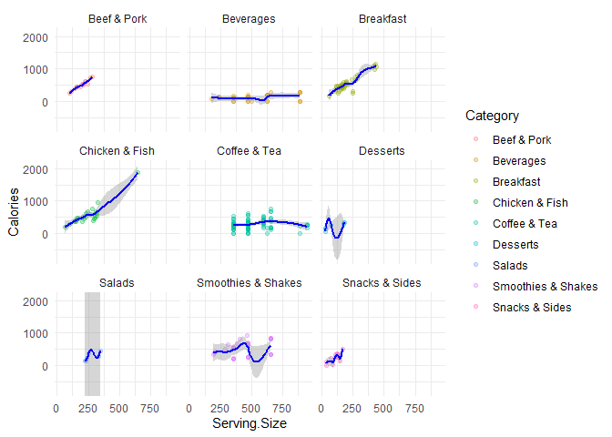
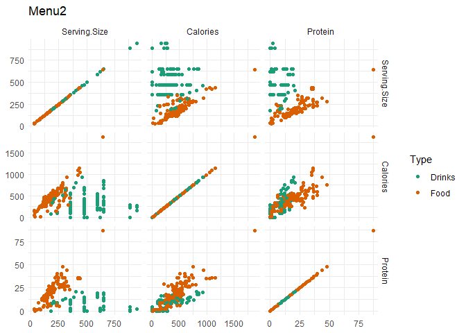
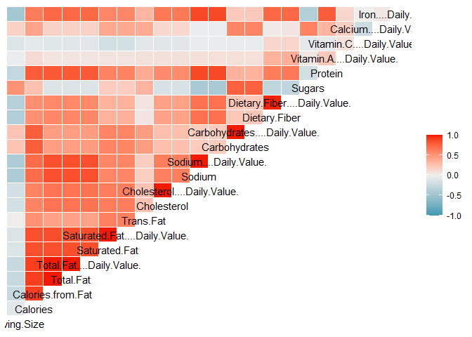

Assignment\_2
================
Hans Franke
September 29, 2020

Importing Libraries

``` r
library(tidyverse)
```

    ## -- Attaching packages ----------------------------------------------------------------------------- tidyverse 1.3.0 --

    ## v ggplot2 3.3.2     v purrr   0.3.4
    ## v tibble  3.0.3     v dplyr   1.0.2
    ## v tidyr   1.1.2     v stringr 1.4.0
    ## v readr   1.3.1     v forcats 0.5.0

    ## -- Conflicts -------------------------------------------------------------------------------- tidyverse_conflicts() --
    ## x dplyr::filter() masks stats::filter()
    ## x dplyr::lag()    masks stats::lag()

``` r
library(ISLR)
library(GGally)
```

    ## Registered S3 method overwritten by 'GGally':
    ##   method from   
    ##   +.gg   ggplot2

Loading dataset:

``` r
menu <- read.csv('menu.csv')
head(menu)
```

    ##    Category                             Item   Serving.Size Calories
    ## 1 Breakfast                     Egg McMuffin 4.8 oz (136 g)      300
    ## 2 Breakfast                Egg White Delight 4.8 oz (135 g)      250
    ## 3 Breakfast                 Sausage McMuffin 3.9 oz (111 g)      370
    ## 4 Breakfast        Sausage McMuffin with Egg 5.7 oz (161 g)      450
    ## 5 Breakfast Sausage McMuffin with Egg Whites 5.7 oz (161 g)      400
    ## 6 Breakfast             Steak & Egg McMuffin 6.5 oz (185 g)      430
    ##   Calories.from.Fat Total.Fat Total.Fat....Daily.Value. Saturated.Fat
    ## 1               120        13                        20             5
    ## 2                70         8                        12             3
    ## 3               200        23                        35             8
    ## 4               250        28                        43            10
    ## 5               210        23                        35             8
    ## 6               210        23                        36             9
    ##   Saturated.Fat....Daily.Value. Trans.Fat Cholesterol
    ## 1                            25         0         260
    ## 2                            15         0          25
    ## 3                            42         0          45
    ## 4                            52         0         285
    ## 5                            42         0          50
    ## 6                            46         1         300
    ##   Cholesterol....Daily.Value. Sodium Sodium....Daily.Value. Carbohydrates
    ## 1                          87    750                     31            31
    ## 2                           8    770                     32            30
    ## 3                          15    780                     33            29
    ## 4                          95    860                     36            30
    ## 5                          16    880                     37            30
    ## 6                         100    960                     40            31
    ##   Carbohydrates....Daily.Value. Dietary.Fiber Dietary.Fiber....Daily.Value.
    ## 1                            10             4                            17
    ## 2                            10             4                            17
    ## 3                            10             4                            17
    ## 4                            10             4                            17
    ## 5                            10             4                            17
    ## 6                            10             4                            18
    ##   Sugars Protein Vitamin.A....Daily.Value. Vitamin.C....Daily.Value.
    ## 1      3      17                        10                         0
    ## 2      3      18                         6                         0
    ## 3      2      14                         8                         0
    ## 4      2      21                        15                         0
    ## 5      2      21                         6                         0
    ## 6      3      26                        15                         2
    ##   Calcium....Daily.Value. Iron....Daily.Value.
    ## 1                      25                   15
    ## 2                      25                    8
    ## 3                      25                   10
    ## 4                      30                   15
    ## 5                      25                   10
    ## 6                      30                   20

Checking the structure of dataset:

``` r
str(menu)
```

    ## 'data.frame':    260 obs. of  24 variables:
    ##  $ Category                     : chr  "Breakfast" "Breakfast" "Breakfast" "Breakfast" ...
    ##  $ Item                         : chr  "Egg McMuffin" "Egg White Delight" "Sausage McMuffin" "Sausage McMuffin with Egg" ...
    ##  $ Serving.Size                 : chr  "4.8 oz (136 g)" "4.8 oz (135 g)" "3.9 oz (111 g)" "5.7 oz (161 g)" ...
    ##  $ Calories                     : int  300 250 370 450 400 430 460 520 410 470 ...
    ##  $ Calories.from.Fat            : int  120 70 200 250 210 210 230 270 180 220 ...
    ##  $ Total.Fat                    : num  13 8 23 28 23 23 26 30 20 25 ...
    ##  $ Total.Fat....Daily.Value.    : int  20 12 35 43 35 36 40 47 32 38 ...
    ##  $ Saturated.Fat                : num  5 3 8 10 8 9 13 14 11 12 ...
    ##  $ Saturated.Fat....Daily.Value.: int  25 15 42 52 42 46 65 68 56 59 ...
    ##  $ Trans.Fat                    : num  0 0 0 0 0 1 0 0 0 0 ...
    ##  $ Cholesterol                  : int  260 25 45 285 50 300 250 250 35 35 ...
    ##  $ Cholesterol....Daily.Value.  : int  87 8 15 95 16 100 83 83 11 11 ...
    ##  $ Sodium                       : int  750 770 780 860 880 960 1300 1410 1300 1420 ...
    ##  $ Sodium....Daily.Value.       : int  31 32 33 36 37 40 54 59 54 59 ...
    ##  $ Carbohydrates                : int  31 30 29 30 30 31 38 43 36 42 ...
    ##  $ Carbohydrates....Daily.Value.: int  10 10 10 10 10 10 13 14 12 14 ...
    ##  $ Dietary.Fiber                : int  4 4 4 4 4 4 2 3 2 3 ...
    ##  $ Dietary.Fiber....Daily.Value.: int  17 17 17 17 17 18 7 12 7 12 ...
    ##  $ Sugars                       : int  3 3 2 2 2 3 3 4 3 4 ...
    ##  $ Protein                      : int  17 18 14 21 21 26 19 19 20 20 ...
    ##  $ Vitamin.A....Daily.Value.    : int  10 6 8 15 6 15 10 15 2 6 ...
    ##  $ Vitamin.C....Daily.Value.    : int  0 0 0 0 0 2 8 8 8 8 ...
    ##  $ Calcium....Daily.Value.      : int  25 25 25 30 25 30 15 20 15 15 ...
    ##  $ Iron....Daily.Value.         : int  15 8 10 15 10 20 15 20 10 15 ...

Doing some transformation:

``` r
# Transformation drinks
drink.fl <- menu %>% 
  filter(str_detect(Serving.Size, " fl oz.*")) %>% 
  mutate(Serving.Size = str_remove(Serving.Size, " fl oz.*")) %>% 
  mutate(Serving.Size = as.numeric(Serving.Size) * 29.5735)

drink.carton <- menu %>% 
  filter(str_detect(Serving.Size, "carton")) %>% 
  mutate(Serving.Size = str_extract(Serving.Size, "[0-9]{2,3}")) %>% 
  mutate(Serving.Size = as.numeric(Serving.Size))

# Transformation food
food <-  menu %>% 
  filter(str_detect(Serving.Size, "g")) %>% 
  mutate(Serving.Size = (str_extract(Serving.Size, "(?<=\\()[0-9]{2,4}"))) %>% 
  mutate(Serving.Size = as.numeric(Serving.Size))

# Add Type variable indicating whether an item is food or a drink 
menu2 <-  bind_rows(drink.fl, drink.carton, food) %>% 
  mutate(
   Type = case_when(
     as.character(Category) == 'Beverages' ~ 'Drinks',
     as.character(Category) == 'Coffee & Tea' ~ 'Drinks',
     as.character(Category) == 'Smoothies & Shakes' ~ 'Drinks',
     TRUE ~ 'Food'
   )
  )
```

``` r
str(menu2)
```

    ## 'data.frame':    260 obs. of  25 variables:
    ##  $ Category                     : chr  "Beverages" "Beverages" "Beverages" "Beverages" ...
    ##  $ Item                         : chr  "Coca-Cola Classic (Small)" "Coca-Cola Classic (Medium)" "Coca-Cola Classic (Large)" "Coca-Cola Classic (Child)" ...
    ##  $ Serving.Size                 : num  473 621 887 355 473 ...
    ##  $ Calories                     : int  140 200 280 100 0 0 0 0 140 190 ...
    ##  $ Calories.from.Fat            : int  0 0 0 0 0 0 0 0 0 0 ...
    ##  $ Total.Fat                    : num  0 0 0 0 0 0 0 0 0 0 ...
    ##  $ Total.Fat....Daily.Value.    : int  0 0 0 0 0 0 0 0 0 0 ...
    ##  $ Saturated.Fat                : num  0 0 0 0 0 0 0 0 0 0 ...
    ##  $ Saturated.Fat....Daily.Value.: int  0 0 0 0 0 0 0 0 0 0 ...
    ##  $ Trans.Fat                    : num  0 0 0 0 0 0 0 0 0 0 ...
    ##  $ Cholesterol                  : int  0 0 0 0 0 0 0 0 0 0 ...
    ##  $ Cholesterol....Daily.Value.  : int  0 0 0 0 0 0 0 0 0 0 ...
    ##  $ Sodium                       : int  0 5 5 0 10 20 35 15 45 65 ...
    ##  $ Sodium....Daily.Value.       : int  0 0 0 0 0 1 1 1 2 3 ...
    ##  $ Carbohydrates                : int  39 55 76 28 0 0 0 0 37 53 ...
    ##  $ Carbohydrates....Daily.Value.: int  13 18 25 9 0 0 0 0 12 18 ...
    ##  $ Dietary.Fiber                : int  0 0 0 0 0 0 0 0 0 0 ...
    ##  $ Dietary.Fiber....Daily.Value.: int  0 0 0 0 0 0 0 0 0 0 ...
    ##  $ Sugars                       : int  39 55 76 28 0 0 0 0 35 51 ...
    ##  $ Protein                      : int  0 0 0 0 0 0 0 0 0 0 ...
    ##  $ Vitamin.A....Daily.Value.    : int  0 0 0 0 0 0 0 0 0 0 ...
    ##  $ Vitamin.C....Daily.Value.    : int  0 0 0 0 0 0 0 0 0 0 ...
    ##  $ Calcium....Daily.Value.      : int  0 0 0 0 0 0 0 0 0 0 ...
    ##  $ Iron....Daily.Value.         : int  0 0 0 0 0 0 0 0 0 0 ...
    ##  $ Type                         : chr  "Drinks" "Drinks" "Drinks" "Drinks" ...

``` r
head(menu2)
```

    ##    Category                       Item Serving.Size Calories Calories.from.Fat
    ## 1 Beverages  Coca-Cola Classic (Small)     473.1760      140                 0
    ## 2 Beverages Coca-Cola Classic (Medium)     621.0435      200                 0
    ## 3 Beverages  Coca-Cola Classic (Large)     887.2050      280                 0
    ## 4 Beverages  Coca-Cola Classic (Child)     354.8820      100                 0
    ## 5 Beverages          Diet Coke (Small)     473.1760        0                 0
    ## 6 Beverages         Diet Coke (Medium)     621.0435        0                 0
    ##   Total.Fat Total.Fat....Daily.Value. Saturated.Fat
    ## 1         0                         0             0
    ## 2         0                         0             0
    ## 3         0                         0             0
    ## 4         0                         0             0
    ## 5         0                         0             0
    ## 6         0                         0             0
    ##   Saturated.Fat....Daily.Value. Trans.Fat Cholesterol
    ## 1                             0         0           0
    ## 2                             0         0           0
    ## 3                             0         0           0
    ## 4                             0         0           0
    ## 5                             0         0           0
    ## 6                             0         0           0
    ##   Cholesterol....Daily.Value. Sodium Sodium....Daily.Value. Carbohydrates
    ## 1                           0      0                      0            39
    ## 2                           0      5                      0            55
    ## 3                           0      5                      0            76
    ## 4                           0      0                      0            28
    ## 5                           0     10                      0             0
    ## 6                           0     20                      1             0
    ##   Carbohydrates....Daily.Value. Dietary.Fiber Dietary.Fiber....Daily.Value.
    ## 1                            13             0                             0
    ## 2                            18             0                             0
    ## 3                            25             0                             0
    ## 4                             9             0                             0
    ## 5                             0             0                             0
    ## 6                             0             0                             0
    ##   Sugars Protein Vitamin.A....Daily.Value. Vitamin.C....Daily.Value.
    ## 1     39       0                         0                         0
    ## 2     55       0                         0                         0
    ## 3     76       0                         0                         0
    ## 4     28       0                         0                         0
    ## 5      0       0                         0                         0
    ## 6      0       0                         0                         0
    ##   Calcium....Daily.Value. Iron....Daily.Value.   Type
    ## 1                       0                    0 Drinks
    ## 2                       0                    0 Drinks
    ## 3                       0                    0 Drinks
    ## 4                       0                    0 Drinks
    ## 5                       0                    0 Drinks
    ## 6                       0                    0 Drinks

## Question 1:

After you ran the code, check the structure of the data once again, what
type of variable is ‘Serving.Size’ now, and what was it before you ran
the code?

Answer: Serving.Size is now numeric, before was char.

# Variation

## Question 2

Create a graph that gives insight in the number of items in each
‘Category’, use ‘geom\_bar()’ to make the graph. You can use
‘coord\_flip()’ to put the categories on the y-axis and the counts on
the x-axis. Use the ‘menu2’ dataframe to do this.

``` r
  menu_graph <-
    ggplot(menu2, aes(Category)) +
    geom_bar() +
    coord_flip() 

  menu_graph
```

<!-- -->

## Question 3

Plot the distribution of ‘Calories’ using ‘geom\_histogram’. Describe
the distribution, do you see anything notable?

Answer: there is some outliers with almost 2000 calories.

``` r
calor_hist <- 
  ggplot(menu2, aes(Calories))+
  geom_histogram()

calor_hist
```

    ## `stat_bin()` using `bins = 30`. Pick better value with `binwidth`.

<!-- -->

# Association

The second type of questions in visual EDA concern the association
between different variables. The histogram you created in the previous
question give insight in how the ‘Calories’ are distributed on the level
of the whole menu. However, it may be interesting how ‘Calories’ are
distributed on ‘Category’ level.

## Question 4

Plot the distribution of ‘Calories’ for each ‘Category’ using
‘geom\_density()’ in combination with ‘facet\_wrap()’, can you see in
which ‘Category’ the outlier that can be seen in the histogram falls?

Answer: Chicken and Fish

``` r
  calories_comp <-
    ggplot(menu2, aes(Calories))+
    geom_density(fill="light blue")+
    facet_wrap(~Category) +
    theme_minimal() 

  calories_comp
```

<!-- -->

An easier way to spot outliers, is by creating a boxplot, because the
geom is structured in a way that it emphasizes the outliers.

## Question 5:

Create a boxplot of the ‘Calories’ for each ‘Category. Is the outlier in
the same ’Category’ as you thought it was in based on the previous
question?‘. Again you can use ’coord\_flip()’ to swich the axes of the
plot. Now you know in which category the outlier falls, you can check
which item it is that has such a high energetic value.

``` r
  calories_boxplot <-
    ggplot(menu2, aes(Category, Calories))+
    geom_boxplot()+
    coord_flip() +
    theme_minimal()
  
  calories_boxplot
```

<!-- -->

Looking for which item:

``` r
      filter(menu2, Calories >= 1500) 
```

    ##         Category                         Item Serving.Size Calories
    ## 1 Chicken & Fish Chicken McNuggets (40 piece)          646     1880
    ##   Calories.from.Fat Total.Fat Total.Fat....Daily.Value. Saturated.Fat
    ## 1              1060       118                       182            20
    ##   Saturated.Fat....Daily.Value. Trans.Fat Cholesterol
    ## 1                           101         1         265
    ##   Cholesterol....Daily.Value. Sodium Sodium....Daily.Value. Carbohydrates
    ## 1                          89   3600                    150           118
    ##   Carbohydrates....Daily.Value. Dietary.Fiber Dietary.Fiber....Daily.Value.
    ## 1                            39             6                            24
    ##   Sugars Protein Vitamin.A....Daily.Value. Vitamin.C....Daily.Value.
    ## 1      1      87                         0                        15
    ##   Calcium....Daily.Value. Iron....Daily.Value. Type
    ## 1                       8                   25 Food

For the next plot, you need to pipe the data using ‘%\>%’ from the
‘magrittr’ package. More information on piping can be found here.

## Question 6:

Create a plot using ‘geom\_col()’ to visualise the number of ‘Calories’
each item in the Chicken & Fish category. Use ‘filter()’ in combination
with a pipe to select the information that you need for this plot. What
is the item that contains so many calories? Why do you need to use
‘geom\_col()’ here instead of ‘geom\_bar()’?

``` r
    menu2 %>%
          filter(Category == "Chicken & Fish") %>%
            ggplot(aes(x = Item, y = Calories))+
              geom_col()+
              coord_flip() + 
              theme_minimal()
```

<!-- -->

  - Answer There are two types of bar charts: geom\_bar() and
    geom\_col(). geom\_bar() makes the height of the bar proportional to
    the number of cases in each group (or if the weight aesthetic is
    supplied, the sum of the weights). If you want the heights of the
    bars to represent values in the data, use geom\_col() instead.
    geom\_bar() uses stat\_count() by default: it counts the number of
    cases at each x position. geom\_col() uses stat\_identity(): it
    leaves the data as is.

Now you know what causes the outlier, you can check whether there is an
association between the serving size and the number of calories.

## Question 7:

Create a scatter plot to visualise the association between serving size
and calories. Are serving size and energetic value related to each
other? Did you expect this outcome? Use the alpha argument in
geom\_point() to adjust the transparency.

Answer: No correlation. I was expecting to see more calories as size
grows, but in fact it dosen’t

``` r
    ggplot(menu2, aes(Serving.Size, Calories))+
    geom_point(alpha = 0.3) + 
    theme_minimal()
```

<!-- -->

## Question 8:

Create a new scatter plot to visualise the association between serving
size and calories, but now use the ‘colour’ argument to make a
distinction between ‘Type’ (see ?aes for more info). Use
‘geom\_smooth()’ to add a regression line to the plot. Does this
alter your conclusion about the relationship between serving size and
calories? What do you conclude now?

Answer: in fact dosent change, only reinforces my previous statament.
The only clearly exception is CHicken & Chips and beverages.

``` r
    ggplot(menu2, aes(Serving.Size, Calories, color = Category))+
    geom_point(alpha = 0.3) + 
    geom_smooth() +
    theme_minimal()
```

    ## `geom_smooth()` using method = 'loess' and formula 'y ~ x'

    ## Warning in simpleLoess(y, x, w, span, degree = degree, parametric =
    ## parametric, : pseudoinverse used at 351.92

    ## Warning in simpleLoess(y, x, w, span, degree = degree, parametric =
    ## parametric, : neighborhood radius 239.55

    ## Warning in simpleLoess(y, x, w, span, degree = degree, parametric =
    ## parametric, : reciprocal condition number 2.7601e-016

    ## Warning in simpleLoess(y, x, w, span, degree = degree, parametric =
    ## parametric, : There are other near singularities as well. 13993

    ## Warning in predLoess(object$y, object$x, newx = if
    ## (is.null(newdata)) object$x else if (is.data.frame(newdata))
    ## as.matrix(model.frame(delete.response(terms(object)), : pseudoinverse used at
    ## 351.92

    ## Warning in predLoess(object$y, object$x, newx = if
    ## (is.null(newdata)) object$x else if (is.data.frame(newdata))
    ## as.matrix(model.frame(delete.response(terms(object)), : neighborhood radius
    ## 239.55

    ## Warning in predLoess(object$y, object$x, newx = if
    ## (is.null(newdata)) object$x else if (is.data.frame(newdata))
    ## as.matrix(model.frame(delete.response(terms(object)), : reciprocal condition
    ## number 2.7601e-016

    ## Warning in predLoess(object$y, object$x, newx = if
    ## (is.null(newdata)) object$x else if (is.data.frame(newdata))
    ## as.matrix(model.frame(delete.response(terms(object)), : There are other near
    ## singularities as well. 13993

<!-- -->

## Question 9:

Why do you think the relationship is so much affected by food type, is
there a way to investigate this further using visualisations?

Answer; probably because when you put some itens in categories they have
some common properties, like Calories for example. We should compare
Calories x Category, but appart from the same plot, this alows to see
the patterns in each category, or in others words: the correlation
between calories and serving.size.

``` r
    ggplot(menu2, aes(Serving.Size, Calories, color = Category))+
    geom_point(alpha = 0.3) + 
    geom_smooth(color = "blue") +
    facet_wrap(~Category, nrow=9, ncol = 3) +
  
    theme_minimal()
```

    ## `geom_smooth()` using method = 'loess' and formula 'y ~ x'

    ## Warning in simpleLoess(y, x, w, span, degree = degree, parametric =
    ## parametric, : pseudoinverse used at 351.92

    ## Warning in simpleLoess(y, x, w, span, degree = degree, parametric =
    ## parametric, : neighborhood radius 239.55

    ## Warning in simpleLoess(y, x, w, span, degree = degree, parametric =
    ## parametric, : reciprocal condition number 2.7601e-016

    ## Warning in simpleLoess(y, x, w, span, degree = degree, parametric =
    ## parametric, : There are other near singularities as well. 13993

    ## Warning in predLoess(object$y, object$x, newx = if
    ## (is.null(newdata)) object$x else if (is.data.frame(newdata))
    ## as.matrix(model.frame(delete.response(terms(object)), : pseudoinverse used at
    ## 351.92

    ## Warning in predLoess(object$y, object$x, newx = if
    ## (is.null(newdata)) object$x else if (is.data.frame(newdata))
    ## as.matrix(model.frame(delete.response(terms(object)), : neighborhood radius
    ## 239.55

    ## Warning in predLoess(object$y, object$x, newx = if
    ## (is.null(newdata)) object$x else if (is.data.frame(newdata))
    ## as.matrix(model.frame(delete.response(terms(object)), : reciprocal condition
    ## number 2.7601e-016

    ## Warning in predLoess(object$y, object$x, newx = if
    ## (is.null(newdata)) object$x else if (is.data.frame(newdata))
    ## as.matrix(model.frame(delete.response(terms(object)), : There are other near
    ## singularities as well. 13993

<!-- -->

So far, you’ve only looked at the association between two variables at a
time. However, when you are exploring associations, you may want to look
at the association of many different variables at the same time
(e.g. when you want to generate hypotheses). An easy way to do this, is
to make use of the ‘ggpairs()’ function from the ‘GGally’ package.

## Question 10:

Create a plot using ‘ggpairs()’ where the association between atleast 4
different variables is visualised. Are there differences in the
associations between those variables based on item Type?

``` r
    ggpairs(menu2[,c(1,3,4,5)], upper = list(continuous = "cor"), lower = list(continuous = "points")) +
    theme_minimal()
```

    ## `stat_bin()` using `bins = 30`. Pick better value with `binwidth`.
    ## `stat_bin()` using `bins = 30`. Pick better value with `binwidth`.
    ## `stat_bin()` using `bins = 30`. Pick better value with `binwidth`.

<!-- -->

``` r
  ggpairs(menu2, columns=c(3,4,20), ggplot2::aes(colour= Category)) +
    theme_minimal()
```

<!-- -->

``` r
 #install.packages("WVPlots")
 library(WVPlots) 
```

    ## Loading required package: wrapr

    ## 
    ## Attaching package: 'wrapr'

    ## The following object is masked from 'package:dplyr':
    ## 
    ##     coalesce

    ## The following object is masked from 'package:tidyr':
    ## 
    ##     unpack

    ## The following object is masked from 'package:tibble':
    ## 
    ##     view

``` r
  PairPlot(menu2, 
         colnames(menu2[, c(3,4,20)]), 
         "Menu2", 
         group_var = "Category") + theme_minimal()
```

    ## Warning in RColorBrewer::brewer.pal(n, pal): n too large, allowed maximum for palette Dark2 is 8
    ## Returning the palette you asked for with that many colors

    ## Warning: Removed 117 rows containing missing values (geom_point).

<!-- -->

``` r
ggcorr(menu2, method = c("everything", "pearson"))+coord_flip()
```

    ## Warning in ggcorr(menu2, method = c("everything", "pearson")): data in column(s)
    ## 'Category', 'Item', 'Type' are not numeric and were ignored

    ## Coordinate system already present. Adding new coordinate system, which will replace the existing one.

<!-- -->
