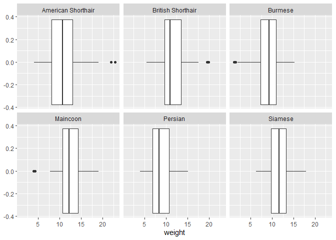

R For Data Sciences - Exercises
================
Hans Franke
October 1, 2020

``` r
library(tidyverse)
```

    ## -- Attaching packages ------------------------------------------------------------------------------------------------------------------------ tidyverse 1.3.0 --

    ## v ggplot2 3.3.2     v purrr   0.3.4
    ## v tibble  3.0.3     v dplyr   1.0.2
    ## v tidyr   1.1.2     v stringr 1.4.0
    ## v readr   1.3.1     v forcats 0.5.0

    ## -- Conflicts --------------------------------------------------------------------------------------------------------------------------- tidyverse_conflicts() --
    ## x dplyr::filter() masks stats::filter()
    ## x dplyr::lag()    masks stats::lag()

``` r
library(ISLR)
```

# 1\. Read Data

``` r
#loading dataset + analysing the file
dat <- read.csv('vet.data.csv')
head(dat)
```

    ##   clinic client   type gen_age   breed food_quality     area value2017
    ## 1      1      1 weight    F_15 Persian           II suburban       7.8
    ## 2      1      1    BMI    F_15 Persian           II suburban      26.0
    ## 3      1      2 weight    M_10 Persian           II suburban      13.7
    ## 4      1      2    BMI    M_10 Persian           II suburban      35.0
    ## 5      1      3 weight    F_14 Burmese           II suburban       6.3
    ## 6      1      3    BMI    F_14 Burmese           II suburban      24.0
    ##   value2018
    ## 1       8.0
    ## 2      22.0
    ## 3      14.6
    ## 4      30.0
    ## 5       6.6
    ## 6      20.0

# 2\. List the thing that need to be changed to make this dataset tidy, it may help to draw out a tidy format on a piece of paper.

  - Weight and BMI are 2 variables -\> there should be a column for
    weight and one for BMI

  - There are 2 observations per client (2017 & 2018) -\> each year
    should get its own row, year should be a variable (with its own
    column) to indicate wheter the row displays observations mage in
    2017 or 2018.

  - Gen\_age is a column where two pieces of information (gender and
    age) share a cell, these should be splitted up into two different
    columns.

# 3\. Use ‘pivot\_longer()’ to restructure the data such that the data from 2017 and 2018 are no longer in two different columns, but with year as a variable indicating when the data is collected. You can use ‘mutate()’ in combination with ‘str\_remove()’ to get rid of the ‘value’ part.

``` r
dat <- dat %>% 
  pivot_longer(cols = c(value2017, value2018), names_to = 'year', values_to = 'count') %>% 
  mutate(year = str_remove(year, "value"))

head(dat)
```

    ## # A tibble: 6 x 9
    ##   clinic client type   gen_age breed   food_quality area     year  count
    ##    <int>  <int> <chr>  <chr>   <chr>   <chr>        <chr>    <chr> <dbl>
    ## 1      1      1 weight F_15    Persian II           suburban 2017    7.8
    ## 2      1      1 weight F_15    Persian II           suburban 2018    8  
    ## 3      1      1 BMI    F_15    Persian II           suburban 2017   26  
    ## 4      1      1 BMI    F_15    Persian II           suburban 2018   22  
    ## 5      1      2 weight M_10    Persian II           suburban 2017   13.7
    ## 6      1      2 weight M_10    Persian II           suburban 2018   14.6

# 4\. Use ‘pivot\_wider’ to restructure the data so that weight and BMI get their own column.

``` r
dat <- dat %>% 
  pivot_wider(names_from = type, values_from = count)

head(dat)
```

    ## # A tibble: 6 x 9
    ##   clinic client gen_age breed   food_quality area     year  weight   BMI
    ##    <int>  <int> <chr>   <chr>   <chr>        <chr>    <chr>  <dbl> <dbl>
    ## 1      1      1 F_15    Persian II           suburban 2017     7.8    26
    ## 2      1      1 F_15    Persian II           suburban 2018     8      22
    ## 3      1      2 M_10    Persian II           suburban 2017    13.7    35
    ## 4      1      2 M_10    Persian II           suburban 2018    14.6    30
    ## 5      1      3 F_14    Burmese II           suburban 2017     6.3    24
    ## 6      1      3 F_14    Burmese II           suburban 2018     6.6    20

# 5\. Use ‘separate()’ to make a separate cloumn for age and one for gender.

``` r
dat <- dat %>% 
  separate(col = gen_age, into = c('gender', 'age'))

head(dat)
```

    ## # A tibble: 6 x 10
    ##   clinic client gender age   breed   food_quality area     year  weight   BMI
    ##    <int>  <int> <chr>  <chr> <chr>   <chr>        <chr>    <chr>  <dbl> <dbl>
    ## 1      1      1 F      15    Persian II           suburban 2017     7.8    26
    ## 2      1      1 F      15    Persian II           suburban 2018     8      22
    ## 3      1      2 M      10    Persian II           suburban 2017    13.7    35
    ## 4      1      2 M      10    Persian II           suburban 2018    14.6    30
    ## 5      1      3 F      14    Burmese II           suburban 2017     6.3    24
    ## 6      1      3 F      14    Burmese II           suburban 2018     6.6    20

# 6\. Check whether each row in this dataset has a unique identifier, if not, assign one. Tip: ‘unite()’ can be usefull if you want to combine information from two different cells into one cell.

``` r
dat <- dat %>% 
  unite(col = ID, clinic, client, remove = FALSE)

head(dat)
```

    ## # A tibble: 6 x 11
    ##   ID    clinic client gender age   breed  food_quality area   year  weight   BMI
    ##   <chr>  <int>  <int> <chr>  <chr> <chr>  <chr>        <chr>  <chr>  <dbl> <dbl>
    ## 1 1_1        1      1 F      15    Persi~ II           subur~ 2017     7.8    26
    ## 2 1_1        1      1 F      15    Persi~ II           subur~ 2018     8      22
    ## 3 1_2        1      2 M      10    Persi~ II           subur~ 2017    13.7    35
    ## 4 1_2        1      2 M      10    Persi~ II           subur~ 2018    14.6    30
    ## 5 1_3        1      3 F      14    Burme~ II           subur~ 2017     6.3    24
    ## 6 1_3        1      3 F      14    Burme~ II           subur~ 2018     6.6    20

# 8\. Reload the data and tidy it again, but now using pipes.

``` r
dat <- read.csv('vet.data.csv')

dat <- dat %>% 
  pivot_longer(cols = c(value2017, value2018), names_to = 'year', values_to = 'count') %>% 
  mutate(year = str_remove(year, "value")) %>% 
  pivot_wider(names_from = type, values_from = count) %>% 
  separate(col = gen_age, into = c('gender', 'age')) %>% 
  unite(col = ID, clinic, client, remove = FALSE) %>% 
  mutate(age = as.numeric(age))
```

# 9\. Visualise the distribution of breed, food quality and and area.

``` r
ggplot(dat, aes(breed)) + 
  geom_bar() + theme_minimal()
```

<!-- -->

``` r
ggplot(dat, aes(food_quality)) + 
  geom_bar() + theme_minimal()
```

<!-- -->

``` r
ggplot(dat, aes(area)) + 
  geom_bar() + theme_minimal()
```

<!-- -->

# 10\. Visualise the distribution of weight, conditional on breed using ‘facet\_wrap()’.

``` r
ggplot(dat, aes(weight)) + 
  geom_histogram() +
  facet_wrap(~breed)
```

    ## `stat_bin()` using `bins = 30`. Pick better value with `binwidth`.

<!-- -->

# 11\. Use ‘geom\_boxplot()’ in combination with ‘facet\_wrap()’ to check if there are any outliers in the data.

``` r
ggplot(dat, aes(weight)) + 
  geom_boxplot() +
  facet_wrap(~breed)
```

<!-- -->

``` r
  theme_minimal()
```

    ## List of 93
    ##  $ line                      :List of 6
    ##   ..$ colour       : chr "black"
    ##   ..$ size         : num 0.5
    ##   ..$ linetype     : num 1
    ##   ..$ lineend      : chr "butt"
    ##   ..$ arrow        : logi FALSE
    ##   ..$ inherit.blank: logi TRUE
    ##   ..- attr(*, "class")= chr [1:2] "element_line" "element"
    ##  $ rect                      :List of 5
    ##   ..$ fill         : chr "white"
    ##   ..$ colour       : chr "black"
    ##   ..$ size         : num 0.5
    ##   ..$ linetype     : num 1
    ##   ..$ inherit.blank: logi TRUE
    ##   ..- attr(*, "class")= chr [1:2] "element_rect" "element"
    ##  $ text                      :List of 11
    ##   ..$ family       : chr ""
    ##   ..$ face         : chr "plain"
    ##   ..$ colour       : chr "black"
    ##   ..$ size         : num 11
    ##   ..$ hjust        : num 0.5
    ##   ..$ vjust        : num 0.5
    ##   ..$ angle        : num 0
    ##   ..$ lineheight   : num 0.9
    ##   ..$ margin       : 'margin' num [1:4] 0points 0points 0points 0points
    ##   .. ..- attr(*, "unit")= int 8
    ##   ..$ debug        : logi FALSE
    ##   ..$ inherit.blank: logi TRUE
    ##   ..- attr(*, "class")= chr [1:2] "element_text" "element"
    ##  $ title                     : NULL
    ##  $ aspect.ratio              : NULL
    ##  $ axis.title                : NULL
    ##  $ axis.title.x              :List of 11
    ##   ..$ family       : NULL
    ##   ..$ face         : NULL
    ##   ..$ colour       : NULL
    ##   ..$ size         : NULL
    ##   ..$ hjust        : NULL
    ##   ..$ vjust        : num 1
    ##   ..$ angle        : NULL
    ##   ..$ lineheight   : NULL
    ##   ..$ margin       : 'margin' num [1:4] 2.75points 0points 0points 0points
    ##   .. ..- attr(*, "unit")= int 8
    ##   ..$ debug        : NULL
    ##   ..$ inherit.blank: logi TRUE
    ##   ..- attr(*, "class")= chr [1:2] "element_text" "element"
    ##  $ axis.title.x.top          :List of 11
    ##   ..$ family       : NULL
    ##   ..$ face         : NULL
    ##   ..$ colour       : NULL
    ##   ..$ size         : NULL
    ##   ..$ hjust        : NULL
    ##   ..$ vjust        : num 0
    ##   ..$ angle        : NULL
    ##   ..$ lineheight   : NULL
    ##   ..$ margin       : 'margin' num [1:4] 0points 0points 2.75points 0points
    ##   .. ..- attr(*, "unit")= int 8
    ##   ..$ debug        : NULL
    ##   ..$ inherit.blank: logi TRUE
    ##   ..- attr(*, "class")= chr [1:2] "element_text" "element"
    ##  $ axis.title.x.bottom       : NULL
    ##  $ axis.title.y              :List of 11
    ##   ..$ family       : NULL
    ##   ..$ face         : NULL
    ##   ..$ colour       : NULL
    ##   ..$ size         : NULL
    ##   ..$ hjust        : NULL
    ##   ..$ vjust        : num 1
    ##   ..$ angle        : num 90
    ##   ..$ lineheight   : NULL
    ##   ..$ margin       : 'margin' num [1:4] 0points 2.75points 0points 0points
    ##   .. ..- attr(*, "unit")= int 8
    ##   ..$ debug        : NULL
    ##   ..$ inherit.blank: logi TRUE
    ##   ..- attr(*, "class")= chr [1:2] "element_text" "element"
    ##  $ axis.title.y.left         : NULL
    ##  $ axis.title.y.right        :List of 11
    ##   ..$ family       : NULL
    ##   ..$ face         : NULL
    ##   ..$ colour       : NULL
    ##   ..$ size         : NULL
    ##   ..$ hjust        : NULL
    ##   ..$ vjust        : num 0
    ##   ..$ angle        : num -90
    ##   ..$ lineheight   : NULL
    ##   ..$ margin       : 'margin' num [1:4] 0points 0points 0points 2.75points
    ##   .. ..- attr(*, "unit")= int 8
    ##   ..$ debug        : NULL
    ##   ..$ inherit.blank: logi TRUE
    ##   ..- attr(*, "class")= chr [1:2] "element_text" "element"
    ##  $ axis.text                 :List of 11
    ##   ..$ family       : NULL
    ##   ..$ face         : NULL
    ##   ..$ colour       : chr "grey30"
    ##   ..$ size         : 'rel' num 0.8
    ##   ..$ hjust        : NULL
    ##   ..$ vjust        : NULL
    ##   ..$ angle        : NULL
    ##   ..$ lineheight   : NULL
    ##   ..$ margin       : NULL
    ##   ..$ debug        : NULL
    ##   ..$ inherit.blank: logi TRUE
    ##   ..- attr(*, "class")= chr [1:2] "element_text" "element"
    ##  $ axis.text.x               :List of 11
    ##   ..$ family       : NULL
    ##   ..$ face         : NULL
    ##   ..$ colour       : NULL
    ##   ..$ size         : NULL
    ##   ..$ hjust        : NULL
    ##   ..$ vjust        : num 1
    ##   ..$ angle        : NULL
    ##   ..$ lineheight   : NULL
    ##   ..$ margin       : 'margin' num [1:4] 2.2points 0points 0points 0points
    ##   .. ..- attr(*, "unit")= int 8
    ##   ..$ debug        : NULL
    ##   ..$ inherit.blank: logi TRUE
    ##   ..- attr(*, "class")= chr [1:2] "element_text" "element"
    ##  $ axis.text.x.top           :List of 11
    ##   ..$ family       : NULL
    ##   ..$ face         : NULL
    ##   ..$ colour       : NULL
    ##   ..$ size         : NULL
    ##   ..$ hjust        : NULL
    ##   ..$ vjust        : num 0
    ##   ..$ angle        : NULL
    ##   ..$ lineheight   : NULL
    ##   ..$ margin       : 'margin' num [1:4] 0points 0points 2.2points 0points
    ##   .. ..- attr(*, "unit")= int 8
    ##   ..$ debug        : NULL
    ##   ..$ inherit.blank: logi TRUE
    ##   ..- attr(*, "class")= chr [1:2] "element_text" "element"
    ##  $ axis.text.x.bottom        : NULL
    ##  $ axis.text.y               :List of 11
    ##   ..$ family       : NULL
    ##   ..$ face         : NULL
    ##   ..$ colour       : NULL
    ##   ..$ size         : NULL
    ##   ..$ hjust        : num 1
    ##   ..$ vjust        : NULL
    ##   ..$ angle        : NULL
    ##   ..$ lineheight   : NULL
    ##   ..$ margin       : 'margin' num [1:4] 0points 2.2points 0points 0points
    ##   .. ..- attr(*, "unit")= int 8
    ##   ..$ debug        : NULL
    ##   ..$ inherit.blank: logi TRUE
    ##   ..- attr(*, "class")= chr [1:2] "element_text" "element"
    ##  $ axis.text.y.left          : NULL
    ##  $ axis.text.y.right         :List of 11
    ##   ..$ family       : NULL
    ##   ..$ face         : NULL
    ##   ..$ colour       : NULL
    ##   ..$ size         : NULL
    ##   ..$ hjust        : num 0
    ##   ..$ vjust        : NULL
    ##   ..$ angle        : NULL
    ##   ..$ lineheight   : NULL
    ##   ..$ margin       : 'margin' num [1:4] 0points 0points 0points 2.2points
    ##   .. ..- attr(*, "unit")= int 8
    ##   ..$ debug        : NULL
    ##   ..$ inherit.blank: logi TRUE
    ##   ..- attr(*, "class")= chr [1:2] "element_text" "element"
    ##  $ axis.ticks                : list()
    ##   ..- attr(*, "class")= chr [1:2] "element_blank" "element"
    ##  $ axis.ticks.x              : NULL
    ##  $ axis.ticks.x.top          : NULL
    ##  $ axis.ticks.x.bottom       : NULL
    ##  $ axis.ticks.y              : NULL
    ##  $ axis.ticks.y.left         : NULL
    ##  $ axis.ticks.y.right        : NULL
    ##  $ axis.ticks.length         : 'simpleUnit' num 2.75points
    ##   ..- attr(*, "unit")= int 8
    ##  $ axis.ticks.length.x       : NULL
    ##  $ axis.ticks.length.x.top   : NULL
    ##  $ axis.ticks.length.x.bottom: NULL
    ##  $ axis.ticks.length.y       : NULL
    ##  $ axis.ticks.length.y.left  : NULL
    ##  $ axis.ticks.length.y.right : NULL
    ##  $ axis.line                 : list()
    ##   ..- attr(*, "class")= chr [1:2] "element_blank" "element"
    ##  $ axis.line.x               : NULL
    ##  $ axis.line.x.top           : NULL
    ##  $ axis.line.x.bottom        : NULL
    ##  $ axis.line.y               : NULL
    ##  $ axis.line.y.left          : NULL
    ##  $ axis.line.y.right         : NULL
    ##  $ legend.background         : list()
    ##   ..- attr(*, "class")= chr [1:2] "element_blank" "element"
    ##  $ legend.margin             : 'margin' num [1:4] 5.5points 5.5points 5.5points 5.5points
    ##   ..- attr(*, "unit")= int 8
    ##  $ legend.spacing            : 'simpleUnit' num 11points
    ##   ..- attr(*, "unit")= int 8
    ##  $ legend.spacing.x          : NULL
    ##  $ legend.spacing.y          : NULL
    ##  $ legend.key                : list()
    ##   ..- attr(*, "class")= chr [1:2] "element_blank" "element"
    ##  $ legend.key.size           : 'simpleUnit' num 1.2lines
    ##   ..- attr(*, "unit")= int 3
    ##  $ legend.key.height         : NULL
    ##  $ legend.key.width          : NULL
    ##  $ legend.text               :List of 11
    ##   ..$ family       : NULL
    ##   ..$ face         : NULL
    ##   ..$ colour       : NULL
    ##   ..$ size         : 'rel' num 0.8
    ##   ..$ hjust        : NULL
    ##   ..$ vjust        : NULL
    ##   ..$ angle        : NULL
    ##   ..$ lineheight   : NULL
    ##   ..$ margin       : NULL
    ##   ..$ debug        : NULL
    ##   ..$ inherit.blank: logi TRUE
    ##   ..- attr(*, "class")= chr [1:2] "element_text" "element"
    ##  $ legend.text.align         : NULL
    ##  $ legend.title              :List of 11
    ##   ..$ family       : NULL
    ##   ..$ face         : NULL
    ##   ..$ colour       : NULL
    ##   ..$ size         : NULL
    ##   ..$ hjust        : num 0
    ##   ..$ vjust        : NULL
    ##   ..$ angle        : NULL
    ##   ..$ lineheight   : NULL
    ##   ..$ margin       : NULL
    ##   ..$ debug        : NULL
    ##   ..$ inherit.blank: logi TRUE
    ##   ..- attr(*, "class")= chr [1:2] "element_text" "element"
    ##  $ legend.title.align        : NULL
    ##  $ legend.position           : chr "right"
    ##  $ legend.direction          : NULL
    ##  $ legend.justification      : chr "center"
    ##  $ legend.box                : NULL
    ##  $ legend.box.just           : NULL
    ##  $ legend.box.margin         : 'margin' num [1:4] 0cm 0cm 0cm 0cm
    ##   ..- attr(*, "unit")= int 1
    ##  $ legend.box.background     : list()
    ##   ..- attr(*, "class")= chr [1:2] "element_blank" "element"
    ##  $ legend.box.spacing        : 'simpleUnit' num 11points
    ##   ..- attr(*, "unit")= int 8
    ##  $ panel.background          : list()
    ##   ..- attr(*, "class")= chr [1:2] "element_blank" "element"
    ##  $ panel.border              : list()
    ##   ..- attr(*, "class")= chr [1:2] "element_blank" "element"
    ##  $ panel.spacing             : 'simpleUnit' num 5.5points
    ##   ..- attr(*, "unit")= int 8
    ##  $ panel.spacing.x           : NULL
    ##  $ panel.spacing.y           : NULL
    ##  $ panel.grid                :List of 6
    ##   ..$ colour       : chr "grey92"
    ##   ..$ size         : NULL
    ##   ..$ linetype     : NULL
    ##   ..$ lineend      : NULL
    ##   ..$ arrow        : logi FALSE
    ##   ..$ inherit.blank: logi TRUE
    ##   ..- attr(*, "class")= chr [1:2] "element_line" "element"
    ##  $ panel.grid.major          : NULL
    ##  $ panel.grid.minor          :List of 6
    ##   ..$ colour       : NULL
    ##   ..$ size         : 'rel' num 0.5
    ##   ..$ linetype     : NULL
    ##   ..$ lineend      : NULL
    ##   ..$ arrow        : logi FALSE
    ##   ..$ inherit.blank: logi TRUE
    ##   ..- attr(*, "class")= chr [1:2] "element_line" "element"
    ##  $ panel.grid.major.x        : NULL
    ##  $ panel.grid.major.y        : NULL
    ##  $ panel.grid.minor.x        : NULL
    ##  $ panel.grid.minor.y        : NULL
    ##  $ panel.ontop               : logi FALSE
    ##  $ plot.background           : list()
    ##   ..- attr(*, "class")= chr [1:2] "element_blank" "element"
    ##  $ plot.title                :List of 11
    ##   ..$ family       : NULL
    ##   ..$ face         : NULL
    ##   ..$ colour       : NULL
    ##   ..$ size         : 'rel' num 1.2
    ##   ..$ hjust        : num 0
    ##   ..$ vjust        : num 1
    ##   ..$ angle        : NULL
    ##   ..$ lineheight   : NULL
    ##   ..$ margin       : 'margin' num [1:4] 0points 0points 5.5points 0points
    ##   .. ..- attr(*, "unit")= int 8
    ##   ..$ debug        : NULL
    ##   ..$ inherit.blank: logi TRUE
    ##   ..- attr(*, "class")= chr [1:2] "element_text" "element"
    ##  $ plot.title.position       : chr "panel"
    ##  $ plot.subtitle             :List of 11
    ##   ..$ family       : NULL
    ##   ..$ face         : NULL
    ##   ..$ colour       : NULL
    ##   ..$ size         : NULL
    ##   ..$ hjust        : num 0
    ##   ..$ vjust        : num 1
    ##   ..$ angle        : NULL
    ##   ..$ lineheight   : NULL
    ##   ..$ margin       : 'margin' num [1:4] 0points 0points 5.5points 0points
    ##   .. ..- attr(*, "unit")= int 8
    ##   ..$ debug        : NULL
    ##   ..$ inherit.blank: logi TRUE
    ##   ..- attr(*, "class")= chr [1:2] "element_text" "element"
    ##  $ plot.caption              :List of 11
    ##   ..$ family       : NULL
    ##   ..$ face         : NULL
    ##   ..$ colour       : NULL
    ##   ..$ size         : 'rel' num 0.8
    ##   ..$ hjust        : num 1
    ##   ..$ vjust        : num 1
    ##   ..$ angle        : NULL
    ##   ..$ lineheight   : NULL
    ##   ..$ margin       : 'margin' num [1:4] 5.5points 0points 0points 0points
    ##   .. ..- attr(*, "unit")= int 8
    ##   ..$ debug        : NULL
    ##   ..$ inherit.blank: logi TRUE
    ##   ..- attr(*, "class")= chr [1:2] "element_text" "element"
    ##  $ plot.caption.position     : chr "panel"
    ##  $ plot.tag                  :List of 11
    ##   ..$ family       : NULL
    ##   ..$ face         : NULL
    ##   ..$ colour       : NULL
    ##   ..$ size         : 'rel' num 1.2
    ##   ..$ hjust        : num 0.5
    ##   ..$ vjust        : num 0.5
    ##   ..$ angle        : NULL
    ##   ..$ lineheight   : NULL
    ##   ..$ margin       : NULL
    ##   ..$ debug        : NULL
    ##   ..$ inherit.blank: logi TRUE
    ##   ..- attr(*, "class")= chr [1:2] "element_text" "element"
    ##  $ plot.tag.position         : chr "topleft"
    ##  $ plot.margin               : 'margin' num [1:4] 5.5points 5.5points 5.5points 5.5points
    ##   ..- attr(*, "unit")= int 8
    ##  $ strip.background          : list()
    ##   ..- attr(*, "class")= chr [1:2] "element_blank" "element"
    ##  $ strip.background.x        : NULL
    ##  $ strip.background.y        : NULL
    ##  $ strip.placement           : chr "inside"
    ##  $ strip.text                :List of 11
    ##   ..$ family       : NULL
    ##   ..$ face         : NULL
    ##   ..$ colour       : chr "grey10"
    ##   ..$ size         : 'rel' num 0.8
    ##   ..$ hjust        : NULL
    ##   ..$ vjust        : NULL
    ##   ..$ angle        : NULL
    ##   ..$ lineheight   : NULL
    ##   ..$ margin       : 'margin' num [1:4] 4.4points 4.4points 4.4points 4.4points
    ##   .. ..- attr(*, "unit")= int 8
    ##   ..$ debug        : NULL
    ##   ..$ inherit.blank: logi TRUE
    ##   ..- attr(*, "class")= chr [1:2] "element_text" "element"
    ##  $ strip.text.x              : NULL
    ##  $ strip.text.y              :List of 11
    ##   ..$ family       : NULL
    ##   ..$ face         : NULL
    ##   ..$ colour       : NULL
    ##   ..$ size         : NULL
    ##   ..$ hjust        : NULL
    ##   ..$ vjust        : NULL
    ##   ..$ angle        : num -90
    ##   ..$ lineheight   : NULL
    ##   ..$ margin       : NULL
    ##   ..$ debug        : NULL
    ##   ..$ inherit.blank: logi TRUE
    ##   ..- attr(*, "class")= chr [1:2] "element_text" "element"
    ##  $ strip.switch.pad.grid     : 'simpleUnit' num 2.75points
    ##   ..- attr(*, "unit")= int 8
    ##  $ strip.switch.pad.wrap     : 'simpleUnit' num 2.75points
    ##   ..- attr(*, "unit")= int 8
    ##  $ strip.text.y.left         :List of 11
    ##   ..$ family       : NULL
    ##   ..$ face         : NULL
    ##   ..$ colour       : NULL
    ##   ..$ size         : NULL
    ##   ..$ hjust        : NULL
    ##   ..$ vjust        : NULL
    ##   ..$ angle        : num 90
    ##   ..$ lineheight   : NULL
    ##   ..$ margin       : NULL
    ##   ..$ debug        : NULL
    ##   ..$ inherit.blank: logi TRUE
    ##   ..- attr(*, "class")= chr [1:2] "element_text" "element"
    ##  - attr(*, "class")= chr [1:2] "theme" "gg"
    ##  - attr(*, "complete")= logi TRUE
    ##  - attr(*, "validate")= logi TRUE

# 12\. Assume that weights below 3 lbs or above 20 lbs are the result of a mistake made at the data input, replace these values with NA. Which cases are affected by this decision?

``` r
# need to select in which ID`s
dat %>%
  filter(weight <3 | weight >20) %>%
  select(ID)
```

    ## # A tibble: 11 x 1
    ##    ID   
    ##    <chr>
    ##  1 4_20 
    ##  2 4_20 
    ##  3 5_16 
    ##  4 7_16 
    ##  5 7_16 
    ##  6 9_12 
    ##  7 9_12 
    ##  8 13_17
    ##  9 13_17
    ## 10 17_20
    ## 11 17_20

``` r
# Filtering all cases with a weight between 3 and 20 lbs.
dat <- dat %>% 
  mutate(weight = replace(weight, weight < 3, NA)) %>% 
  mutate(weight = replace(weight, weight > 20, NA))
```

# 13\. What is the mean weight for each breed? Use ‘group\_by()’ in combination with ‘summarise()’.

``` r
dat %>%
  group_by(breed) %>%
  summarise( mean = mean(weight, na.rm = TRUE))
```

    ## `summarise()` ungrouping output (override with `.groups` argument)

    ## # A tibble: 6 x 2
    ##   breed               mean
    ##   <chr>              <dbl>
    ## 1 American Shorthair 10.5 
    ## 2 British Shorthair  11.5 
    ## 3 Burmese             9.50
    ## 4 Maincoon           12.3 
    ## 5 Persian             8.87
    ## 6 Siamese            11.8

# 14\. Visualise the relationship between age and weight, add a regressionline to your plot using ‘geom\_smooth()’. Are weight and age related?

``` r
ggplot(dat, aes(age, weight)) +
  geom_point() +
  geom_smooth()+
  theme_minimal()
```

    ## `geom_smooth()` using method = 'loess' and formula 'y ~ x'

    ## Warning: Removed 11 rows containing non-finite values (stat_smooth).

    ## Warning: Removed 11 rows containing missing values (geom_point).

<!-- -->

# 15\. Use ‘facet\_grid()’ make the same visualisation, but now conditioning on breed and area. How does this alter your conclusion?

``` r
ggplot(dat, aes(age, weight)) +
  geom_point() +
  geom_smooth()+
  theme_minimal()+
  facet_grid(breed ~ area)
```

    ## `geom_smooth()` using method = 'loess' and formula 'y ~ x'

    ## Warning: Removed 11 rows containing non-finite values (stat_smooth).

    ## Warning: Removed 11 rows containing missing values (geom_point).

<!-- -->

# 16\. Based on the visualisations made for question 15 and 16, can you draw the conclusion that individual cats don’t weigh more as they get older? Explain your answer.

No, you can’t. Even though there is no clear correlation between weight
and age on group level (all cats), this doesn’t mean that there is no
relation between age and weight on an individual level (1 cat). Deducing
inferences about the individual from inferences about the group is known
under the term *ecological fallacy*.

# 17\. To get an idea if cats tend to weigh more as they get older on an individual level, you could compare the weight of each cat in 2017 and 2018 on an individual level. In how many percent of the cases did cats gain weight over the year?

``` r
mean(dat %>% 
  filter(year == 2017) %>% 
  select(weight) <
    dat %>% 
      filter(year == 2018) %>% 
      select(weight), na.rm = TRUE) 
```

    ## [1] 0.8781726

``` r
w_2017 <- dat %>% 
  filter(year == 2017) %>% 
  select(weight, year) 

w_2018 <- dat %>% 
  filter(year == 2018) %>% 
  select(weight, year) 

ggplot(w_2017, aes(year, weight)) + geom_boxplot() + geom_boxplot(data = w_2018, aes(year, weight))
```

    ## Warning: Removed 6 rows containing non-finite values (stat_boxplot).

    ## Warning: Removed 5 rows containing non-finite values (stat_boxplot).

<!-- -->
