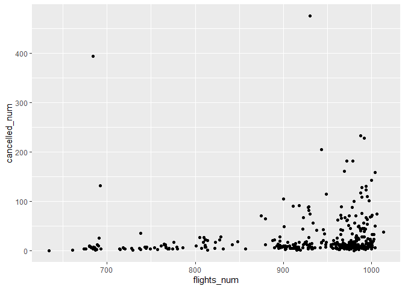
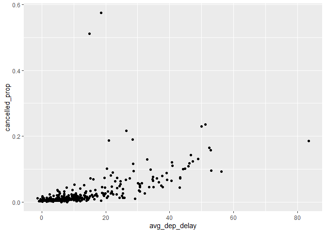

R For Data Sciences - Exercises
================
Hans Franke
September 30, 2020

``` r
library("nycflights13")
library("tidyverse")
```

    ## -- Attaching packages ---------------------------------------------------------------- tidyverse 1.3.0 --

    ## v ggplot2 3.3.2     v purrr   0.3.4
    ## v tibble  3.0.3     v dplyr   1.0.2
    ## v tidyr   1.1.2     v stringr 1.4.0
    ## v readr   1.3.1     v forcats 0.5.0

    ## -- Conflicts ------------------------------------------------------------------- tidyverse_conflicts() --
    ## x dplyr::filter() masks stats::filter()
    ## x dplyr::lag()    masks stats::lag()

# 5.2: Filter

## 5.2.4

Find all flights that

Had an arrival delay of two or more hours

``` r
  filter(flights, arr_delay >=120)
```

    ## # A tibble: 10,200 x 19
    ##     year month   day dep_time sched_dep_time dep_delay arr_time sched_arr_time
    ##    <int> <int> <int>    <int>          <int>     <dbl>    <int>          <int>
    ##  1  2013     1     1      811            630       101     1047            830
    ##  2  2013     1     1      848           1835       853     1001           1950
    ##  3  2013     1     1      957            733       144     1056            853
    ##  4  2013     1     1     1114            900       134     1447           1222
    ##  5  2013     1     1     1505           1310       115     1638           1431
    ##  6  2013     1     1     1525           1340       105     1831           1626
    ##  7  2013     1     1     1549           1445        64     1912           1656
    ##  8  2013     1     1     1558           1359       119     1718           1515
    ##  9  2013     1     1     1732           1630        62     2028           1825
    ## 10  2013     1     1     1803           1620       103     2008           1750
    ## # ... with 10,190 more rows, and 11 more variables: arr_delay <dbl>,
    ## #   carrier <chr>, flight <int>, tailnum <chr>, origin <chr>, dest <chr>,
    ## #   air_time <dbl>, distance <dbl>, hour <dbl>, minute <dbl>, time_hour <dttm>

Flew to Houston (IAH or HOU)

``` r
  filter(flights, dest == "IAH" | dest == "HOU")
```

    ## # A tibble: 9,313 x 19
    ##     year month   day dep_time sched_dep_time dep_delay arr_time sched_arr_time
    ##    <int> <int> <int>    <int>          <int>     <dbl>    <int>          <int>
    ##  1  2013     1     1      517            515         2      830            819
    ##  2  2013     1     1      533            529         4      850            830
    ##  3  2013     1     1      623            627        -4      933            932
    ##  4  2013     1     1      728            732        -4     1041           1038
    ##  5  2013     1     1      739            739         0     1104           1038
    ##  6  2013     1     1      908            908         0     1228           1219
    ##  7  2013     1     1     1028           1026         2     1350           1339
    ##  8  2013     1     1     1044           1045        -1     1352           1351
    ##  9  2013     1     1     1114            900       134     1447           1222
    ## 10  2013     1     1     1205           1200         5     1503           1505
    ## # ... with 9,303 more rows, and 11 more variables: arr_delay <dbl>,
    ## #   carrier <chr>, flight <int>, tailnum <chr>, origin <chr>, dest <chr>,
    ## #   air_time <dbl>, distance <dbl>, hour <dbl>, minute <dbl>, time_hour <dttm>

Were operated by United, American, or Delta

``` r
filter(flights, carrier %in% c("AA", "DL", "UA"))
```

    ## # A tibble: 139,504 x 19
    ##     year month   day dep_time sched_dep_time dep_delay arr_time sched_arr_time
    ##    <int> <int> <int>    <int>          <int>     <dbl>    <int>          <int>
    ##  1  2013     1     1      517            515         2      830            819
    ##  2  2013     1     1      533            529         4      850            830
    ##  3  2013     1     1      542            540         2      923            850
    ##  4  2013     1     1      554            600        -6      812            837
    ##  5  2013     1     1      554            558        -4      740            728
    ##  6  2013     1     1      558            600        -2      753            745
    ##  7  2013     1     1      558            600        -2      924            917
    ##  8  2013     1     1      558            600        -2      923            937
    ##  9  2013     1     1      559            600        -1      941            910
    ## 10  2013     1     1      559            600        -1      854            902
    ## # ... with 139,494 more rows, and 11 more variables: arr_delay <dbl>,
    ## #   carrier <chr>, flight <int>, tailnum <chr>, origin <chr>, dest <chr>,
    ## #   air_time <dbl>, distance <dbl>, hour <dbl>, minute <dbl>, time_hour <dttm>

Departed in summer (July, August, and September)

``` r
filter(flights, month >=7 & month <=9)
```

    ## # A tibble: 86,326 x 19
    ##     year month   day dep_time sched_dep_time dep_delay arr_time sched_arr_time
    ##    <int> <int> <int>    <int>          <int>     <dbl>    <int>          <int>
    ##  1  2013     7     1        1           2029       212      236           2359
    ##  2  2013     7     1        2           2359         3      344            344
    ##  3  2013     7     1       29           2245       104      151              1
    ##  4  2013     7     1       43           2130       193      322             14
    ##  5  2013     7     1       44           2150       174      300            100
    ##  6  2013     7     1       46           2051       235      304           2358
    ##  7  2013     7     1       48           2001       287      308           2305
    ##  8  2013     7     1       58           2155       183      335             43
    ##  9  2013     7     1      100           2146       194      327             30
    ## 10  2013     7     1      100           2245       135      337            135
    ## # ... with 86,316 more rows, and 11 more variables: arr_delay <dbl>,
    ## #   carrier <chr>, flight <int>, tailnum <chr>, origin <chr>, dest <chr>,
    ## #   air_time <dbl>, distance <dbl>, hour <dbl>, minute <dbl>, time_hour <dttm>

Arrived more than two hours late, but didn’t leave late

``` r
filter (flights, arr_delay > 120 & dep_delay <= 0 )
```

    ## # A tibble: 29 x 19
    ##     year month   day dep_time sched_dep_time dep_delay arr_time sched_arr_time
    ##    <int> <int> <int>    <int>          <int>     <dbl>    <int>          <int>
    ##  1  2013     1    27     1419           1420        -1     1754           1550
    ##  2  2013    10     7     1350           1350         0     1736           1526
    ##  3  2013    10     7     1357           1359        -2     1858           1654
    ##  4  2013    10    16      657            700        -3     1258           1056
    ##  5  2013    11     1      658            700        -2     1329           1015
    ##  6  2013     3    18     1844           1847        -3       39           2219
    ##  7  2013     4    17     1635           1640        -5     2049           1845
    ##  8  2013     4    18      558            600        -2     1149            850
    ##  9  2013     4    18      655            700        -5     1213            950
    ## 10  2013     5    22     1827           1830        -3     2217           2010
    ## # ... with 19 more rows, and 11 more variables: arr_delay <dbl>, carrier <chr>,
    ## #   flight <int>, tailnum <chr>, origin <chr>, dest <chr>, air_time <dbl>,
    ## #   distance <dbl>, hour <dbl>, minute <dbl>, time_hour <dttm>

Were delayed by at least an hour, but made up over 30 minutes in flight

``` r
filter(flights, dep_delay >= 60, dep_delay - arr_delay > 30)
```

    ## # A tibble: 1,844 x 19
    ##     year month   day dep_time sched_dep_time dep_delay arr_time sched_arr_time
    ##    <int> <int> <int>    <int>          <int>     <dbl>    <int>          <int>
    ##  1  2013     1     1     2205           1720       285       46           2040
    ##  2  2013     1     1     2326           2130       116      131             18
    ##  3  2013     1     3     1503           1221       162     1803           1555
    ##  4  2013     1     3     1839           1700        99     2056           1950
    ##  5  2013     1     3     1850           1745        65     2148           2120
    ##  6  2013     1     3     1941           1759       102     2246           2139
    ##  7  2013     1     3     1950           1845        65     2228           2227
    ##  8  2013     1     3     2015           1915        60     2135           2111
    ##  9  2013     1     3     2257           2000       177       45           2224
    ## 10  2013     1     4     1917           1700       137     2135           1950
    ## # ... with 1,834 more rows, and 11 more variables: arr_delay <dbl>,
    ## #   carrier <chr>, flight <int>, tailnum <chr>, origin <chr>, dest <chr>,
    ## #   air_time <dbl>, distance <dbl>, hour <dbl>, minute <dbl>, time_hour <dttm>

Departed between midnight and 6am (inclusive)

``` r
#look for midnight = 2400
summary(flights$dep_time)
```

    ##    Min. 1st Qu.  Median    Mean 3rd Qu.    Max.    NA's 
    ##       1     907    1401    1349    1744    2400    8255

``` r
filter(flights, dep_time <= 600 | dep_time == 2400)
```

    ## # A tibble: 9,373 x 19
    ##     year month   day dep_time sched_dep_time dep_delay arr_time sched_arr_time
    ##    <int> <int> <int>    <int>          <int>     <dbl>    <int>          <int>
    ##  1  2013     1     1      517            515         2      830            819
    ##  2  2013     1     1      533            529         4      850            830
    ##  3  2013     1     1      542            540         2      923            850
    ##  4  2013     1     1      544            545        -1     1004           1022
    ##  5  2013     1     1      554            600        -6      812            837
    ##  6  2013     1     1      554            558        -4      740            728
    ##  7  2013     1     1      555            600        -5      913            854
    ##  8  2013     1     1      557            600        -3      709            723
    ##  9  2013     1     1      557            600        -3      838            846
    ## 10  2013     1     1      558            600        -2      753            745
    ## # ... with 9,363 more rows, and 11 more variables: arr_delay <dbl>,
    ## #   carrier <chr>, flight <int>, tailnum <chr>, origin <chr>, dest <chr>,
    ## #   air_time <dbl>, distance <dbl>, hour <dbl>, minute <dbl>, time_hour <dttm>

Another useful dplyr filtering helper is between(). What does it do? Can
you use it to simplify the code needed to answer the previous
challenges?

``` r
# column, left, right
filter(flights, between(month, 7, 9))
```

    ## # A tibble: 86,326 x 19
    ##     year month   day dep_time sched_dep_time dep_delay arr_time sched_arr_time
    ##    <int> <int> <int>    <int>          <int>     <dbl>    <int>          <int>
    ##  1  2013     7     1        1           2029       212      236           2359
    ##  2  2013     7     1        2           2359         3      344            344
    ##  3  2013     7     1       29           2245       104      151              1
    ##  4  2013     7     1       43           2130       193      322             14
    ##  5  2013     7     1       44           2150       174      300            100
    ##  6  2013     7     1       46           2051       235      304           2358
    ##  7  2013     7     1       48           2001       287      308           2305
    ##  8  2013     7     1       58           2155       183      335             43
    ##  9  2013     7     1      100           2146       194      327             30
    ## 10  2013     7     1      100           2245       135      337            135
    ## # ... with 86,316 more rows, and 11 more variables: arr_delay <dbl>,
    ## #   carrier <chr>, flight <int>, tailnum <chr>, origin <chr>, dest <chr>,
    ## #   air_time <dbl>, distance <dbl>, hour <dbl>, minute <dbl>, time_hour <dttm>

How many flights have a missing dep\_time? What other variables are
missing? What might these rows represent?

``` r
filter(flights, is.na(dep_time))
```

    ## # A tibble: 8,255 x 19
    ##     year month   day dep_time sched_dep_time dep_delay arr_time sched_arr_time
    ##    <int> <int> <int>    <int>          <int>     <dbl>    <int>          <int>
    ##  1  2013     1     1       NA           1630        NA       NA           1815
    ##  2  2013     1     1       NA           1935        NA       NA           2240
    ##  3  2013     1     1       NA           1500        NA       NA           1825
    ##  4  2013     1     1       NA            600        NA       NA            901
    ##  5  2013     1     2       NA           1540        NA       NA           1747
    ##  6  2013     1     2       NA           1620        NA       NA           1746
    ##  7  2013     1     2       NA           1355        NA       NA           1459
    ##  8  2013     1     2       NA           1420        NA       NA           1644
    ##  9  2013     1     2       NA           1321        NA       NA           1536
    ## 10  2013     1     2       NA           1545        NA       NA           1910
    ## # ... with 8,245 more rows, and 11 more variables: arr_delay <dbl>,
    ## #   carrier <chr>, flight <int>, tailnum <chr>, origin <chr>, dest <chr>,
    ## #   air_time <dbl>, distance <dbl>, hour <dbl>, minute <dbl>, time_hour <dttm>

Why is NA ^ 0 not missing? Why is NA | TRUE not missing? Why is FALSE &
NA not missing? Can you figure out the general rule? (NA \* 0 is a
tricky counterexample\!)

*Answer: any number ^ 0 = 1, anything compare with OR True == True,
anything compare with & FALSE = FALSE*

# 5.3: Arrange

How could you use arrange() to sort all missing values to the start?
(Hint: use is.na()).

``` r
arrange(flights, desc(is.na(dep_time)), dep_time)
```

    ## # A tibble: 336,776 x 19
    ##     year month   day dep_time sched_dep_time dep_delay arr_time sched_arr_time
    ##    <int> <int> <int>    <int>          <int>     <dbl>    <int>          <int>
    ##  1  2013     1     1       NA           1630        NA       NA           1815
    ##  2  2013     1     1       NA           1935        NA       NA           2240
    ##  3  2013     1     1       NA           1500        NA       NA           1825
    ##  4  2013     1     1       NA            600        NA       NA            901
    ##  5  2013     1     2       NA           1540        NA       NA           1747
    ##  6  2013     1     2       NA           1620        NA       NA           1746
    ##  7  2013     1     2       NA           1355        NA       NA           1459
    ##  8  2013     1     2       NA           1420        NA       NA           1644
    ##  9  2013     1     2       NA           1321        NA       NA           1536
    ## 10  2013     1     2       NA           1545        NA       NA           1910
    ## # ... with 336,766 more rows, and 11 more variables: arr_delay <dbl>,
    ## #   carrier <chr>, flight <int>, tailnum <chr>, origin <chr>, dest <chr>,
    ## #   air_time <dbl>, distance <dbl>, hour <dbl>, minute <dbl>, time_hour <dttm>

Sort flights to find the most delayed flights. Find the flights that
left earliest.

``` r
arrange(flights, desc(dep_delay))
```

    ## # A tibble: 336,776 x 19
    ##     year month   day dep_time sched_dep_time dep_delay arr_time sched_arr_time
    ##    <int> <int> <int>    <int>          <int>     <dbl>    <int>          <int>
    ##  1  2013     1     9      641            900      1301     1242           1530
    ##  2  2013     6    15     1432           1935      1137     1607           2120
    ##  3  2013     1    10     1121           1635      1126     1239           1810
    ##  4  2013     9    20     1139           1845      1014     1457           2210
    ##  5  2013     7    22      845           1600      1005     1044           1815
    ##  6  2013     4    10     1100           1900       960     1342           2211
    ##  7  2013     3    17     2321            810       911      135           1020
    ##  8  2013     6    27      959           1900       899     1236           2226
    ##  9  2013     7    22     2257            759       898      121           1026
    ## 10  2013    12     5      756           1700       896     1058           2020
    ## # ... with 336,766 more rows, and 11 more variables: arr_delay <dbl>,
    ## #   carrier <chr>, flight <int>, tailnum <chr>, origin <chr>, dest <chr>,
    ## #   air_time <dbl>, distance <dbl>, hour <dbl>, minute <dbl>, time_hour <dttm>

Sort flights to find the fastest flights.

``` r
  arrange(flights, air_time)
```

    ## # A tibble: 336,776 x 19
    ##     year month   day dep_time sched_dep_time dep_delay arr_time sched_arr_time
    ##    <int> <int> <int>    <int>          <int>     <dbl>    <int>          <int>
    ##  1  2013     1    16     1355           1315        40     1442           1411
    ##  2  2013     4    13      537            527        10      622            628
    ##  3  2013    12     6      922            851        31     1021            954
    ##  4  2013     2     3     2153           2129        24     2247           2224
    ##  5  2013     2     5     1303           1315       -12     1342           1411
    ##  6  2013     2    12     2123           2130        -7     2211           2225
    ##  7  2013     3     2     1450           1500       -10     1547           1608
    ##  8  2013     3     8     2026           1935        51     2131           2056
    ##  9  2013     3    18     1456           1329        87     1533           1426
    ## 10  2013     3    19     2226           2145        41     2305           2246
    ## # ... with 336,766 more rows, and 11 more variables: arr_delay <dbl>,
    ## #   carrier <chr>, flight <int>, tailnum <chr>, origin <chr>, dest <chr>,
    ## #   air_time <dbl>, distance <dbl>, hour <dbl>, minute <dbl>, time_hour <dttm>

# 5.4: Select

What happens if you include the name of a variable multiple times in a
select() call?

``` r
#nothing happens, select ignores the duplicates values
head(select(flights, month, month))
```

    ## # A tibble: 6 x 1
    ##   month
    ##   <int>
    ## 1     1
    ## 2     1
    ## 3     1
    ## 4     1
    ## 5     1
    ## 6     1

What does the one\_of() function do? Why might it be helpful in
conjunction with this vector?

``` r
# it picks the columns that exists in dataframe, and ignore who dosen`t
head(select(flights, one_of(c("year", "month", "day", "dep_delay", "arr_delay", "hans"))))
```

    ## Warning: Unknown columns: `hans`

    ## # A tibble: 6 x 5
    ##    year month   day dep_delay arr_delay
    ##   <int> <int> <int>     <dbl>     <dbl>
    ## 1  2013     1     1         2        11
    ## 2  2013     1     1         4        20
    ## 3  2013     1     1         2        33
    ## 4  2013     1     1        -1       -18
    ## 5  2013     1     1        -6       -25
    ## 6  2013     1     1        -4        12

``` r
#default = IGNORE case, if u want to exact match use argument (ignore.case = FALSE)
head(select(flights, contains("TIME")))
```

    ## # A tibble: 6 x 6
    ##   dep_time sched_dep_time arr_time sched_arr_time air_time time_hour          
    ##      <int>          <int>    <int>          <int>    <dbl> <dttm>             
    ## 1      517            515      830            819      227 2013-01-01 05:00:00
    ## 2      533            529      850            830      227 2013-01-01 05:00:00
    ## 3      542            540      923            850      160 2013-01-01 05:00:00
    ## 4      544            545     1004           1022      183 2013-01-01 05:00:00
    ## 5      554            600      812            837      116 2013-01-01 06:00:00
    ## 6      554            558      740            728      150 2013-01-01 05:00:00

# 5.5: Mutate

Currently dep\_time and sched\_dep\_time are convenient to look at, but
hard to compute with because they’re not really continuous numbers.
Convert them to a more convenient representation of number of minutes
since midnight.

``` r
# First need to convert undestand (number 1504 is 15:04pm) so in other words we want to convert to minutes.

1504 %/% 100 * 60 + 1504 %% 100 
```

    ## [1] 904

``` r
 flights_mod <- mutate(flights, dep_time_mins = (dep_time %/% 100 * 60) + (dep_time %% 100))

 #select only this table
 head(select(flights_mod, dep_time, dep_time_mins))
```

    ## # A tibble: 6 x 2
    ##   dep_time dep_time_mins
    ##      <int>         <dbl>
    ## 1      517           317
    ## 2      533           333
    ## 3      542           342
    ## 4      544           344
    ## 5      554           354
    ## 6      554           354

Compare air\_time with arr\_time - dep\_time. What do you expect to see?
What do you see? What do you need to do to fix it?

``` r
flight_mod2 <- mutate(flights, air_time, air_time_new = arr_time - dep_time )

select(flight_mod2, air_time, arr_time, dep_time, air_time_new)
```

    ## # A tibble: 336,776 x 4
    ##    air_time arr_time dep_time air_time_new
    ##       <dbl>    <int>    <int>        <int>
    ##  1      227      830      517          313
    ##  2      227      850      533          317
    ##  3      160      923      542          381
    ##  4      183     1004      544          460
    ##  5      116      812      554          258
    ##  6      150      740      554          186
    ##  7      158      913      555          358
    ##  8       53      709      557          152
    ##  9      140      838      557          281
    ## 10      138      753      558          195
    ## # ... with 336,766 more rows

Compare dep\_time, sched\_dep\_time, and dep\_delay. How would you
expect those three numbers to be related?

Find the 10 most delayed flights using a ranking function. How do you
want to handle ties? Carefully read the documentation for min\_rank().

``` r
flights_delayed3 <- top_n(flights, 10, dep_delay)
flights_delayed3 <- arrange(flights_delayed3, desc(dep_delay))
select(flights_delayed3, month, day, carrier, flight, dep_delay)
```

    ## # A tibble: 10 x 5
    ##    month   day carrier flight dep_delay
    ##    <int> <int> <chr>    <int>     <dbl>
    ##  1     1     9 HA          51      1301
    ##  2     6    15 MQ        3535      1137
    ##  3     1    10 MQ        3695      1126
    ##  4     9    20 AA         177      1014
    ##  5     7    22 MQ        3075      1005
    ##  6     4    10 DL        2391       960
    ##  7     3    17 DL        2119       911
    ##  8     6    27 DL        2007       899
    ##  9     7    22 DL        2047       898
    ## 10    12     5 AA         172       896

What does 1:3 + 1:10 return? Why?

``` r
1:3 + 1:10
```

    ## Warning in 1:3 + 1:10: longer object length is not a multiple of shorter object
    ## length

    ##  [1]  2  4  6  5  7  9  8 10 12 11

``` r
# Operation is like;
c(1 + 1, 2 + 2, 3 + 3, 1 + 4, 2 + 5, 3 + 6, 1 + 7, 2 + 8, 3 + 9, 1 + 10)
```

    ##  [1]  2  4  6  5  7  9  8 10 12 11

What trigonometric functions does R provide?

*Answer:All trigonometric functions are all described in a single help
page, named Trig. You can open the documentation for these functions
with ?Trig or by using ? with any of the following functions, for
<example:?sin>.*

*R provides functions for the three primary trigonometric functions:
sine (sin()), cosine (cos()), and tangent (tan()). The input angles to
all these functions are in radians.*

5.6: grouped summaries

5.7: Grouped mutated (and filters)

``` r
flights %>% 
  group_by(dest) %>% 
  summarise(
    count = n(),
    dist = mean(distance, na.rm = TRUE),
    delay = mean(arr_delay, na.rm = TRUE)
  ) %>% 
  filter(count > 20, dest == "HNL")
```

    ## `summarise()` ungrouping output (override with `.groups` argument)

    ## # A tibble: 1 x 4
    ##   dest  count  dist delay
    ##   <chr> <int> <dbl> <dbl>
    ## 1 HNL     707 4973. -1.37

Brainstorm at least 5 different ways to assess the typical delay
characteristics of a group of flights. Consider the following scenarios:

  - A flight is 15 minutes early 50% of the time, and 15 minutes late
    50% of the time.

  - A flight is always 10 minutes late.

  - A flight is 30 minutes early 50% of the time, and 30 minutes late
    50% of the time.

  - 99% of the time a flight is on time. 1% of the time it’s 2 hours
    late.

Which is more important: arrival delay or departure delay?

Come up with another approach that will give you the same output as
not\_cancelled %\>% count(dest) and not\_cancelled %\>% count(tailnum,
wt = distance) (without using count()).

``` r
not_cancelled <- flights %>%
  filter(!is.na(dep_delay), !is.na(arr_delay))
```

``` r
#First expression; 
 not_cancelled %>% count(dest)
```

    ## # A tibble: 104 x 2
    ##    dest      n
    ##    <chr> <int>
    ##  1 ABQ     254
    ##  2 ACK     264
    ##  3 ALB     418
    ##  4 ANC       8
    ##  5 ATL   16837
    ##  6 AUS    2411
    ##  7 AVL     261
    ##  8 BDL     412
    ##  9 BGR     358
    ## 10 BHM     269
    ## # ... with 94 more rows

``` r
#We need to use group_by + tally()
not_cancelled %>%
  group_by(dest) %>%
  tally()
```

    ## # A tibble: 104 x 2
    ##    dest      n
    ##    <chr> <int>
    ##  1 ABQ     254
    ##  2 ACK     264
    ##  3 ALB     418
    ##  4 ANC       8
    ##  5 ATL   16837
    ##  6 AUS    2411
    ##  7 AVL     261
    ##  8 BDL     412
    ##  9 BGR     358
    ## 10 BHM     269
    ## # ... with 94 more rows

``` r
# 2nd expression
not_cancelled %>% count(tailnum, wt = distance)
```

    ## # A tibble: 4,037 x 2
    ##    tailnum      n
    ##    <chr>    <dbl>
    ##  1 D942DN    3418
    ##  2 N0EGMQ  239143
    ##  3 N10156  109664
    ##  4 N102UW   25722
    ##  5 N103US   24619
    ##  6 N104UW   24616
    ##  7 N10575  139903
    ##  8 N105UW   23618
    ##  9 N107US   21677
    ## 10 N108UW   32070
    ## # ... with 4,027 more rows

``` r
#We need to use group_by + tally()
not_cancelled %>%
  group_by(tailnum) %>%
  tally(distance)
```

    ## # A tibble: 4,037 x 2
    ##    tailnum      n
    ##    <chr>    <dbl>
    ##  1 D942DN    3418
    ##  2 N0EGMQ  239143
    ##  3 N10156  109664
    ##  4 N102UW   25722
    ##  5 N103US   24619
    ##  6 N104UW   24616
    ##  7 N10575  139903
    ##  8 N105UW   23618
    ##  9 N107US   21677
    ## 10 N108UW   32070
    ## # ... with 4,027 more rows

Our definition of cancelled flights (is.na(dep\_delay) |
is.na(arr\_delay) ) is slightly suboptimal. Why? Which is the most
important column?

*Answer: If a flight never departs, then it won’t arrive. A flight could
also depart and not arrive if it crashes, or if it is redirected and
lands in an airport other than its intended destination. So the most
important column is arr\_delay, which indicates the amount of delay in
arrival.*

``` r
filter(flights, !is.na(dep_delay), is.na(arr_delay)) %>%
  select(dep_time, arr_time, sched_arr_time, dep_delay, arr_delay)
```

    ## # A tibble: 1,175 x 5
    ##    dep_time arr_time sched_arr_time dep_delay arr_delay
    ##       <int>    <int>          <int>     <dbl>     <dbl>
    ##  1     1525     1934           1805        -5        NA
    ##  2     1528     2002           1647        29        NA
    ##  3     1740     2158           2020        -5        NA
    ##  4     1807     2251           2103        29        NA
    ##  5     1939       29           2151        59        NA
    ##  6     1952     2358           2207        22        NA
    ##  7     2016       NA           2220        46        NA
    ##  8      905     1313           1045        43        NA
    ##  9     1125     1445           1146       120        NA
    ## 10     1848     2333           2151         8        NA
    ## # ... with 1,165 more rows

Look at the number of cancelled flights per day. Is there a pattern? Is
the proportion of cancelled flights related to the average delay?

``` r
# Determine the total cancelled flights by day
cancelled_per_day <- 
  flights %>%
  mutate(cancelled = (is.na(arr_delay) | is.na(dep_delay))) %>% #create cancelled flights
  group_by(year, month, day) %>%
  summarise(
    cancelled_num = sum(cancelled),
    flights_num = n(),
  )
```

    ## `summarise()` regrouping output by 'year', 'month' (override with `.groups` argument)

``` r
ggplot(cancelled_per_day, aes(flights_num, cancelled_num)) + 
  geom_point()
```

<!-- -->

``` r
# Look for AVG delay in each day
cancelled_and_delays <- 
  flights %>%
  mutate(cancelled = (is.na(arr_delay) | is.na(dep_delay))) %>%
  group_by(year, month, day) %>%
  summarise(
    cancelled_prop = mean(cancelled),
    avg_dep_delay = mean(dep_delay, na.rm = TRUE),
    avg_arr_delay = mean(arr_delay, na.rm = TRUE)
  )
```

    ## `summarise()` regrouping output by 'year', 'month' (override with `.groups` argument)

``` r
cancelled_and_delays
```

    ## # A tibble: 365 x 6
    ## # Groups:   year, month [12]
    ##     year month   day cancelled_prop avg_dep_delay avg_arr_delay
    ##    <int> <int> <int>          <dbl>         <dbl>         <dbl>
    ##  1  2013     1     1        0.0131          11.5         12.7  
    ##  2  2013     1     2        0.0159          13.9         12.7  
    ##  3  2013     1     3        0.0153          11.0          5.73 
    ##  4  2013     1     4        0.00765          8.95        -1.93 
    ##  5  2013     1     5        0.00417          5.73        -1.53 
    ##  6  2013     1     6        0.00361          7.15         4.24 
    ##  7  2013     1     7        0.00322          5.42        -4.95 
    ##  8  2013     1     8        0.00779          2.55        -3.23 
    ##  9  2013     1     9        0.00998          2.28        -0.264
    ## 10  2013     1    10        0.00322          2.84        -5.90 
    ## # ... with 355 more rows

``` r
ggplot(cancelled_and_delays) +
  geom_point(aes(x = avg_dep_delay, y = cancelled_prop))
```

<!-- -->

Which carrier has the worst delays? Challenge: can you disentangle the
effects of bad airports vs. bad carriers? Why/why not? (Hint: think
about flights %\>% group\_by(carrier, dest) %\>% summarise(n()))

What does the sort argument to count() do. When might you use it?

*Answer: The sort argument to count() sorts the results in order of
n. You could use this anytime you would run count() followed by
arrange().For example, the following expression counts the number of
flights to a destination and sorts the returned data from highest to
lowest.*
