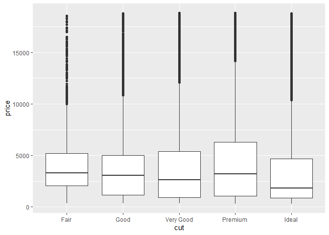
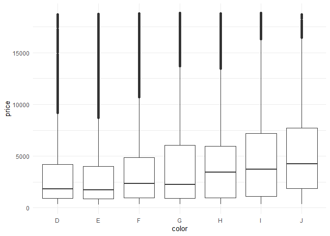

R For Data Sciences - Exercises
================
Hans Franke
September 30, 2020

``` r
library("nycflights13")
library("tidyverse")
```

    ## -- Attaching packages ---------------------------------------------------------------- tidyverse 1.3.0 --

    ## v ggplot2 3.3.2     v purrr   0.3.4
    ## v tibble  3.0.3     v dplyr   1.0.2
    ## v tidyr   1.1.2     v stringr 1.4.0
    ## v readr   1.3.1     v forcats 0.5.0

    ## -- Conflicts ------------------------------------------------------------------- tidyverse_conflicts() --
    ## x dplyr::filter() masks stats::filter()
    ## x dplyr::lag()    masks stats::lag()

# 7.3 Variation

## 7.3.4 Exercises

  - Explore the distribution of each of the x, y, and z variables in
    diamonds. What do you learn? Think about a diamond and how you might
    decide which dimension is the length, width, and depth.

<!-- end list -->

``` r
# x, y and Z are continuos, so we should use a histogram!
 str(diamonds)
```

    ## tibble [53,940 x 10] (S3: tbl_df/tbl/data.frame)
    ##  $ carat  : num [1:53940] 0.23 0.21 0.23 0.29 0.31 0.24 0.24 0.26 0.22 0.23 ...
    ##  $ cut    : Ord.factor w/ 5 levels "Fair"<"Good"<..: 5 4 2 4 2 3 3 3 1 3 ...
    ##  $ color  : Ord.factor w/ 7 levels "D"<"E"<"F"<"G"<..: 2 2 2 6 7 7 6 5 2 5 ...
    ##  $ clarity: Ord.factor w/ 8 levels "I1"<"SI2"<"SI1"<..: 2 3 5 4 2 6 7 3 4 5 ...
    ##  $ depth  : num [1:53940] 61.5 59.8 56.9 62.4 63.3 62.8 62.3 61.9 65.1 59.4 ...
    ##  $ table  : num [1:53940] 55 61 65 58 58 57 57 55 61 61 ...
    ##  $ price  : int [1:53940] 326 326 327 334 335 336 336 337 337 338 ...
    ##  $ x      : num [1:53940] 3.95 3.89 4.05 4.2 4.34 3.94 3.95 4.07 3.87 4 ...
    ##  $ y      : num [1:53940] 3.98 3.84 4.07 4.23 4.35 3.96 3.98 4.11 3.78 4.05 ...
    ##  $ z      : num [1:53940] 2.43 2.31 2.31 2.63 2.75 2.48 2.47 2.53 2.49 2.39 ...

``` r
#Some summary statistics

#1) how u can have some diamonds with 0 on their dimensions?
#2) probably the max values from y and z are wront too, they are so high compare with mean/median
#3) Looking at plots (see below) we notice there are some outliers, looking for the space in the x-axis
#4) looking for help ?diamonds, we notice that x = lenght, y = width and z = deph. 
summary(select(diamonds, x, y, z))
```

    ##        x                y                z         
    ##  Min.   : 0.000   Min.   : 0.000   Min.   : 0.000  
    ##  1st Qu.: 4.710   1st Qu.: 4.720   1st Qu.: 2.910  
    ##  Median : 5.700   Median : 5.710   Median : 3.530  
    ##  Mean   : 5.731   Mean   : 5.735   Mean   : 3.539  
    ##  3rd Qu.: 6.540   3rd Qu.: 6.540   3rd Qu.: 4.040  
    ##  Max.   :10.740   Max.   :58.900   Max.   :31.800

``` r
  ggplot(diamonds, aes(x))+
  geom_histogram(fill = "dark blue") +
  theme_minimal()
```

    ## `stat_bin()` using `bins = 30`. Pick better value with `binwidth`.

<!-- -->

``` r
  ggplot(diamonds, aes(y))+
  geom_histogram(fill = "dark green") +
  theme_minimal()
```

    ## `stat_bin()` using `bins = 30`. Pick better value with `binwidth`.

<!-- -->

``` r
  ggplot(diamonds, aes(z))+
  geom_histogram(fill = "dark red") +
  theme_minimal()
```

    ## `stat_bin()` using `bins = 30`. Pick better value with `binwidth`.

<!-- -->

  - Explore the distribution of price. Do you discover anything unusual
    or surprising? (Hint: Carefully think about the binwidth and make
    sure you try a wide range of values.)

<!-- end list -->

``` r
#there is no diamong with price in that "hole"
ggplot(diamonds, aes(price))+
  geom_histogram(binwidth = 10, center = 0)+
  coord_cartesian(ylim= c(0,1000), xlim=c(0,2000))
```

<!-- -->

  - How many diamonds are 0.99 carat? How many are 1 carat? What do you
    think is the cause of the difference?

<!-- end list -->

``` r
#there is much more diamonds with carat =1
diamonds %>%
  filter(carat>0.98 & carat <1.01) %>%
ggplot(aes(carat))+
  geom_histogram()
```

    ## `stat_bin()` using `bins = 30`. Pick better value with `binwidth`.

<!-- -->

``` r
#showing the values
diamonds %>%
  filter(carat >= 0.99, carat <= 1) %>%
  count(carat)
```

    ## # A tibble: 2 x 2
    ##   carat     n
    ##   <dbl> <int>
    ## 1  0.99    23
    ## 2  1     1558

  - Compare and contrast coord\_cartesian() vs xlim() or ylim() when
    zooming in on a histogram. What happens if you leave binwidth unset?
    What happens if you try and zoom so only half a bar shows?

<!-- end list -->

``` r
#the coord_cartesian works after the bins were evaluated
ggplot(diamonds) +
  geom_histogram(mapping = aes(x = price)) +
  coord_cartesian(xlim = c(100, 5000), ylim = c(0, 3000))
```

    ## `stat_bin()` using `bins = 30`. Pick better value with `binwidth`.

<!-- -->

``` r
#x_lim and y+lim cuts from the plot values outside the range values! So the plot can be different
ggplot(diamonds) +
  geom_histogram(mapping = aes(x = price)) +
  xlim(100, 5000) +
  ylim(0, 3000)
```

    ## `stat_bin()` using `bins = 30`. Pick better value with `binwidth`.

    ## Warning: Removed 14714 rows containing non-finite values (stat_bin).

    ## Warning: Removed 6 rows containing missing values (geom_bar).

<!-- -->

# 7.4: Missing Values

## Question: 7.4.1

What happens to missing values in a histogram? What happens to missing
values in a bar chart? Why is there a difference?

*Answer:* - Histogram =\> missing values are when the number of
observations in each bin are calculated. - Bar\_chart =\> n/a values are
a another category

What does na.rm = TRUE do in mean() and sum()?

*Answer: This option removes NA values from the vector prior to
calculating the mean and sum*

# 7.5: Covariation

## 7.5.1.1 Exercises

Use what you’ve learned to improve the visualisation of the departure
times of cancelled vs. non-cancelled flights.

``` r
flights %>% 
  mutate(
    cancelled = is.na(dep_time),
    sch_dep = sched_dep_time %/% 100,
    sch_dep_min = sched_dep_time %% 100,
    sche = sch_dep + sch_dep_min / 60
    
  ) %>%
  ggplot(aes(x = sche, y = cancelled)) + 
  geom_boxplot()
```

<!-- -->

What variable in the diamonds dataset is most important for predicting
the price of a diamond? How is that variable correlated with cut? Why
does the combination of those two relationships lead to lower quality
diamonds being more expensive?

``` r
# Variables: carat, cut, color, cut
head(diamonds)
```

    ## # A tibble: 6 x 10
    ##   carat cut       color clarity depth table price     x     y     z
    ##   <dbl> <ord>     <ord> <ord>   <dbl> <dbl> <int> <dbl> <dbl> <dbl>
    ## 1 0.23  Ideal     E     SI2      61.5    55   326  3.95  3.98  2.43
    ## 2 0.21  Premium   E     SI1      59.8    61   326  3.89  3.84  2.31
    ## 3 0.23  Good      E     VS1      56.9    65   327  4.05  4.07  2.31
    ## 4 0.290 Premium   I     VS2      62.4    58   334  4.2   4.23  2.63
    ## 5 0.31  Good      J     SI2      63.3    58   335  4.34  4.35  2.75
    ## 6 0.24  Very Good J     VVS2     62.8    57   336  3.94  3.96  2.48

``` r
#Carat vs Price -> 2 continuos so we should use scatterplot
ggplot(diamonds, aes(x = carat, y = price)) +
  geom_point()
```

<!-- -->

``` r
#Carat vs Price but with boxplot (One continuos cutted with bins) => Positive correlation, as increase in carat increase the price
ggplot(diamonds, aes(x=carat, y = price))+
  geom_boxplot(aes(group=cut_width(carat,0.2)))
```

<!-- -->

``` r
#Cut vs Price, negative correlation (1 continuos x 1 categorical)
ggplot(diamonds, aes(x=cut, y=price))+
  geom_boxplot()
```

<!-- -->

``` r
#Color vs Price, negative correlation (1 continuos x 1 categorical) => this is dificult to visualise but there is a very light negative correlation (color J is the worst)
ggplot(diamonds, aes(x=color, y=price))+
  geom_boxplot()+
  theme_minimal()
```

<!-- -->

``` r
#Clairty vs Price, negative correlation (1 continuos x 1 categorical) => this is dificult to visualise but there is a very light negative correlation (color IF is the worst)
ggplot(diamonds, aes(x=clarity, y=price))+
  geom_boxplot()+
  theme_minimal()
```

<!-- -->

## 7.5.2 Two Categorical Variables

``` r
diamonds %>%
  count(color, cut) %>%
  group_by(color) %>%
  mutate(prop = n / sum(n)) %>%
  ggplot(mapping = aes(x = color, y = cut)) +
  geom_tile(mapping = aes(fill = prop))
```

<!-- -->

## 7.5.3 Two continuous variables

``` r
ggplot(diamonds, aes(x = carat, y = price)) +
  geom_hex() +
  facet_wrap(~cut, ncol = 1)
```

<!-- -->
