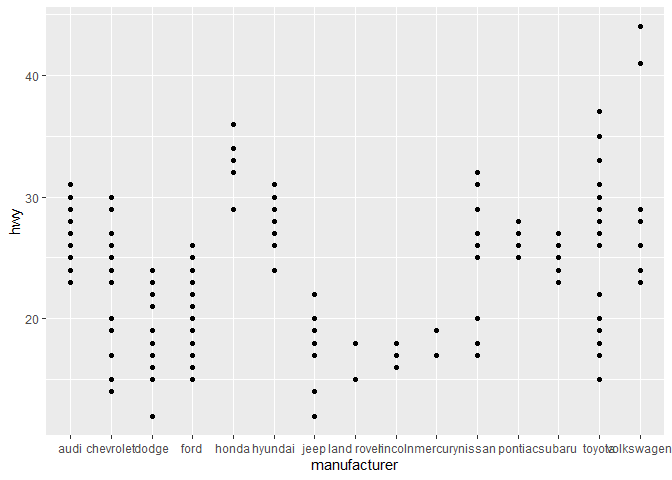
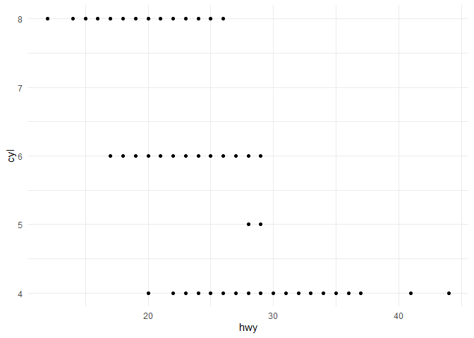
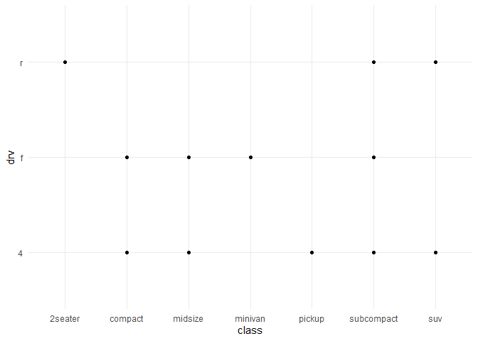
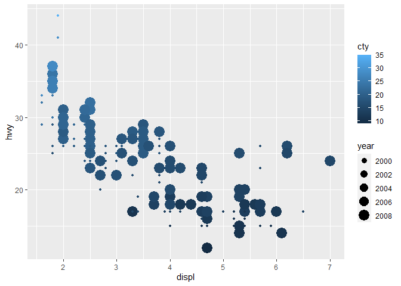
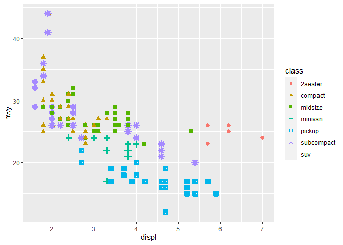
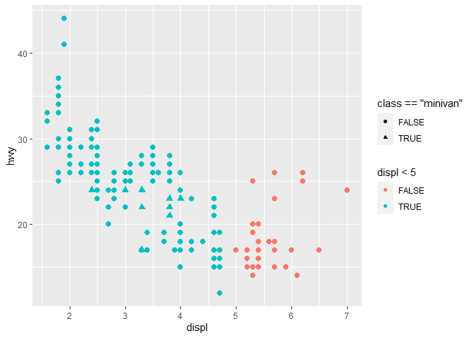
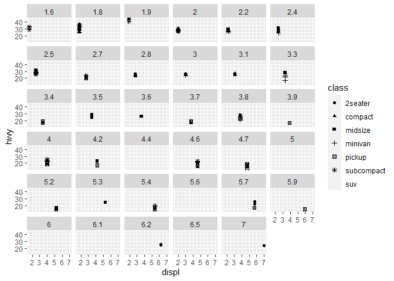
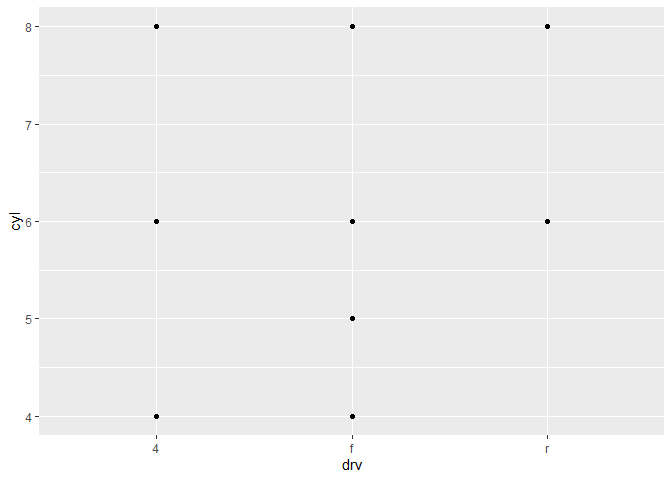
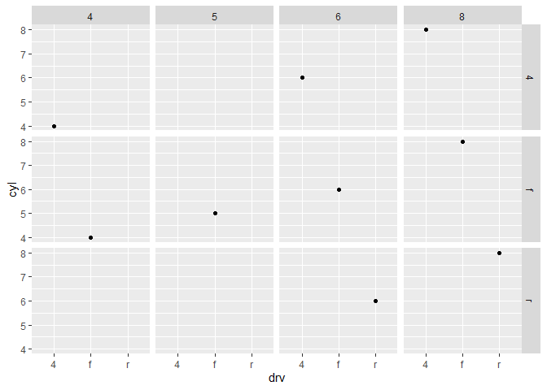

R For Data Sciences - Exercises
================
Hans Franke
September 29, 2020

``` r
library(tidyverse)
```

    ## -- Attaching packages -------------------------------------------------------------------------------- tidyverse 1.3.0 --

    ## v ggplot2 3.3.2     v purrr   0.3.4
    ## v tibble  3.0.3     v dplyr   1.0.2
    ## v tidyr   1.1.2     v stringr 1.4.0
    ## v readr   1.3.1     v forcats 0.5.0

    ## -- Conflicts ----------------------------------------------------------------------------------- tidyverse_conflicts() --
    ## x dplyr::filter() masks stats::filter()
    ## x dplyr::lag()    masks stats::lag()

``` r
library(ISLR)
```

# Chapter 3: Data Visualisation

## 3.2.4 Exercises

Run ggplot(data = mpg). What do you see?

*Answer:* Nothing, because there is no axis, on aes1 aditional must
define GEOm to show proper graph.

``` r
  # corrected code
  #View(mpg)

  ggplot(data = mpg, aes(x = manufacturer, y = hwy))+
  geom_point()
```

<!-- -->

How many rows are in mpg? How many columns?

``` r
  # 234 rows and 11 columns
  str(mpg)
```

    ## tibble [234 x 11] (S3: tbl_df/tbl/data.frame)
    ##  $ manufacturer: chr [1:234] "audi" "audi" "audi" "audi" ...
    ##  $ model       : chr [1:234] "a4" "a4" "a4" "a4" ...
    ##  $ displ       : num [1:234] 1.8 1.8 2 2 2.8 2.8 3.1 1.8 1.8 2 ...
    ##  $ year        : int [1:234] 1999 1999 2008 2008 1999 1999 2008 1999 1999 2008 ...
    ##  $ cyl         : int [1:234] 4 4 4 4 6 6 6 4 4 4 ...
    ##  $ trans       : chr [1:234] "auto(l5)" "manual(m5)" "manual(m6)" "auto(av)" ...
    ##  $ drv         : chr [1:234] "f" "f" "f" "f" ...
    ##  $ cty         : int [1:234] 18 21 20 21 16 18 18 18 16 20 ...
    ##  $ hwy         : int [1:234] 29 29 31 30 26 26 27 26 25 28 ...
    ##  $ fl          : chr [1:234] "p" "p" "p" "p" ...
    ##  $ class       : chr [1:234] "compact" "compact" "compact" "compact" ...

What does the drv variable describe? Read the help for ?mpg to find out.

``` r
  ?mpg
```

    ## starting httpd help server ... done

``` r
  # DRV = the type of drive train, where f = front-wheel drive, r = rear wheel drive, 4 = 4wd
```

Make a scatterplot of hwy vs cyl.

``` r
  ggplot(mpg, aes(hwy,cyl))+
  geom_point()+
  theme_minimal()
```

<!-- -->

What happens if you make a scatterplot of class vs drv? Why is the plot
not useful?

``` r
#Both categorical variables, scatterplot usually shows some relations between variables, but to get better results with one continuos.
  ggplot(mpg, aes(class,drv))+
  geom_point()+
  theme_minimal()
```

<!-- -->

\#\# 3.3.1 Exercises

What’s gone wrong with this code? Why are the points not blue?

``` r
#Color inside the AES, determine CLASS of points, usually is used by other variable to describe or add informations
ggplot(data = mpg) + 
  geom_point(mapping = aes(x = displ, y = hwy, color = "blue"))
```

<!-- -->

Which variables in mpg are categorical? Which variables are continuous?
(Hint: type ?mpg to read the documentation for the dataset). How can you
see this information when you run mpg?

Answer: - Continuos: displ, year, cty, hwy - Categorical: manufacturer,
model, trans, drv, fl, class

``` r
#Look for variables NON-Numeric => categorical
str(mpg)
```

    ## tibble [234 x 11] (S3: tbl_df/tbl/data.frame)
    ##  $ manufacturer: chr [1:234] "audi" "audi" "audi" "audi" ...
    ##  $ model       : chr [1:234] "a4" "a4" "a4" "a4" ...
    ##  $ displ       : num [1:234] 1.8 1.8 2 2 2.8 2.8 3.1 1.8 1.8 2 ...
    ##  $ year        : int [1:234] 1999 1999 2008 2008 1999 1999 2008 1999 1999 2008 ...
    ##  $ cyl         : int [1:234] 4 4 4 4 6 6 6 4 4 4 ...
    ##  $ trans       : chr [1:234] "auto(l5)" "manual(m5)" "manual(m6)" "auto(av)" ...
    ##  $ drv         : chr [1:234] "f" "f" "f" "f" ...
    ##  $ cty         : int [1:234] 18 21 20 21 16 18 18 18 16 20 ...
    ##  $ hwy         : int [1:234] 29 29 31 30 26 26 27 26 25 28 ...
    ##  $ fl          : chr [1:234] "p" "p" "p" "p" ...
    ##  $ class       : chr [1:234] "compact" "compact" "compact" "compact" ...

Map a continuous variable to color, size, and shape. How do these
aesthetics behave differently for categorical vs. continuous variables?

``` r
#shape => dosent accept continuos 
# size and color => accpect but i will not recommend for continuos variables with many values!
ggplot(data = mpg) + 
  geom_point(mapping = aes(x = displ, y = hwy, color = cty, size = year))
```

<!-- -->

What happens if you map the same variable to multiple aesthetics?

``` r
#it will be shown the same information.... lot of unecessary visual with no value added!
ggplot(data = mpg) + 
  geom_point(mapping = aes(x = displ, y = hwy, color = class, size = class, shape = class))
```

    ## Warning: Using size for a discrete variable is not advised.

    ## Warning: The shape palette can deal with a maximum of 6 discrete values because
    ## more than 6 becomes difficult to discriminate; you have 7. Consider
    ## specifying shapes manually if you must have them.

    ## Warning: Removed 62 rows containing missing values (geom_point).

<!-- -->

What does the stroke aesthetic do? What shapes does it work with? (Hint:
use ?geom\_point)

``` r
#stroke = define the size of the points...
  ggplot(data = mpg) + 
    geom_point(mapping = aes(x = displ, y = hwy, stroke = 2 , color = class, shape = class))
```

    ## Warning: The shape palette can deal with a maximum of 6 discrete values because
    ## more than 6 becomes difficult to discriminate; you have 7. Consider
    ## specifying shapes manually if you must have them.

    ## Warning: Removed 62 rows containing missing values (geom_point).

<!-- -->

What happens if you map an aesthetic to something other than a variable
name, like aes(colour = displ \< 5)? Note, you’ll also need to specify x
and y.

``` r
  #Split variable COLOR to true or false with logical conditional 
  ggplot(data = mpg) + 
    geom_point(mapping = aes(x = displ, y = hwy, stroke = 2 , colour = displ < 5, shape = class == "minivan"))
```

<!-- -->

## 3.5.1 Exercises

What happens if you facet on a continuous variable?

``` r
  #Lot of messy visual... each region of facet is probably one observation
  ggplot(data = mpg) + 
    geom_point(mapping = aes(x = displ, y = hwy, shape = class))+
    facet_wrap(~displ)
```

    ## Warning: The shape palette can deal with a maximum of 6 discrete values because
    ## more than 6 becomes difficult to discriminate; you have 7. Consider
    ## specifying shapes manually if you must have them.

    ## Warning: Removed 62 rows containing missing values (geom_point).

<!-- -->

What do the empty cells in plot with facet\_grid(drv \~ cyl) mean? How
do they relate to this plot?

``` r
ggplot(data = mpg) + 
  geom_point(mapping = aes(x = drv, y = cyl))
```

<!-- -->

``` r
 #there is no match value with DRV and CYL with this values
 ggplot(data = mpg) + 
    geom_point(mapping = aes(x = drv, y = cyl))+
    facet_grid(drv ~ cyl)
```

<!-- -->

``` r
  #check if values exists => in fact there is no obervation
  filter(mpg, drv == 5 & cyl == 4)
```

    ## # A tibble: 0 x 11
    ## # ... with 11 variables: manufacturer <chr>, model <chr>, displ <dbl>,
    ## #   year <int>, cyl <int>, trans <chr>, drv <chr>, cty <int>, hwy <int>,
    ## #   fl <chr>, class <chr>

What plots does the following code make? What does . do?

``` r
ggplot(data = mpg) + 
  geom_point(mapping = aes(x = displ, y = hwy)) +
  facet_grid(drv ~ .)
```

<!-- -->

``` r
ggplot(data = mpg) + 
  geom_point(mapping = aes(x = displ, y = hwy)) +
  facet_grid(. ~ cyl)
```

<!-- -->

Take the first faceted plot in this section:

``` r
ggplot(data = mpg) + 
  geom_point(mapping = aes(x = displ, y = hwy)) + 
  facet_wrap(~ class, nrow = 2)
```

<!-- -->

``` r
ggplot(data = mpg) + 
  geom_point(mapping = aes(x = displ, y = hwy, color = class)) 
```

<!-- -->

What are the advantages to using faceting instead of the colour
aesthetic? What are the disadvantages? How might the balance change if
you had a larger dataset?

*Answer: Faceting shows a more visual graph, where u can see the details
of each point inside the “class”. With color u compare the position
between the “classes”. If u have a larger dataset with a lot of points
and few classes, faceting is better because u can\`t see the diferences
in the same plot.*

Read ?facet\_wrap. What does nrow do? What does ncol do? What other
options control the layout of the individual panels? Why doesn’t
facet\_grid() have nrow and ncol arguments?

*Answer: nrow and ncol define how to display the plots. Face grid dosent
have because they ajust only by variables numbers, for example a
variable with 4 variables will have 4 columns/rows.*

When using facet\_grid() you should usually put the variable with more
unique levels in the columns. Why?

*Answer: When putting the more levels on the row axis, then the y-axis
would shrink so that it is harder to see which actual values are at the
points as shown in the plot *

## 3.6.1 Exercises

What geom would you use to draw a line chart? A boxplot? A histogram? An
area chart?

Run this code in your head and predict what the output will look like.
Then, run the code in R and check your predictions.

ggplot(data = mpg, mapping = aes(x = displ, y = hwy, color = drv)) +
geom\_point() + geom\_smooth(se = FALSE) What does show.legend = FALSE
do? What happens if you remove it? Why do you think I used it earlier in
the chapter?

What does the se argument to geom\_smooth() do?

Will these two graphs look different? Why/why not?

ggplot(data = mpg, mapping = aes(x = displ, y = hwy)) + geom\_point() +
geom\_smooth()

ggplot() + geom\_point(data = mpg, mapping = aes(x = displ, y = hwy)) +
geom\_smooth(data = mpg, mapping = aes(x = displ, y = hwy))

## 3.7.1 Exercises

What is the default geom associated with stat\_summary()? How could you
rewrite the previous plot to use that geom function instead of the stat
function?

What does geom\_col() do? How is it different to geom\_bar()?

Most geoms and stats come in pairs that are almost always used in
concert. Read through the documentation and make a list of all the
pairs. What do they have in common?

What variables does stat\_smooth() compute? What parameters control its
behaviour?

In our proportion bar chart, we need to set group = 1. Why? In other
words what is the problem with these two graphs?

ggplot(data = diamonds) + geom\_bar(mapping = aes(x = cut, y =
..prop..)) ggplot(data = diamonds) + geom\_bar(mapping = aes(x = cut,
fill = color, y = ..prop..))

## 3.8.1 Exercises

What is the problem with this plot? How could you improve it?

ggplot(data = mpg, mapping = aes(x = cty, y = hwy)) + geom\_point()

What parameters to geom\_jitter() control the amount of jittering?

Compare and contrast geom\_jitter() with geom\_count().

What’s the default position adjustment for geom\_boxplot()? Create a
visualisation of the mpg dataset that demonstrates it.

## 3.9.1 Exercises

Turn a stacked bar chart into a pie chart using coord\_polar().

What does labs() do? Read the documentation.

What’s the difference between coord\_quickmap() and coord\_map()?

What does the plot below tell you about the relationship between city
and highway mpg? Why is coord\_fixed() important? What does
geom\_abline() do?

ggplot(data = mpg, mapping = aes(x = cty, y = hwy)) + geom\_point() +
geom\_abline() + coord\_fixed()

K
