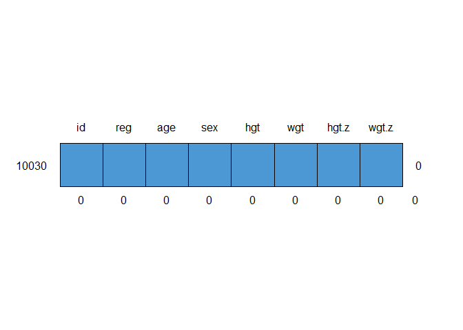

Assigment 1
================
Hans Franke
October 12, 2020

    library(tidyverse)

    ## -- Attaching packages ------------------------------------------------------------------------------------------------------------------------ tidyverse 1.3.0 --

    ## v ggplot2 3.3.2     v purrr   0.3.4
    ## v tibble  3.0.3     v dplyr   1.0.2
    ## v tidyr   1.1.2     v stringr 1.4.0
    ## v readr   1.3.1     v forcats 0.5.0

    ## -- Conflicts --------------------------------------------------------------------------------------------------------------------------- tidyverse_conflicts() --
    ## x dplyr::filter() masks stats::filter()
    ## x dplyr::lag()    masks stats::lag()

    library(mice)

    ## 
    ## Attaching package: 'mice'

    ## The following objects are masked from 'package:base':
    ## 
    ##     cbind, rbind

View Data
---------

Store the nhanes dataset from the mice package in a variable called df.
Print the df variable.

    head(mice::nhanes)

    ##   age  bmi hyp chl
    ## 1   1   NA  NA  NA
    ## 2   2 22.7   1 187
    ## 3   1   NA   1 187
    ## 4   3   NA  NA  NA
    ## 5   1 20.4   1 113
    ## 6   3   NA  NA 184

    df <- nhanes

    view(df)

Show Missing Values
-------------------

Output the percentage missingness for each feature as a vector.

    is.na(df)

    ##      age   bmi   hyp   chl
    ## 1  FALSE  TRUE  TRUE  TRUE
    ## 2  FALSE FALSE FALSE FALSE
    ## 3  FALSE  TRUE FALSE FALSE
    ## 4  FALSE  TRUE  TRUE  TRUE
    ## 5  FALSE FALSE FALSE FALSE
    ## 6  FALSE  TRUE  TRUE FALSE
    ## 7  FALSE FALSE FALSE FALSE
    ## 8  FALSE FALSE FALSE FALSE
    ## 9  FALSE FALSE FALSE FALSE
    ## 10 FALSE  TRUE  TRUE  TRUE
    ## 11 FALSE  TRUE  TRUE  TRUE
    ## 12 FALSE  TRUE  TRUE  TRUE
    ## 13 FALSE FALSE FALSE FALSE
    ## 14 FALSE FALSE FALSE FALSE
    ## 15 FALSE FALSE FALSE  TRUE
    ## 16 FALSE  TRUE  TRUE  TRUE
    ## 17 FALSE FALSE FALSE FALSE
    ## 18 FALSE FALSE FALSE FALSE
    ## 19 FALSE FALSE FALSE FALSE
    ## 20 FALSE FALSE FALSE  TRUE
    ## 21 FALSE  TRUE  TRUE  TRUE
    ## 22 FALSE FALSE FALSE FALSE
    ## 23 FALSE FALSE FALSE FALSE
    ## 24 FALSE FALSE FALSE  TRUE
    ## 25 FALSE FALSE FALSE FALSE

    #Missing values in all columns
    colSums(is.na(df))

    ## age bmi hyp chl 
    ##   0   9   8  10

    # % of Missing values in all columns
    colSums(is.na(df))/nrow(df)*100

    ## age bmi hyp chl 
    ##   0  36  32  40

Use ggplot to show the % of the missing value
---------------------------------------------

    #Put data in the DF
    df_missing <- tibble(
      nmissing = colnames(is.na(df)),
      perc_col = colSums(is.na(df))/nrow(df)*100
    )

    df_missing

    ## # A tibble: 4 x 2
    ##   nmissing perc_col
    ##   <chr>       <dbl>
    ## 1 age             0
    ## 2 bmi            36
    ## 3 hyp            32
    ## 4 chl            40

    #Plotting as a barplot

    ggplot(df_missing, aes(x=nmissing, y = perc_col) ) +
             geom_bar(stat = "identity") +
             labs(y="% Of missing values") + 
             theme_classic()  

<!-- -->

Now display the missingness pattern per age group (1, 2, 3).
------------------------------------------------------------

    df %>%
      group_by(age)%>%
      summarise_all(function(x) sum(is.na(x))/n()*100)%>%
      round(2)

    ## # A tibble: 3 x 4
    ##     age   bmi   hyp   chl
    ##   <dbl> <dbl> <dbl> <dbl>
    ## 1     1  41.7  33.3  41.7
    ## 2     2  28.6  28.6  28.6
    ## 3     3  33.3  33.3  50

Missing Data Patterns
---------------------

    md.pattern(df)

<!-- -->

    ##    age hyp bmi chl   
    ## 13   1   1   1   1  0
    ## 3    1   1   1   0  1
    ## 1    1   1   0   1  1
    ## 1    1   0   0   1  2
    ## 7    1   0   0   0  3
    ##      0   8   9  10 27

Questions
---------

1.  how many rows are missing all data except the age feature? A: 7
2.  how many missing values are there in the bmi feature? A: 9
3.  how many rows are completely observed? A: 13
4.  how many missing data patterns are there? A: 5 (we include rows
    without missing values as a pattern too)

<!-- -->

    # Others packages to try :)
    #install.packages("skimr")
    skimr::skim(df)

|                                                  |      |
|:-------------------------------------------------|:-----|
| Name                                             | df   |
| Number of rows                                   | 25   |
| Number of columns                                | 4    |
| \_\_\_\_\_\_\_\_\_\_\_\_\_\_\_\_\_\_\_\_\_\_\_   |      |
| Column type frequency:                           |      |
| numeric                                          | 4    |
| \_\_\_\_\_\_\_\_\_\_\_\_\_\_\_\_\_\_\_\_\_\_\_\_ |      |
| Group variables                                  | None |

Data summary

**Variable type: numeric**

| skim\_variable | n\_missing | complete\_rate |   mean |    sd |    p0 |    p25 |    p50 |    p75 |  p100 | hist  |
|:---------------|-----------:|---------------:|-------:|------:|------:|-------:|-------:|-------:|------:|:------|
| age            |          0 |           1.00 |   1.76 |  0.83 |   1.0 |   1.00 |   2.00 |   2.00 |   3.0 | ▇▁▅▁▃ |
| bmi            |          9 |           0.64 |  26.56 |  4.22 |  20.4 |  22.65 |  26.75 |  28.92 |  35.3 | ▇▅▆▃▃ |
| hyp            |          8 |           0.68 |   1.24 |  0.44 |   1.0 |   1.00 |   1.00 |   1.00 |   2.0 | ▇▁▁▁▂ |
| chl            |         10 |           0.60 | 191.40 | 45.22 | 113.0 | 185.00 | 187.00 | 212.00 | 284.0 | ▃▁▇▃▁ |

    visdat::vis_dat(df)

<!-- -->

Assigment
=========

Analyze the patterns of missing data for the fdgs dataset, and write a small paragraph on how you are going to solve the missingness in this data for an analyst who wants to compute the average weight of the population under study, assuming MAR.
-----------------------------------------------------------------------------------------------------------------------------------------------------------------------------------------------------------------------------------------------------

    #Lookinf for patterns of missing data
    md.pattern(fdgs)

<!-- -->

    ##      id reg age sex wgt wgt.z hgt hgt.z   
    ## 9987  1   1   1   1   1     1   1     1  0
    ## 23    1   1   1   1   1     1   0     0  2
    ## 20    1   1   1   1   0     0   1     1  2
    ##       0   0   0   0  20    20  23    23 86

### Answer:

As we can see in the plot above, the total number of missing rows are
extreme low (23 + 20 / 10030 =&gt; 0.42% ), and mainly focused on 2
variables (the others \_z are only the z-score of that variable). So to
consider a MAR, we should replace the values by the mean clustered by
each variable, for example:

    # mean( df$wgt) and mean(df$hgt).

    #Assign the fgds to a another df (dosent lose information later)

    imp_mean <- mice(fdgs, method = "mean", m = 1, maxit = 1)

    ## 
    ##  iter imp variable
    ##   1   1  hgt  wgt  hgt.z  wgt.z

    fdgs_nomiss <- complete(imp_mean)
    #CHECK FINAL RESULT
    colSums(is.na(fdgs_nomiss))

    ##    id   reg   age   sex   hgt   wgt hgt.z wgt.z 
    ##     0     0     0     0     0     0     0     0

    md.pattern(fdgs_nomiss)

    ##  /\     /\
    ## {  `---'  }
    ## {  O   O  }
    ## ==>  V <==  No need for mice. This data set is completely observed.
    ##  \  \|/  /
    ##   `-----'

<!-- -->

    ##       id reg age sex hgt wgt hgt.z wgt.z  
    ## 10030  1   1   1   1   1   1     1     1 0
    ##        0   0   0   0   0   0     0     0 0

But this is not the best solution because replace by the means, ads a
lot of variance in the samples. The best solution should be use a
regression technique to predict the value considering other variables.
For example, use Age and Sex to predict the weight.

    # Lookinf visual if makes sense this correlation:

    ggplot(fdgs, aes(x=age, y=wgt, color=sex)) +
      geom_point()

    ## Warning: Removed 20 rows containing missing values (geom_point).

<!-- -->

    #In fact it makes, so lets run a regression
    imp <- mice(fdgs, method = "norm.predict", seed = 1,
               m = 1, print = FALSE)
    xyplot(imp, wgt ~ age)

<!-- -->

    #building new df

    #Assign the fgds to a another df (dosent lose information later)
    data_imp <- complete(imp)
    mean(data_imp$wgt)

    ## [1] 32.3799

    #CHECK FINAL RESULT
    colSums(is.na(data_imp))

    ##    id   reg   age   sex   hgt   wgt hgt.z wgt.z 
    ##     0     0     0     0     0     0     0     0

    #Comparison between methods (only on weight) => Try to see the diference in the mean( 0.380 vs 0.385)

    summary(fdgs_nomiss)

    ##        id            reg            age              sex            hgt       
    ##  Min.   :100001   North: 732   Min.   : 0.008214   boy :4829   Min.   : 46.0  
    ##  1st Qu.:106353   East :2528   1st Qu.: 1.618754   girl:5201   1st Qu.: 83.9  
    ##  Median :203855   South:2931   Median : 8.084873               Median :131.2  
    ##  Mean   :180091   West :2578   Mean   : 8.157936               Mean   :123.9  
    ##  3rd Qu.:210591   City :1261   3rd Qu.:13.547570               3rd Qu.:162.2  
    ##  Max.   :401955                Max.   :21.993155               Max.   :208.0  
    ##       wgt              hgt.z               wgt.z         
    ##  Min.   :  2.585   Min.   :-4.470000   Min.   :-5.04000  
    ##  1st Qu.: 11.600   1st Qu.:-0.676000   1st Qu.:-0.62400  
    ##  Median : 27.500   Median :-0.015000   Median : 0.02800  
    ##  Mean   : 32.385   Mean   :-0.006054   Mean   : 0.04573  
    ##  3rd Qu.: 51.000   3rd Qu.: 0.674750   3rd Qu.: 0.70675  
    ##  Max.   :135.300   Max.   : 3.900000   Max.   : 4.74100

    summary(data_imp)

    ##        id            reg            age              sex            hgt        
    ##  Min.   :100001   North: 732   Min.   : 0.008214   boy :4829   Min.   : 46.00  
    ##  1st Qu.:106353   East :2528   1st Qu.: 1.618754   girl:5201   1st Qu.: 83.53  
    ##  Median :203855   South:2931   Median : 8.084873               Median :131.30  
    ##  Mean   :180091   West :2578   Mean   : 8.157936               Mean   :123.83  
    ##  3rd Qu.:210591   City :1261   3rd Qu.:13.547570               3rd Qu.:162.20  
    ##  Max.   :401955                Max.   :21.993155               Max.   :208.00  
    ##       wgt              hgt.z               wgt.z        
    ##  Min.   :  2.585   Min.   :-4.470000   Min.   :-5.0400  
    ##  1st Qu.: 11.600   1st Qu.:-0.677000   1st Qu.:-0.6240  
    ##  Median : 27.500   Median :-0.019500   Median : 0.0260  
    ##  Mean   : 32.380   Mean   :-0.006671   Mean   : 0.0459  
    ##  3rd Qu.: 51.100   3rd Qu.: 0.675750   3rd Qu.: 0.7070  
    ##  Max.   :135.300   Max.   : 3.900000   Max.   : 4.7410

    #Standard deviation
    sd(fdgs$wgt, na.rm = TRUE) #original df

    ## [1] 23.14654

    sd(fdgs_nomiss$wgt) #using mean

    ## [1] 23.12345

    sd(data_imp$wgt) #using regression

    ## [1] 23.13642

    #Variance
    var(fdgs$wgt, na.rm = TRUE) #original df

    ## [1] 535.7624

    var(fdgs_nomiss$wgt) #using mean

    ## [1] 534.694

    var(data_imp$wgt) #using regression

    ## [1] 535.294
