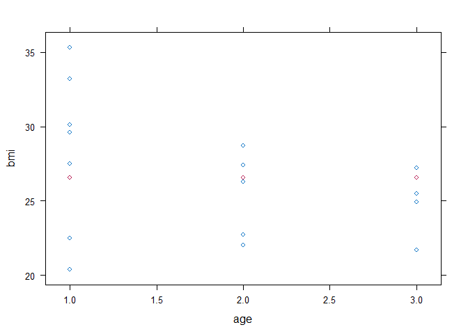
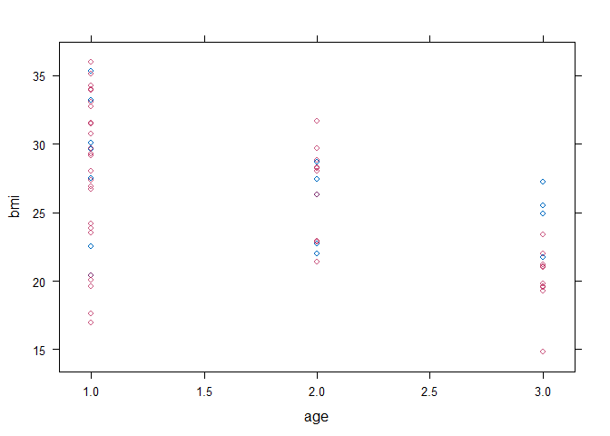
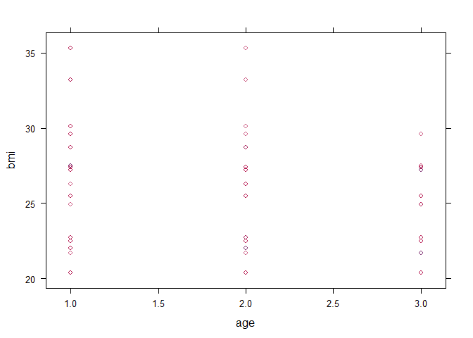

Assigment 3
================
Hans Franke
October 12, 2020

``` r
#loading libraries
library(tidyverse)
```

    ## -- Attaching packages ------------------------------------------------------------------------------------------------------------------------ tidyverse 1.3.0 --

    ## v ggplot2 3.3.2     v purrr   0.3.4
    ## v tibble  3.0.3     v dplyr   1.0.2
    ## v tidyr   1.1.2     v stringr 1.4.0
    ## v readr   1.3.1     v forcats 0.5.0

    ## -- Conflicts --------------------------------------------------------------------------------------------------------------------------- tidyverse_conflicts() --
    ## x dplyr::filter() masks stats::filter()
    ## x dplyr::lag()    masks stats::lag()

``` r
library(mice)
```

    ## 
    ## Attaching package: 'mice'

    ## The following objects are masked from 'package:base':
    ## 
    ##     cbind, rbind

The aim of this assignment is to enhance your understanding of multiple
imputation, in general. You will learn how to multiply impute simple
datasets and how to obtain the imputed data for further analysis. The
main objective is to increase your knowledge and understanding on
applications of multiple imputation. For all imputation tasks in this
assignment, we will use the mice package.

# Ad Hoc imputation, redux

Fit a regression model where bmi is predicted from age using the nhanes
dataset, using the following code. How many observations were excluded
from this analysis? Is there a significant effect of age on bmi?

``` r
# this with() notation will come in handy later
fit <- with(nhanes, lm(bmi ~ age))

#look for statistics and missing values (# 9 observations were deleted)
summary(fit)
```

    ## 
    ## Call:
    ## lm(formula = bmi ~ age)
    ## 
    ## Residuals:
    ##     Min      1Q  Median      3Q     Max 
    ## -7.6892 -2.8509  0.8689  2.1305  7.2108 
    ## 
    ## Coefficients:
    ##             Estimate Std. Error t value Pr(>|t|)    
    ## (Intercept)   29.968      2.488  12.047  8.9e-09 ***
    ## age           -1.879      1.254  -1.499    0.156    
    ## ---
    ## Signif. codes:  0 '***' 0.001 '**' 0.01 '*' 0.05 '.' 0.1 ' ' 1
    ## 
    ## Residual standard error: 4.05 on 14 degrees of freedom
    ##   (9 observations deleted due to missingness)
    ## Multiple R-squared:  0.1383, Adjusted R-squared:  0.07672 
    ## F-statistic: 2.246 on 1 and 14 DF,  p-value: 0.1561

``` r
#Let see the % of missing values in BMI colum 36%, so we can conclude this probably have a huge impact!

#% missing
colSums(is.na(nhanes))/nrow(nhanes)*100
```

    ## age bmi hyp chl 
    ##   0  36  32  40

Impute the missing data in the nhanes dataset with mean imputation using
the mice() function. Obtain the complete dataset using the complete()
function. Show a summary of the complete data using summary().

``` r
df_nhanes <- nhanes #store in df to avoid changes in original df

imp_mean <- mice(df_nhanes, method = "mean", maxit = 1,
           m = 1, print = FALSE)

xyplot(imp_mean, bmi ~ age) #plot the inserted points (red ones) WHy there is only 3 points if total missing points is 9? A: because the points inserted is always the same, plus the fact that we have only 3 "classes of age"
```

<!-- -->

``` r
#look where is the missing points
df_nhanes[rowSums(is.na(df_nhanes)) > 0,]
```

    ##    age  bmi hyp chl
    ## 1    1   NA  NA  NA
    ## 3    1   NA   1 187
    ## 4    3   NA  NA  NA
    ## 6    3   NA  NA 184
    ## 10   2   NA  NA  NA
    ## 11   1   NA  NA  NA
    ## 12   2   NA  NA  NA
    ## 15   1 29.6   1  NA
    ## 16   1   NA  NA  NA
    ## 20   3 25.5   2  NA
    ## 21   1   NA  NA  NA
    ## 24   3 24.9   1  NA

``` r
#complete DF with missing values

df_nhanes_mean <- complete(imp_mean)

summary(df_nhanes_mean)
```

    ##       age            bmi             hyp             chl       
    ##  Min.   :1.00   Min.   :20.40   Min.   :1.000   Min.   :113.0  
    ##  1st Qu.:1.00   1st Qu.:25.50   1st Qu.:1.000   1st Qu.:187.0  
    ##  Median :2.00   Median :26.56   Median :1.000   Median :191.4  
    ##  Mean   :1.76   Mean   :26.56   Mean   :1.235   Mean   :191.4  
    ##  3rd Qu.:2.00   3rd Qu.:27.40   3rd Qu.:1.235   3rd Qu.:199.0  
    ##  Max.   :3.00   Max.   :35.30   Max.   :2.000   Max.   :284.0

Recompute the regression model using the imputations. Did the
conclusions change?

``` r
#Original regression without mean imputation
summary(fit)
```

    ## 
    ## Call:
    ## lm(formula = bmi ~ age)
    ## 
    ## Residuals:
    ##     Min      1Q  Median      3Q     Max 
    ## -7.6892 -2.8509  0.8689  2.1305  7.2108 
    ## 
    ## Coefficients:
    ##             Estimate Std. Error t value Pr(>|t|)    
    ## (Intercept)   29.968      2.488  12.047  8.9e-09 ***
    ## age           -1.879      1.254  -1.499    0.156    
    ## ---
    ## Signif. codes:  0 '***' 0.001 '**' 0.01 '*' 0.05 '.' 0.1 ' ' 1
    ## 
    ## Residual standard error: 4.05 on 14 degrees of freedom
    ##   (9 observations deleted due to missingness)
    ## Multiple R-squared:  0.1383, Adjusted R-squared:  0.07672 
    ## F-statistic: 2.246 on 1 and 14 DF,  p-value: 0.1561

``` r
# Fitting with mean_imputation
fit_mean <- with(df_nhanes_mean, lm(bmi ~ age))

#look for statistics=> We conclude that STD erros decrease, the p-value descrease as well but in a lesser scale!
summary(fit_mean)
```

    ## 
    ## Call:
    ## lm(formula = bmi ~ age)
    ## 
    ## Residuals:
    ##     Min      1Q  Median      3Q     Max 
    ## -7.0626 -0.9001  0.0374  1.4686  7.8374 
    ## 
    ## Coefficients:
    ##             Estimate Std. Error t value Pr(>|t|)    
    ## (Intercept)  28.6469     1.5498  18.485 2.67e-15 ***
    ## age          -1.1843     0.7992  -1.482    0.152    
    ## ---
    ## Signif. codes:  0 '***' 0.001 '**' 0.01 '*' 0.05 '.' 0.1 ' ' 1
    ## 
    ## Residual standard error: 3.252 on 23 degrees of freedom
    ## Multiple R-squared:  0.08715,    Adjusted R-squared:  0.04746 
    ## F-statistic: 2.196 on 1 and 23 DF,  p-value: 0.152

Impute the missing data in the nhanes dataset with regression
imputation.

``` r
#create a df to store the imputaiton
df_nhanes_reg <- df_nhanes

# Use regression (fit_mean) to predict the value
df_nhanes_reg <- df_nhanes_reg %>% 
  #create a pred column to compare with original
  mutate(pred = predict(fit_mean, .)) %>%
  # Replace NA with pred in var1
  mutate(bmi = ifelse(is.na(bmi), pred, bmi))
  
df_nhanes_reg  
```

    ##    age      bmi hyp chl     pred
    ## 1    1 27.46259  NA  NA 27.46259
    ## 2    2 22.70000   1 187 26.27826
    ## 3    1 27.46259   1 187 27.46259
    ## 4    3 25.09393  NA  NA 25.09393
    ## 5    1 20.40000   1 113 27.46259
    ## 6    3 25.09393  NA 184 25.09393
    ## 7    1 22.50000   1 118 27.46259
    ## 8    1 30.10000   1 187 27.46259
    ## 9    2 22.00000   1 238 26.27826
    ## 10   2 26.27826  NA  NA 26.27826
    ## 11   1 27.46259  NA  NA 27.46259
    ## 12   2 26.27826  NA  NA 26.27826
    ## 13   3 21.70000   1 206 25.09393
    ## 14   2 28.70000   2 204 26.27826
    ## 15   1 29.60000   1  NA 27.46259
    ## 16   1 27.46259  NA  NA 27.46259
    ## 17   3 27.20000   2 284 25.09393
    ## 18   2 26.30000   2 199 26.27826
    ## 19   1 35.30000   1 218 27.46259
    ## 20   3 25.50000   2  NA 25.09393
    ## 21   1 27.46259  NA  NA 27.46259
    ## 22   1 33.20000   1 229 27.46259
    ## 23   1 27.50000   1 131 27.46259
    ## 24   3 24.90000   1  NA 25.09393
    ## 25   2 27.40000   1 186 26.27826

Again, inspect the completed data and investigate the imputed data
regression model. Has the inference changed?

``` r
#original df
summary(df_nhanes)
```

    ##       age            bmi             hyp             chl       
    ##  Min.   :1.00   Min.   :20.40   Min.   :1.000   Min.   :113.0  
    ##  1st Qu.:1.00   1st Qu.:22.65   1st Qu.:1.000   1st Qu.:185.0  
    ##  Median :2.00   Median :26.75   Median :1.000   Median :187.0  
    ##  Mean   :1.76   Mean   :26.56   Mean   :1.235   Mean   :191.4  
    ##  3rd Qu.:2.00   3rd Qu.:28.93   3rd Qu.:1.000   3rd Qu.:212.0  
    ##  Max.   :3.00   Max.   :35.30   Max.   :2.000   Max.   :284.0  
    ##                 NA's   :9       NA's   :8       NA's   :10

``` r
#df with imputation by regression => the value of mean is higher
summary(df_nhanes_reg)
```

    ##       age            bmi             hyp             chl             pred      
    ##  Min.   :1.00   Min.   :20.40   Min.   :1.000   Min.   :113.0   Min.   :25.09  
    ##  1st Qu.:1.00   1st Qu.:25.09   1st Qu.:1.000   1st Qu.:185.0   1st Qu.:26.28  
    ##  Median :2.00   Median :27.20   Median :1.000   Median :187.0   Median :26.28  
    ##  Mean   :1.76   Mean   :26.60   Mean   :1.235   Mean   :191.4   Mean   :26.56  
    ##  3rd Qu.:2.00   3rd Qu.:27.46   3rd Qu.:1.000   3rd Qu.:212.0   3rd Qu.:27.46  
    ##  Max.   :3.00   Max.   :35.30   Max.   :2.000   Max.   :284.0   Max.   :27.46  
    ##                                 NA's   :8       NA's   :10

## Impute the missing data in the nhanes dataset with stochastic regression imputation (method = “norm.nob”).

``` r
#df with stocasthic regression imputation Using mice

df_nhanes_stocreg <- df_nhanes

imp_stoc <- mice(df_nhanes, method = "norm.nob", seed = 1,
           m = 5, print = FALSE)
xyplot(imp_stoc, bmi ~ age )
```

<!-- -->

``` r
#why there is much more red points than original 9 missing? A: Because we are using m =5, so there is 5*9 imputation points
```

``` r
#complete the df with imputation values (stoc regression)
df_nhanes_stocreg <- complete(imp_stoc)
```

## Again, inspect the completed data and investigate the imputed data regression model.

``` r
#statistics of data frame
summary(df_nhanes_stocreg)
```

    ##       age            bmi             hyp              chl       
    ##  Min.   :1.00   Min.   :14.86   Min.   :0.7338   Min.   :113.0  
    ##  1st Qu.:1.00   1st Qu.:23.38   1st Qu.:1.0000   1st Qu.:184.0  
    ##  Median :2.00   Median :27.20   Median :1.0000   Median :204.0  
    ##  Mean   :1.76   Mean   :27.08   Mean   :1.3105   Mean   :202.4  
    ##  3rd Qu.:2.00   3rd Qu.:30.10   3rd Qu.:1.7105   3rd Qu.:225.3  
    ##  Max.   :3.00   Max.   :35.95   Max.   :2.0000   Max.   :284.0

``` r
#statics of regression model => Error and p value decrease much more than original regression.
stoc_reg <- with(df_nhanes_stocreg, lm(bmi ~age))
summary(stoc_reg)
```

    ## 
    ## Call:
    ## lm(formula = bmi ~ age)
    ## 
    ## Residuals:
    ##     Min      1Q  Median      3Q     Max 
    ## -9.0647 -2.5718  0.6353  2.4665  6.4872 
    ## 
    ## Coefficients:
    ##             Estimate Std. Error t value Pr(>|t|)    
    ## (Intercept)   32.600      2.044  15.952 6.26e-14 ***
    ## age           -3.136      1.054  -2.975  0.00678 ** 
    ## ---
    ## Signif. codes:  0 '***' 0.001 '**' 0.01 '*' 0.05 '.' 0.1 ' ' 1
    ## 
    ## Residual standard error: 4.289 on 23 degrees of freedom
    ## Multiple R-squared:  0.2779, Adjusted R-squared:  0.2465 
    ## F-statistic: 8.851 on 1 and 23 DF,  p-value: 0.006775

``` r
#Original regression with mean values
summary(fit_mean)
```

    ## 
    ## Call:
    ## lm(formula = bmi ~ age)
    ## 
    ## Residuals:
    ##     Min      1Q  Median      3Q     Max 
    ## -7.0626 -0.9001  0.0374  1.4686  7.8374 
    ## 
    ## Coefficients:
    ##             Estimate Std. Error t value Pr(>|t|)    
    ## (Intercept)  28.6469     1.5498  18.485 2.67e-15 ***
    ## age          -1.1843     0.7992  -1.482    0.152    
    ## ---
    ## Signif. codes:  0 '***' 0.001 '**' 0.01 '*' 0.05 '.' 0.1 ' ' 1
    ## 
    ## Residual standard error: 3.252 on 23 degrees of freedom
    ## Multiple R-squared:  0.08715,    Adjusted R-squared:  0.04746 
    ## F-statistic: 2.196 on 1 and 23 DF,  p-value: 0.152

## Re-run the stochastic imputation model with the argument seed 123 and verify if your results are the same as the ones below

``` r
imp_stoc123 <- mice(df_nhanes, method = "norm.nob", seed = 123,
            print = FALSE)

df_nhanes_stoc123 <- df_nhanes #copy original
df_nhanes_stoc123 <- complete(imp_stoc123) #complete with imputation stock seed = 123

reg123 <- with(df_nhanes_stoc123, lm(age ~ bmi)) #run the regression with this imputaiton values
summary(reg123)
```

    ## 
    ## Call:
    ## lm(formula = age ~ bmi)
    ## 
    ## Residuals:
    ##     Min      1Q  Median      3Q     Max 
    ## -1.2683 -0.4250 -0.0575  0.3733  1.3550 
    ## 
    ## Coefficients:
    ##             Estimate Std. Error t value Pr(>|t|)    
    ## (Intercept)  4.13832    0.84010   4.926  5.6e-05 ***
    ## bmi         -0.09167    0.03189  -2.874  0.00856 ** 
    ## ---
    ## Signif. codes:  0 '***' 0.001 '**' 0.01 '*' 0.05 '.' 0.1 ' ' 1
    ## 
    ## Residual standard error: 0.7278 on 23 degrees of freedom
    ## Multiple R-squared:  0.2643, Adjusted R-squared:  0.2323 
    ## F-statistic: 8.263 on 1 and 23 DF,  p-value: 0.008564

# Multiple imputation

# Perform multiple imputation in the nhanes dataset, by calling mice() on the data set. Assign the result of the function call to a variable called imp

``` r
imp <- mice(nhanes, m = 20, print = FALSE)

summary(imp)
```

    ## Class: mids
    ## Number of multiple imputations:  20 
    ## Imputation methods:
    ##   age   bmi   hyp   chl 
    ##    "" "pmm" "pmm" "pmm" 
    ## PredictorMatrix:
    ##     age bmi hyp chl
    ## age   0   1   1   1
    ## bmi   1   0   1   1
    ## hyp   1   1   0   1
    ## chl   1   1   1   0

The object imp contains a multiply imputed data set (of class mids). It
encapsulates all information from imputing the nhanes dataset, such as
the original data, the imputed values, the number of missing values,
number of iterations, and so on.

To obtain an overview of the information stored in the object imp, use
the attributes() function:

For example, the original data are stored as

``` r
imp$data
```

    ##    age  bmi hyp chl
    ## 1    1   NA  NA  NA
    ## 2    2 22.7   1 187
    ## 3    1   NA   1 187
    ## 4    3   NA  NA  NA
    ## 5    1 20.4   1 113
    ## 6    3   NA  NA 184
    ## 7    1 22.5   1 118
    ## 8    1 30.1   1 187
    ## 9    2 22.0   1 238
    ## 10   2   NA  NA  NA
    ## 11   1   NA  NA  NA
    ## 12   2   NA  NA  NA
    ## 13   3 21.7   1 206
    ## 14   2 28.7   2 204
    ## 15   1 29.6   1  NA
    ## 16   1   NA  NA  NA
    ## 17   3 27.2   2 284
    ## 18   2 26.3   2 199
    ## 19   1 35.3   1 218
    ## 20   3 25.5   2  NA
    ## 21   1   NA  NA  NA
    ## 22   1 33.2   1 229
    ## 23   1 27.5   1 131
    ## 24   3 24.9   1  NA
    ## 25   2 27.4   1 186

and the imputations are stored as

``` r
imp$imp
```

    ## $age
    ##  [1] 1  2  3  4  5  6  7  8  9  10 11 12 13 14 15 16 17 18 19 20
    ## <0 rows> (or 0-length row.names)
    ## 
    ## $bmi
    ##       1    2    3    4    5    6    7    8    9   10   11   12   13   14   15
    ## 1  22.0 30.1 30.1 29.6 20.4 29.6 30.1 22.0 35.3 26.3 29.6 27.4 22.5 20.4 27.2
    ## 3  22.0 28.7 28.7 29.6 30.1 30.1 28.7 22.0 27.2 35.3 30.1 28.7 35.3 22.0 33.2
    ## 4  20.4 21.7 30.1 27.2 25.5 25.5 22.5 24.9 21.7 22.5 27.2 21.7 20.4 27.5 20.4
    ## 6  20.4 21.7 26.3 30.1 22.5 24.9 20.4 21.7 24.9 22.7 22.0 27.4 22.5 25.5 22.5
    ## 10 22.7 27.4 28.7 22.0 22.0 22.7 27.5 20.4 26.3 30.1 27.2 28.7 25.5 22.0 22.7
    ## 11 27.5 27.5 30.1 29.6 24.9 30.1 33.2 22.0 30.1 27.2 22.7 26.3 30.1 22.7 26.3
    ## 12 21.7 29.6 28.7 35.3 20.4 22.7 27.5 22.0 27.5 28.7 35.3 22.5 25.5 22.0 22.5
    ## 16 29.6 27.4 30.1 33.2 35.3 30.1 28.7 27.2 30.1 30.1 27.2 28.7 29.6 22.7 27.2
    ## 21 29.6 27.2 33.2 30.1 25.5 27.2 30.1 27.4 30.1 27.2 29.6 22.0 29.6 20.4 27.2
    ##      16   17   18   19   20
    ## 1  30.1 28.7 30.1 30.1 33.2
    ## 3  30.1 22.0 27.2 27.2 26.3
    ## 4  22.7 30.1 20.4 25.5 24.9
    ## 6  27.4 21.7 25.5 24.9 25.5
    ## 10 26.3 27.4 22.5 27.5 22.5
    ## 11 29.6 35.3 27.2 22.0 22.0
    ## 12 24.9 22.5 22.5 22.0 25.5
    ## 16 30.1 22.0 27.2 28.7 22.0
    ## 21 29.6 33.2 30.1 27.2 33.2
    ## 
    ## $hyp
    ##    1 2 3 4 5 6 7 8 9 10 11 12 13 14 15 16 17 18 19 20
    ## 1  1 1 1 1 1 1 2 1 1  1  1  1  1  1  1  1  1  1  1  2
    ## 4  2 1 1 1 1 1 2 1 1  2  2  2  2  2  1  2  2  2  1  1
    ## 6  1 1 1 1 2 1 2 1 2  1  1  2  1  2  2  1  1  2  2  1
    ## 10 1 1 1 2 1 1 2 2 2  1  2  2  1  1  1  1  1  1  1  1
    ## 11 1 1 1 1 1 1 2 1 1  1  1  1  1  1  1  1  1  1  1  1
    ## 12 2 1 1 1 1 1 2 1 1  1  1  1  1  1  1  1  1  1  1  2
    ## 16 1 1 1 1 2 1 1 1 1  1  1  1  1  1  1  1  1  1  1  1
    ## 21 1 1 1 1 1 1 2 1 1  1  1  1  1  1  1  1  1  1  1  2
    ## 
    ## $chl
    ##      1   2   3   4   5   6   7   8   9  10  11  12  13  14  15  16  17  18  19
    ## 1  238 238 131 229 113 187 229 187 199 131 238 238 113 113 187 186 229 204 238
    ## 4  229 204 184 218 206 284 199 184 206 204 184 206 206 284 186 218 204 199 186
    ## 10 238 206 206 229 187 238 206 186 199 206 186 229 229 187 199 186 199 187 204
    ## 11 238 131 187 218 131 238 284 131 238 131 238 187 131 113 238 187 206 131 238
    ## 12 131 218 218 199 187 187 204 186 218 187 204 199 238 238 199 229 187 199 187
    ## 15 187 238 187 229 187 238 199 206 187 187 187 199 187 187 187 186 131 229 238
    ## 16 238 131 187 218 206 187 187 186 131 131 187 187 131 118 187 229 187 238 238
    ## 20 204 206 199 204 206 206 284 206 218 206 284 184 206 186 204 204 206 284 186
    ## 21 187 118 187 206 187 238 187 187 187 118 187 187 238 113 131 187 184 229 118
    ## 24 218 218 218 204 206 218 206 284 184 206 218 284 204 218 284 206 218 284 186
    ##     20
    ## 1  238
    ## 4  284
    ## 10 186
    ## 11 238
    ## 12 229
    ## 15 187
    ## 16 118
    ## 20 204
    ## 21 187
    ## 24 199

## Extract the third completed dataset

``` r
df_nhanes_multi <- nhanes

df_nhanes_multi <- complete(imp)

df_nhanes_multi
```

    ##    age  bmi hyp chl
    ## 1    1 22.0   1 238
    ## 2    2 22.7   1 187
    ## 3    1 22.0   1 187
    ## 4    3 20.4   2 229
    ## 5    1 20.4   1 113
    ## 6    3 20.4   1 184
    ## 7    1 22.5   1 118
    ## 8    1 30.1   1 187
    ## 9    2 22.0   1 238
    ## 10   2 22.7   1 238
    ## 11   1 27.5   1 238
    ## 12   2 21.7   2 131
    ## 13   3 21.7   1 206
    ## 14   2 28.7   2 204
    ## 15   1 29.6   1 187
    ## 16   1 29.6   1 238
    ## 17   3 27.2   2 284
    ## 18   2 26.3   2 199
    ## 19   1 35.3   1 218
    ## 20   3 25.5   2 204
    ## 21   1 29.6   1 187
    ## 22   1 33.2   1 229
    ## 23   1 27.5   1 131
    ## 24   3 24.9   1 218
    ## 25   2 27.4   1 186

## Perform the now familiar regression model using the with(imp, …) notation. What do you see?

``` r
reg_multi <- with(df_nhanes_multi, lm(bmi ~ age))
summary(reg_multi)
```

    ## 
    ## Call:
    ## lm(formula = bmi ~ age)
    ## 
    ## Residuals:
    ##     Min      1Q  Median      3Q     Max 
    ## -6.8599 -2.5865  0.2401  2.3401  8.0401 
    ## 
    ## Coefficients:
    ##             Estimate Std. Error t value Pr(>|t|)    
    ## (Intercept)  29.3966     1.8453  15.931 6.44e-14 ***
    ## age          -2.1367     0.9516  -2.245   0.0347 *  
    ## ---
    ## Signif. codes:  0 '***' 0.001 '**' 0.01 '*' 0.05 '.' 0.1 ' ' 1
    ## 
    ## Residual standard error: 3.873 on 23 degrees of freedom
    ## Multiple R-squared:  0.1798, Adjusted R-squared:  0.1441 
    ## F-statistic: 5.041 on 1 and 23 DF,  p-value: 0.03466

``` r
summary(df_nhanes_multi)
```

    ##       age            bmi             hyp            chl       
    ##  Min.   :1.00   Min.   :20.40   Min.   :1.00   Min.   :113.0  
    ##  1st Qu.:1.00   1st Qu.:22.00   1st Qu.:1.00   1st Qu.:187.0  
    ##  Median :2.00   Median :25.50   Median :1.00   Median :204.0  
    ##  Mean   :1.76   Mean   :25.64   Mean   :1.24   Mean   :199.2  
    ##  3rd Qu.:2.00   3rd Qu.:28.70   3rd Qu.:1.00   3rd Qu.:229.0  
    ##  Max.   :3.00   Max.   :35.30   Max.   :2.00   Max.   :284.0

## Last but not least, use the function pool() to combine these regressions. Use the summary() function on the pooled results. Use the help function and the FIMD book to explain what you see\!

``` r
#The pool() function combines the estimates from m repeated complete data analyses.
#Imp are already did but show again just to make code clear | Every time u run the code the results changes because there are random variance added to results by multiple imputations
imp <- mice(nhanes, m = 20, print = FALSE)
fit <- with(data = imp, exp = lm(bmi ~ age))
summary(pool(fit))
```

    ##          term estimate std.error statistic       df      p.value
    ## 1 (Intercept) 29.27971  2.266115 12.920661 12.76170 1.058963e-08
    ## 2         age -1.67779  1.103650 -1.520219 14.70423 1.496648e-01

``` r
#visualise the imputation
xyplot(imp, bmi ~age)
```

<!-- -->
