ISRL - Chapter 10.3 - Clustering Lab
================
Hans Franke
28/10/2022

``` r
library(tidyverse)
```

    ## -- Attaching packages ----------------------------------------- tidyverse 1.3.0 --

    ## v ggplot2 3.3.2     v purrr   0.3.4
    ## v tibble  3.0.3     v dplyr   1.0.2
    ## v tidyr   1.1.2     v stringr 1.4.0
    ## v readr   1.3.1     v forcats 0.5.0

    ## -- Conflicts -------------------------------------------- tidyverse_conflicts() --
    ## x dplyr::filter() masks stats::filter()
    ## x dplyr::lag()    masks stats::lag()

``` r
set.seed(2)
x=matrix(rnorm (50*2), ncol=2)
x[1:25,1]=x[1:25,1]+3
x[1:25,2]=x[1:25,2]-4
```

# K-means

``` r
km.out=kmeans (x,2, nstart =20)
plot(x, col=(km.out$cluster +1), main="K-Means Clustering
Results with K=2", xlab="", ylab="", pch=20, cex=2)
```

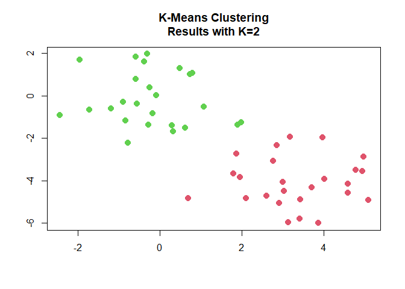<!-- -->

``` r
set.seed(3)
km.out=kmeans (x,2, nstart = 1)
km.out$tot.withinss
```

    ## [1] 128.6066

``` r
km.out=kmeans (x,2, nstart =20)
km.out$tot.withinss
```

    ## [1] 128.6066

# Hierarchical Clustering

``` r
hc.complete = hclust(dist(x), method="complete")
hc.complete
```

    ## 
    ## Call:
    ## hclust(d = dist(x), method = "complete")
    ## 
    ## Cluster method   : complete 
    ## Distance         : euclidean 
    ## Number of objects: 50

``` r
hc.average =hclust(dist(x), method ="average")
hc.single=hclust(dist(x), method ="single")
```

``` r
par(mfrow=c(1,3))
plot(hc.complete ,main="Complete Linkage ", xlab="", sub="", cex=.9)
plot(hc.average , main="Average Linkage", xlab="", sub="", cex=.9)
plot(hc.single , main="Single Linkage ", xlab="", sub="", cex=.9)
```

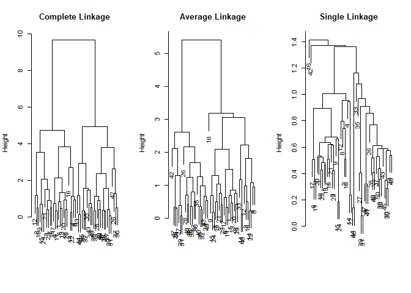<!-- -->

``` r
cutree(hc.complete,2)
```

    ##  [1] 1 1 1 1 1 1 1 1 1 1 1 1 1 1 1 1 1 1 1 1 1 1 1 1 1 2 2 2 2 2 2 2 2 2 2 2 2 2
    ## [39] 2 2 2 2 2 2 2 2 2 2 2 2

``` r
cutree(hc.average,2)
```

    ##  [1] 1 1 1 1 1 1 1 1 1 1 1 1 1 1 1 1 1 1 1 1 1 1 1 1 1 2 2 2 2 2 2 2 1 2 2 2 2 2
    ## [39] 2 2 2 2 2 1 2 1 2 2 2 2

``` r
cutree(hc.single,2)
```

    ##  [1] 1 1 1 1 1 1 1 1 1 1 1 1 1 1 1 2 1 1 1 1 1 1 1 1 1 1 1 1 1 1 1 1 1 1 1 1 1 1
    ## [39] 1 1 1 1 1 1 1 1 1 1 1 1

``` r
xsc=scale(x)
plot(hclust(dist(xsc), method ="complete"), main=" Hierarchical Clustering with Scaled Features ")
```

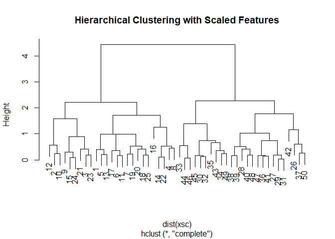<!-- -->

``` r
x=matrix(rnorm (30*3), ncol=3)
dd=as.dist(1-cor(t(x)))
plot(hclust(dd, method ="complete"), main=" Complete Linkage with Correlation -Based Distance ", xlab="", sub ="")
```

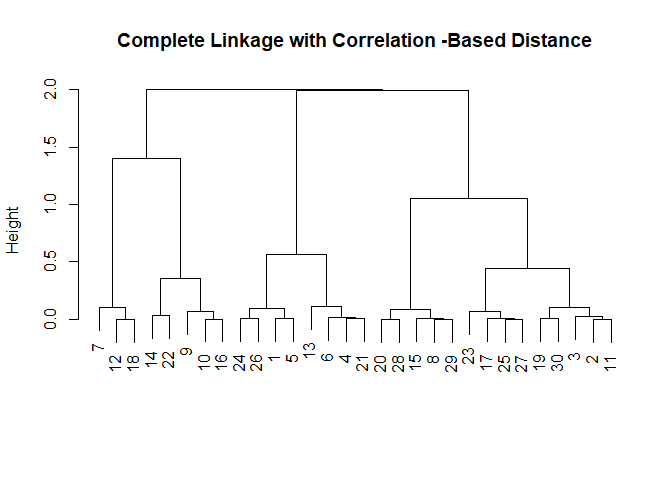<!-- -->

# Exercises

3.  In this problem, you will perform K-means clustering manually, with
    K = 2, on a small example with n = 6 observations and p = 2
    features. The observations are as follows.

<!-- end list -->

``` r
#Example from the book
X1 <- c(1,1,0,5,6,4)
X2 <- c(4,3,4,1,2,0)

df <- tibble(X1=X1,X2=X2)
df
```

    ## # A tibble: 6 x 2
    ##      X1    X2
    ##   <dbl> <dbl>
    ## 1     1     4
    ## 2     1     3
    ## 3     0     4
    ## 4     5     1
    ## 5     6     2
    ## 6     4     0

1)  Plot the observations.

<!-- end list -->

``` r
ggplot(df, aes(X1,X2)) + geom_point() + theme_minimal()+ggtitle("Simple plot X1 and X2")
```

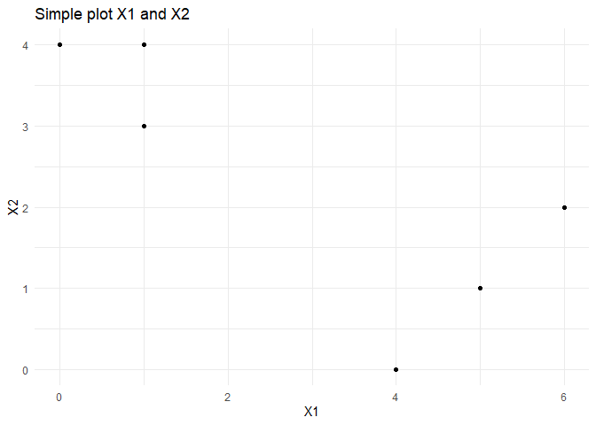<!-- -->

2)  Randomly assign a cluster label to each observation. You can use the
    sample() command in R to do this. Report the cluster labels for each
    observation.

<!-- end list -->

``` r
df <- df %>% 
  mutate('label' = sample.int(2, size=6, replace=TRUE))

df
```

    ## # A tibble: 6 x 3
    ##      X1    X2 label
    ##   <dbl> <dbl> <int>
    ## 1     1     4     2
    ## 2     1     3     2
    ## 3     0     4     1
    ## 4     5     1     2
    ## 5     6     2     2
    ## 6     4     0     1

3)  Compute the centroid for each cluster.

<!-- end list -->

``` r
cluster1 <- filter(df, df$label == 1)
cluster2 <- filter(df, df$label == 2)

centroid1 <- tibble("X1" = mean(cluster1$X1), "X2" = mean(cluster1$X2))
#centroid1

centroid2 <- tibble("X1" = mean(cluster2$X1), "X2" = mean(cluster2$X2))
#centroid2
```

4)  Assign each observation to the centroid to which it is closest, in
    terms of Euclidean distance. Report the cluster labels for each
    observation.

<!-- end list -->

``` r
#assign centroids
cluster1 <- filter(df, df$label == 1)
cluster2 <- filter(df, df$label == 2)

centroid1 <- tibble("X1" = mean(cluster1$X1), "X2" = mean(cluster1$X2))
centroid2 <- tibble("X1" = mean(cluster2$X1), "X2" = mean(cluster2$X2))


for (val in 1:nrow(df)) {
  #print(val)
  var <- df[val,1:2] #store position of each element to compare with centroid
  
  dist1 = dist(rbind(var, centroid1), method="euclidean")
  dist2 = dist(rbind(var, centroid2), method="euclidean") 

  df[val, 3] = case_when(dist1 <= dist2 ~ 1, dist2 < dist1 ~ 2) 
 
  }
```

``` r
#generate df
X1 <- c(1,1,0,5,6,4,6,7,2,4,6,7,8,9,0,2)
X2 <- c(4,3,4,1,2,0,3,5,1,3,8,2,3,1,9,2)

df <- tibble(X1=X1,X2=X2)

#assign random labels
df <- df %>% 
  mutate('label' = sample.int(2, size=nrow(df), replace=TRUE))
```

5)  Repeat (c) and (d) until the answers obtained stop changing.

<!-- end list -->

``` r
#initialize first time 
cluster1 <- filter(df, df$label == 1)
cluster2 <- filter(df, df$label == 2)

centroid1 <- tibble("X1" = mean(cluster1$X1), "X2" = mean(cluster1$X2))
centroid2 <- tibble("X1" = mean(cluster2$X1), "X2" = mean(cluster2$X2))

centroid1_new = 0
centroid2_new = 0

ggplot(df, aes(X1,X2,color=label)) + geom_point() + geom_point(aes(centroid1$X1, centroid1$X2), color = "red", size=4) + geom_point(aes(centroid2$X1, centroid2$X2), color = "green", size=4) + theme_minimal()+ggtitle("Initial Plot")
```

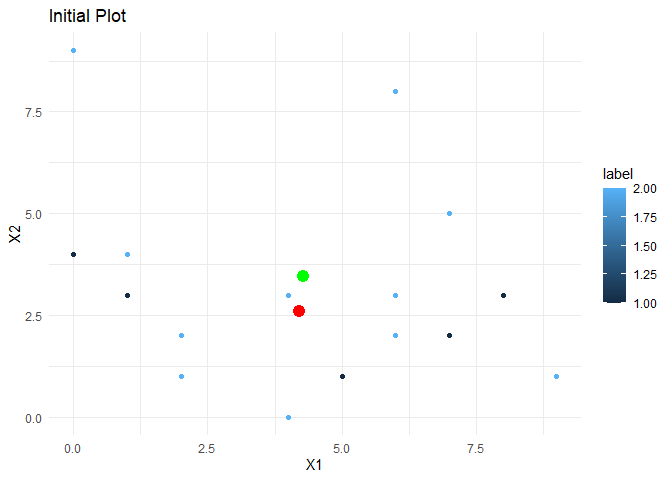<!-- -->

``` r
while ((centroid1_new != centroid1) & centroid2_new != centroid2) {
  
#assign centroids
cluster1 <- filter(df, df$label == 1)
cluster2 <- filter(df, df$label == 2)

centroid1 <- tibble("X1" = mean(cluster1$X1), "X2" = mean(cluster1$X2))
centroid2 <- tibble("X1" = mean(cluster2$X1), "X2" = mean(cluster2$X2))


for (val in 1:nrow(df)) {
  
  var <- df[val,1:2] #store position of each element to compare with centroid
  
  #evaluate distance of each obs x each centroid
  dist1 = dist(rbind(var, centroid1), method="euclidean")
  dist2 = dist(rbind(var, centroid2), method="euclidean") 

  #assign label to the closest distance!  
  df[val, 3] = case_when(dist1 <= dist2 ~ 1, dist2 < dist1 ~ 2) 
 
}

#iterating with visuals
print(  
  ggplot(df, aes(X1,X2,color=label)) + geom_point() + geom_point(aes(centroid1$X1, centroid1$X2), color = "red", size=4) + geom_point(aes(centroid2$X1, centroid2$X2), color = "green", size=4) + theme_minimal()+ggtitle("Iterative PLOT")
  )
cluster1 <- filter(df, df$label == 1)
cluster2 <- filter(df, df$label == 2)

centroid1_new <- tibble("X1" = mean(cluster1$X1), "X2" = mean(cluster1$X2))
centroid2_new <- tibble("X1" = mean(cluster2$X1), "X2" = mean(cluster2$X2))

}
```

    ## Warning in while ((centroid1_new != centroid1) & centroid2_new != centroid2) {:
    ## the condition has length > 1 and only the first element will be used
    
    ## Warning in while ((centroid1_new != centroid1) & centroid2_new != centroid2) {:
    ## the condition has length > 1 and only the first element will be used

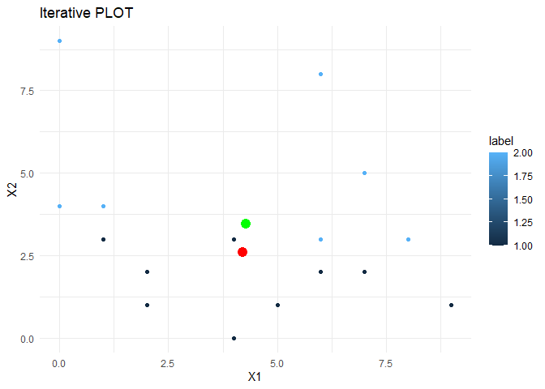<!-- -->

    ## Warning in while ((centroid1_new != centroid1) & centroid2_new != centroid2) {:
    ## the condition has length > 1 and only the first element will be used

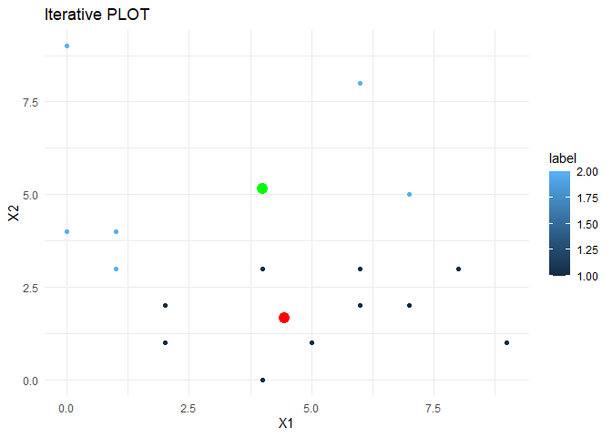<!-- -->

    ## Warning in while ((centroid1_new != centroid1) & centroid2_new != centroid2) {:
    ## the condition has length > 1 and only the first element will be used

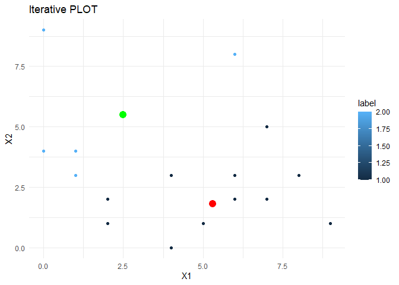<!-- -->

    ## Warning in while ((centroid1_new != centroid1) & centroid2_new != centroid2) {:
    ## the condition has length > 1 and only the first element will be used

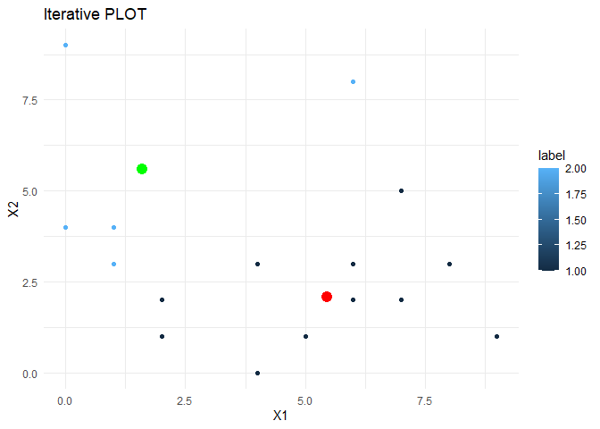<!-- -->

``` r
df
```

    ## # A tibble: 16 x 3
    ##       X1    X2 label
    ##    <dbl> <dbl> <int>
    ##  1     1     4     2
    ##  2     1     3     2
    ##  3     0     4     2
    ##  4     5     1     1
    ##  5     6     2     1
    ##  6     4     0     1
    ##  7     6     3     1
    ##  8     7     5     1
    ##  9     2     1     1
    ## 10     4     3     1
    ## 11     6     8     2
    ## 12     7     2     1
    ## 13     8     3     1
    ## 14     9     1     1
    ## 15     0     9     2
    ## 16     2     2     1

6)  In your plot from (a), color the observations according to the
    cluster labels obtained.

<!-- end list -->

``` r
ggplot(df, aes(X1,X2,color=label)) + geom_point() + theme_minimal()+ggtitle("Simple plot X1 and X2")
```

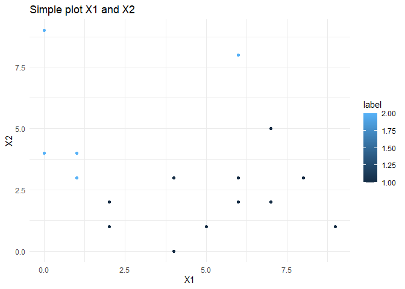<!-- -->
