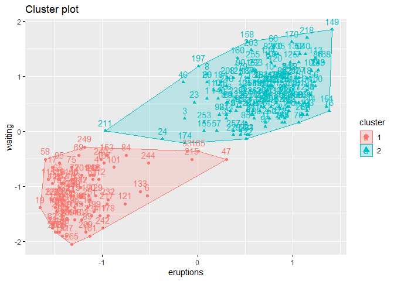

Week9\_Assigment 1
================
Hans Franke

``` r
library(tidyverse)
```

    ## -- Attaching packages ------------------------------------------ tidyverse 1.3.0 --

    ## v ggplot2 3.3.2     v purrr   0.3.4
    ## v tibble  3.0.3     v dplyr   1.0.2
    ## v tidyr   1.1.2     v stringr 1.4.0
    ## v readr   1.3.1     v forcats 0.5.0

    ## -- Conflicts --------------------------------------------- tidyverse_conflicts() --
    ## x dplyr::filter() masks stats::filter()
    ## x dplyr::lag()    masks stats::lag()

``` r
distances <- dist(faithful, method = "euclidean")
result <- hclust(distances, method = "average")
```

``` r
#install.packages("ggdendro")
library(ggdendro)
```

    ## Warning: package 'ggdendro' was built under R version 4.0.3

``` r
ggdendrogram(result)
```

<!-- -->

``` r
df_kmeans <- kmeans(faithful, centers=2)
str(df_kmeans)
```

    ## List of 9
    ##  $ cluster     : Named int [1:272] 2 1 2 1 2 1 2 2 1 2 ...
    ##   ..- attr(*, "names")= chr [1:272] "1" "2" "3" "4" ...
    ##  $ centers     : num [1:2, 1:2] 2.09 4.3 54.75 80.28
    ##   ..- attr(*, "dimnames")=List of 2
    ##   .. ..$ : chr [1:2] "1" "2"
    ##   .. ..$ : chr [1:2] "eruptions" "waiting"
    ##  $ totss       : num 50440
    ##  $ withinss    : num [1:2] 3456 5446
    ##  $ tot.withinss: num 8902
    ##  $ betweenss   : num 41538
    ##  $ size        : int [1:2] 100 172
    ##  $ iter        : int 1
    ##  $ ifault      : int 0
    ##  - attr(*, "class")= chr "kmeans"

``` r
df_kmeans$cluster
```

    ##   1   2   3   4   5   6   7   8   9  10  11  12  13  14  15  16  17  18  19  20 
    ##   2   1   2   1   2   1   2   2   1   2   1   2   2   1   2   1   1   2   1   2 
    ##  21  22  23  24  25  26  27  28  29  30  31  32  33  34  35  36  37  38  39  40 
    ##   1   1   2   2   2   2   1   2   2   2   2   2   1   2   2   1   1   2   1   2 
    ##  41  42  43  44  45  46  47  48  49  50  51  52  53  54  55  56  57  58  59  60 
    ##   2   1   2   1   2   2   1   1   2   1   2   2   1   2   1   2   2   1   2   2 
    ##  61  62  63  64  65  66  67  68  69  70  71  72  73  74  75  76  77  78  79  80 
    ##   1   2   1   2   1   2   2   2   1   2   2   1   2   2   1   2   1   2   2   2 
    ##  81  82  83  84  85  86  87  88  89  90  91  92  93  94  95  96  97  98  99 100 
    ##   2   2   2   1   2   2   2   2   1   2   1   2   1   2   1   2   2   2   1   2 
    ## 101 102 103 104 105 106 107 108 109 110 111 112 113 114 115 116 117 118 119 120 
    ##   1   2   1   2   2   1   2   1   2   2   2   1   2   2   1   2   1   2   1   2 
    ## 121 122 123 124 125 126 127 128 129 130 131 132 133 134 135 136 137 138 139 140 
    ##   1   2   2   1   2   2   1   2   1   2   1   2   1   2   1   2   1   2   1   2 
    ## 141 142 143 144 145 146 147 148 149 150 151 152 153 154 155 156 157 158 159 160 
    ##   2   1   2   2   2   1   2   1   2   1   2   2   1   2   2   2   2   2   1   2 
    ## 161 162 163 164 165 166 167 168 169 170 171 172 173 174 175 176 177 178 179 180 
    ##   1   2   1   2   1   2   1   2   1   2   1   1   2   2   2   2   2   1   2   2 
    ## 181 182 183 184 185 186 187 188 189 190 191 192 193 194 195 196 197 198 199 200 
    ##   1   2   2   2   1   2   2   1   2   1   2   1   2   2   2   2   2   2   1   2 
    ## 201 202 203 204 205 206 207 208 209 210 211 212 213 214 215 216 217 218 219 220 
    ##   1   2   2   1   2   1   2   2   1   2   2   2   1   2   1   2   1   2   1   2 
    ## 221 222 223 224 225 226 227 228 229 230 231 232 233 234 235 236 237 238 239 240 
    ##   1   2   1   2   2   2   2   2   2   2   2   1   2   1   2   1   1   2   2   1 
    ## 241 242 243 244 245 246 247 248 249 250 251 252 253 254 255 256 257 258 259 260 
    ##   2   1   2   1   2   2   1   2   1   2   1   2   2   2   2   2   2   2   1   2 
    ## 261 262 263 264 265 266 267 268 269 270 271 272 
    ##   2   2   1   2   1   1   2   2   1   2   1   2

``` r
df_kmeans$centers
```

    ##   eruptions  waiting
    ## 1   2.09433 54.75000
    ## 2   4.29793 80.28488

``` r
#install.packages("factoextra")
library("factoextra")
```

    ## Warning: package 'factoextra' was built under R version 4.0.3

    ## Welcome! Want to learn more? See two factoextra-related books at https://goo.gl/ve3WBa

``` r
fviz_cluster(df_kmeans, data = faithful)
```

<!-- -->
\#\# Look for the best number of clusters

``` r
fviz_nbclust(faithful, FUN=hcut, method = "wss") #elbow method
```

<!-- -->

``` r
fviz_nbclust(faithful, FUN=hcut, method = "silhouette") #silhouette
```

<!-- -->

``` r
library(MASS) # make sure to load mass before tidyverse to avoid conflicts!
```

    ## 
    ## Attaching package: 'MASS'

    ## The following object is masked from 'package:dplyr':
    ## 
    ##     select

``` r
library(tidyverse)
#install.packages("patchwork")
library(patchwork)
```

    ## Warning: package 'patchwork' was built under R version 4.0.3

    ## 
    ## Attaching package: 'patchwork'

    ## The following object is masked from 'package:MASS':
    ## 
    ##     area

``` r
library(ggdendro)
```

# Hierarchical and k-means clustering Introduction

We use the following packages:

library(MASS) \# make sure to load mass before tidyverse to avoid
conflicts\! library(tidyverse) library(patchwork) library(ggdendro)

In this practical, we will apply hierarchical and k-means clustering to
two synthetic datasets. The data can be generated by running the code
below.

Try to understand what is happening as you run each line of the code
below

``` r
# randomly generate bivariate normal data
set.seed(123)
sigma      <- matrix(c(1, .5, .5, 1), 2, 2)
sim_matrix <- mvrnorm(n = 100, mu = c(5, 5), Sigma = sigma)
colnames(sim_matrix) <- c("x1", "x2")

# change to a data frame (tibble) and add a cluster label column
sim_df <- 
  sim_matrix %>% 
  as_tibble() %>%
  mutate(class = sample(c("A", "B", "C"), size = 100, replace = TRUE))

# Move the clusters to generate separation
sim_df_small <- 
  sim_df %>%
  mutate(x2 = case_when(class == "A" ~ x2 + .5,
                        class == "B" ~ x2 - .5,
                        class == "C" ~ x2 + .5),
         x1 = case_when(class == "A" ~ x1 - .5,
                        class == "B" ~ x1 - 0,
                        class == "C" ~ x1 + .5))
sim_df_large <- 
  sim_df %>%
  mutate(x2 = case_when(class == "A" ~ x2 + 2.5,
                        class == "B" ~ x2 - 2.5,
                        class == "C" ~ x2 + 2.5),
         x1 = case_when(class == "A" ~ x1 - 2.5,
                        class == "B" ~ x1 - 0,
                        class == "C" ~ x1 + 2.5))
```

Prepare two unsupervised datasets by removing the class feature

``` r
sim_df_small_un <- sim_df_small[,1:2]
sim_df_large_un <- sim_df_large[,1:2]
```

For each of these datasets, create a scatterplot. Combine the two plots
into a single frame (look up the “patchwork” package to see how to do
this\!) What is the difference between the two datasets?

``` r
# at first plot we can imagine as a single cluster, in the second we can think of 3 clusters
g1 <- ggplot(sim_df_small_un, aes(x1,x2)) + geom_point() + ylim(0,10) + xlim(0,10)
g2 <- ggplot(sim_df_large_un, aes(x1,x2)) + geom_point() +ylim(0,10) + xlim(0,10)
g1 + g2
```

<!-- -->

``` r
#look if this is true!
sim_kmeans <- kmeans(sim_df_large_un, centers=3)

fviz_cluster(sim_kmeans, data = sim_df_large_un)
```

<!-- -->

``` r
#look if this is true!
sim_kmeans <- kmeans(sim_df_small_un, centers=1)

fviz_cluster(sim_kmeans, data = sim_df_small_un)
```

<!-- -->

``` r
#Original DF
sim_kmeans <- kmeans(sim_df[,1:2], centers=3)

fviz_cluster(sim_kmeans, data = sim_df[,1:2])
```

<!-- -->

# Hierarchical clustering

Run a hierarchical clustering on these datasets and display the result
as dendrograms. Use euclidian distances and the complete agglomeration
method. Make sure the two plots have the same y-scale. What is the
difference between the dendrograms? (Hint: functions you’ll need are
hclust, ggdendrogram, and ylim)

``` r
#Small dataset
distances <- dist(sim_df_small_un, method = "euclidean")
result_com_eu <- hclust(distances, method = "complete")
g1 <- ggdendrogram(result_com_eu) + ylim(0,10) + labs(title = "Small Dataset")
```

    ## Scale for 'y' is already present. Adding another scale for 'y', which will
    ## replace the existing scale.

``` r
#large dataset
distances <- dist(sim_df_large_un, method = "euclidean")
result <- hclust(distances, method = "complete")
g2 <- ggdendrogram(result) + ylim(0,10) + labs(title = "Large Dataset")
```

    ## Scale for 'y' is already present. Adding another scale for 'y', which will
    ## replace the existing scale.

``` r
g1 + g2
```

<!-- -->

``` r
#in the small dataset the distances are lesser than on large, so the points are closer to eachother, as we see in previous experiments. Max height = max distance = 5,5 on smalldf, and 10 in largedf.
```

For the dataset with small differences, also run a complete
agglomeration hierarchical cluster with manhattan distance.

``` r
#Small dataset
distances <- dist(sim_df_small_un, method = "manhattan")
result_com_man <- hclust(distances, method = "complete")
g1 <- ggdendrogram(result_com_man) + ylim(0,10) + labs(title = "Small Dataset")
```

    ## Scale for 'y' is already present. Adding another scale for 'y', which will
    ## replace the existing scale.

``` r
g1
```

<!-- -->

``` r
#now we see that the average distance increase.
```

Use the cutree() function to obtain the cluster assignments for three
clusters and compare the cluster assignments to the 3-cluster euclidian
solution. Do this comparison by creating two scatter plots with cluster
assignment mapped to the colour aesthetic. Which difference do you see?

``` r
man <- cutree(result_com_man, k=3) 
euc <- cutree(result_com_eu, k=3)

sim_df_small_un  <- sim_df_small_un %>%
  mutate("man" = man, #assign the classes from manhattan distance
         "euc" = euc) #assign the classes from euclidean distance

g1 <- ggplot(sim_df_small_un, aes(x1,x2, color=man)) + geom_point() + labs(title= "3-Clusters Manhattan Distances")
g2 <- ggplot(sim_df_small_un, aes(x1,x2, color=euc)) + geom_point() + labs(title= "3-Clusters Euclidean Distances")

g1 + g2
```

<!-- -->

``` r
#we see the boundaries of the classes mostly in the middle-points is different
```

# K-means clustering

Create k-means clusterings with 2, 3, 4, and 6 classes on the large
difference data. Again, create coloured scatter plots for these
clusterings.

``` r
k2 <- kmeans(sim_df_large_un, centers=2)
k3 <- kmeans(sim_df_large_un, centers=3)
k4 <- kmeans(sim_df_large_un, centers=4)
k6 <- kmeans(sim_df_large_un, centers=6)

sim_df_large_un_kmeans <- sim_df_large_un %>%
  mutate("k2" = k2$cluster,
         "k3" = k3$cluster,
         "k4" = k4$cluster,
         "k6" = k6$cluster,
         )

(ggplot(sim_df_large_un_kmeans, aes(x1,x2, color=k2))+geom_point() + theme_classic()) +
  (ggplot(sim_df_large_un_kmeans, aes(x1,x2, color=k3))+geom_point() + theme_classic()) +
   (ggplot(sim_df_large_un_kmeans, aes(x1,x2, color=k4))+geom_point() + theme_classic()) +
    (ggplot(sim_df_large_un_kmeans, aes(x1,x2, color=k6))+geom_point() + theme_classic()) 
```

<!-- -->

``` r
k2 <- kmeans(sim_df_large_un, centers=2)
k3 <- kmeans(sim_df_large_un, centers=3)
k4 <- kmeans(sim_df_large_un, centers=4)
k6 <- kmeans(sim_df_large_un, centers=6)

sim_df_large_un_kmeans <- sim_df_large_un %>%
  mutate("k2" = k2$cluster,
         "k3" = k3$cluster,
         "k4" = k4$cluster,
         "k6" = k6$cluster,
         )

(ggplot(sim_df_large_un_kmeans, aes(x1,x2, color=k2))+geom_point() + theme_classic()) +
  (ggplot(sim_df_large_un_kmeans, aes(x1,x2, color=k3))+geom_point() + theme_classic()) +
   (ggplot(sim_df_large_un_kmeans, aes(x1,x2, color=k4))+geom_point() + theme_classic()) +
    (ggplot(sim_df_large_un_kmeans, aes(x1,x2, color=k6))+geom_point() + theme_classic()) 
```

<!-- -->

Do the same thing again a few times. Do you see the same results every
time? where do you see differences?

``` r
#Yes as we assign random values as start position the classes can change, specialy at large the number of clusters.
```

Find a way online to perform bootstrap stability assessment for the 3
and 6-cluster solutions.

``` r
#install.packages("fpc") 
library("fpc")
```

    ## Warning: package 'fpc' was built under R version 4.0.3

``` r
#set desire number of clusters
kbest.p<- 6 

#   called cboot.hclust.
cboot.hclust <- clusterboot(sim_df_large_un, clustermethod=hclustCBI,
                           method="ward.D", k=kbest.p)
```

    ## boot 1 
    ## boot 2 
    ## boot 3 
    ## boot 4 
    ## boot 5 
    ## boot 6 
    ## boot 7 
    ## boot 8 
    ## boot 9 
    ## boot 10 
    ## boot 11 
    ## boot 12 
    ## boot 13 
    ## boot 14 
    ## boot 15 
    ## boot 16 
    ## boot 17 
    ## boot 18 
    ## boot 19 
    ## boot 20 
    ## boot 21 
    ## boot 22 
    ## boot 23 
    ## boot 24 
    ## boot 25 
    ## boot 26 
    ## boot 27 
    ## boot 28 
    ## boot 29 
    ## boot 30 
    ## boot 31 
    ## boot 32 
    ## boot 33 
    ## boot 34 
    ## boot 35 
    ## boot 36 
    ## boot 37 
    ## boot 38 
    ## boot 39 
    ## boot 40 
    ## boot 41 
    ## boot 42 
    ## boot 43 
    ## boot 44 
    ## boot 45 
    ## boot 46 
    ## boot 47 
    ## boot 48 
    ## boot 49 
    ## boot 50 
    ## boot 51 
    ## boot 52 
    ## boot 53 
    ## boot 54 
    ## boot 55 
    ## boot 56 
    ## boot 57 
    ## boot 58 
    ## boot 59 
    ## boot 60 
    ## boot 61 
    ## boot 62 
    ## boot 63 
    ## boot 64 
    ## boot 65 
    ## boot 66 
    ## boot 67 
    ## boot 68 
    ## boot 69 
    ## boot 70 
    ## boot 71 
    ## boot 72 
    ## boot 73 
    ## boot 74 
    ## boot 75 
    ## boot 76 
    ## boot 77 
    ## boot 78 
    ## boot 79 
    ## boot 80 
    ## boot 81 
    ## boot 82 
    ## boot 83 
    ## boot 84 
    ## boot 85 
    ## boot 86 
    ## boot 87 
    ## boot 88 
    ## boot 89 
    ## boot 90 
    ## boot 91 
    ## boot 92 
    ## boot 93 
    ## boot 94 
    ## boot 95 
    ## boot 96 
    ## boot 97 
    ## boot 98 
    ## boot 99 
    ## boot 100

``` r
#alternative version 
cboot.kmeansCBI <- clusterboot(sim_df_large_un, clustermethod=kmeansCBI, k=kbest.p)
```

    ## boot 1 
    ## boot 2 
    ## boot 3 
    ## boot 4 
    ## boot 5 
    ## boot 6 
    ## boot 7 
    ## boot 8 
    ## boot 9 
    ## boot 10 
    ## boot 11 
    ## boot 12 
    ## boot 13 
    ## boot 14 
    ## boot 15 
    ## boot 16 
    ## boot 17 
    ## boot 18 
    ## boot 19 
    ## boot 20 
    ## boot 21 
    ## boot 22 
    ## boot 23 
    ## boot 24 
    ## boot 25 
    ## boot 26 
    ## boot 27 
    ## boot 28 
    ## boot 29 
    ## boot 30 
    ## boot 31 
    ## boot 32 
    ## boot 33 
    ## boot 34 
    ## boot 35 
    ## boot 36 
    ## boot 37 
    ## boot 38 
    ## boot 39 
    ## boot 40 
    ## boot 41 
    ## boot 42 
    ## boot 43 
    ## boot 44 
    ## boot 45 
    ## boot 46 
    ## boot 47 
    ## boot 48 
    ## boot 49 
    ## boot 50 
    ## boot 51 
    ## boot 52 
    ## boot 53 
    ## boot 54 
    ## boot 55 
    ## boot 56 
    ## boot 57 
    ## boot 58 
    ## boot 59 
    ## boot 60 
    ## boot 61 
    ## boot 62 
    ## boot 63 
    ## boot 64 
    ## boot 65 
    ## boot 66 
    ## boot 67 
    ## boot 68 
    ## boot 69 
    ## boot 70 
    ## boot 71 
    ## boot 72 
    ## boot 73 
    ## boot 74 
    ## boot 75 
    ## boot 76 
    ## boot 77 
    ## boot 78 
    ## boot 79 
    ## boot 80 
    ## boot 81 
    ## boot 82 
    ## boot 83 
    ## boot 84 
    ## boot 85 
    ## boot 86 
    ## boot 87 
    ## boot 88 
    ## boot 89 
    ## boot 90 
    ## boot 91 
    ## boot 92 
    ## boot 93 
    ## boot 94 
    ## boot 95 
    ## boot 96 
    ## boot 97 
    ## boot 98 
    ## boot 99 
    ## boot 100

``` r
#   The results of the clustering are in 
#   cboot.hclust$result. The output of the hclust() 
#   function is in cboot.hclust$result$result. 
#
#   cboot.hclust$result$partition returns a 
#   vector of clusterlabels. 
groups<-cboot.hclust$result$partition 


cboot.hclust$bootmean 
```

    ## [1] 0.7872441 0.7179041 0.6361775 0.6735265 0.8956219 0.6561686

``` r
cboot.kmeansCBI$bootmean
```

    ## [1] 0.5777896 0.6279482 0.7752473 0.5287075 0.6762769 0.4496445

``` r
# We can see that the stability on each cluster (we see that k=5 has the most stability and 3 and 6 the fewer, as we see from previous example)

clusters <- 1:6
stability2 <- cboot.kmeansCBI$bootmean
stability <- cboot.hclust$bootmean 

ggplot(data=NULL) + geom_line(aes(x=clusters, y=stability, color='HCLUST')) + geom_line(aes(x=clusters, y=stability2, color="Kmeans")) + xlim(1,6) + ylim(0,1) + labs(title="Stability test with resampling")
```

<!-- -->
