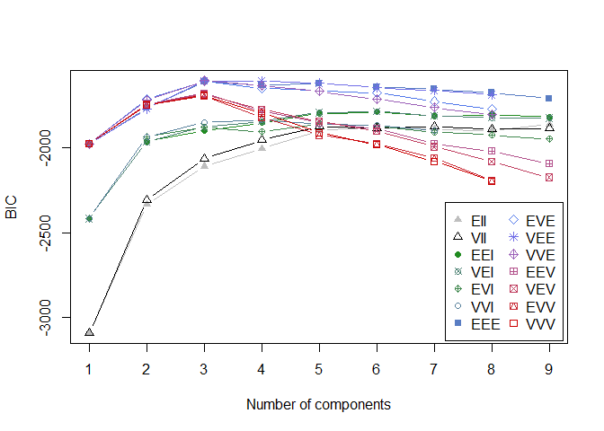

Week9\_Assigment 2
================
Hans Franke

``` r
library(MASS) # make sure to load mass before tidyverse to avoid conflicts!
library(tidyverse)
```

    ## -- Attaching packages ----------------------------------------- tidyverse 1.3.0 --

    ## v ggplot2 3.3.2     v purrr   0.3.4
    ## v tibble  3.0.3     v dplyr   1.0.2
    ## v tidyr   1.1.2     v stringr 1.4.0
    ## v readr   1.3.1     v forcats 0.5.0

    ## -- Conflicts -------------------------------------------- tidyverse_conflicts() --
    ## x dplyr::filter() masks stats::filter()
    ## x dplyr::lag()    masks stats::lag()
    ## x dplyr::select() masks MASS::select()

``` r
#install.packages("patchwork")
library(patchwork)
```

    ## Warning: package 'patchwork' was built under R version 4.0.3

    ## 
    ## Attaching package: 'patchwork'

    ## The following object is masked from 'package:MASS':
    ## 
    ##     area

``` r
library(ggdendro)
```

    ## Warning: package 'ggdendro' was built under R version 4.0.3

``` r
library(mclust)
```

    ## Warning: package 'mclust' was built under R version 4.0.3

    ## Package 'mclust' version 5.4.6
    ## Type 'citation("mclust")' for citing this R package in publications.

    ## 
    ## Attaching package: 'mclust'

    ## The following object is masked from 'package:purrr':
    ## 
    ##     map

In this practical, we will apply model-based clustering on a dataset of
bank note measurements. The data is built into the mclust package and
can be loaded as a tibble by running the following code:

``` r
df <- as_tibble(banknote)
head(df)
```

    ## # A tibble: 6 x 7
    ##   Status  Length  Left Right Bottom   Top Diagonal
    ##   <fct>    <dbl> <dbl> <dbl>  <dbl> <dbl>    <dbl>
    ## 1 genuine   215.  131   131.    9     9.7     141 
    ## 2 genuine   215.  130.  130.    8.1   9.5     142.
    ## 3 genuine   215.  130.  130.    8.7   9.6     142.
    ## 4 genuine   215.  130.  130.    7.5  10.4     142 
    ## 5 genuine   215   130.  130.   10.4   7.7     142.
    ## 6 genuine   216.  131.  130.    9    10.1     141.

# Data exploration

Read the help file of the banknote dataset to understand what it’s all
about.

Create a scatter plot of the left (x-axis) and right (y-axis)
measurements on the dataset. Map the Status column to colour. Jitter the
points to avoid overplotting. Are the classes easy to distinguish based
on these features?

``` r
ggplot(df, aes(Left, Right, color=Status))+geom_jitter()
```

<!-- -->

``` r
#We can see there is overlaping in classes considering only this 2 features, so no clear distinguishing
```

From now on, we will assume that we don’t have the labels. Remove the
Status column from the dataset.

``` r
df_unlabel <- df[,2:7]
head(df_unlabel)
```

    ## # A tibble: 6 x 6
    ##   Length  Left Right Bottom   Top Diagonal
    ##    <dbl> <dbl> <dbl>  <dbl> <dbl>    <dbl>
    ## 1   215.  131   131.    9     9.7     141 
    ## 2   215.  130.  130.    8.1   9.5     142.
    ## 3   215.  130.  130.    8.7   9.6     142.
    ## 4   215.  130.  130.    7.5  10.4     142 
    ## 5   215   130.  130.   10.4   7.7     142.
    ## 6   216.  131.  130.    9    10.1     141.

Create density plots for all columns in the dataset. Which single
feature is likely to be best for clustering?

``` r
(ggplot(df_unlabel )+
     geom_density(aes(x=Length)) ) +

        (ggplot(df_unlabel )+
          geom_density(aes(x=Left)) ) +
  
            (ggplot(df_unlabel )+
                geom_density(aes(x=Right)) ) +
  
              (ggplot(df_unlabel )+
                geom_density(aes(x=Bottom)) ) +
  
                (ggplot(df_unlabel )+
                geom_density(aes(x=Top)) ) +
  
                        (ggplot(df_unlabel )+
                geom_density(aes(x=Diagonal)) ) 
```

<!-- -->

``` r
#Diagonal seems to have a non-normal distribution, so this can explain Clusters better, probably there is two normal distributions (clusters)
```

``` r
(ggplot(df )+
     geom_density(aes(x=Diagonal, color=Status)) ) + theme_minimal()
```

<!-- -->

``` r
#As we imagine, indeed there is 2 normal distribution explaining the classes
```

``` r
(ggplot(df )+
     geom_density(aes(x=Length, color=Status)) ) + theme_minimal()
```

<!-- -->

# Univariate model-based clustering

``` r
class <- df_unlabel[,6]
fit <- Mclust(class)
summary(fit)
```

    ## ---------------------------------------------------- 
    ## Gaussian finite mixture model fitted by EM algorithm 
    ## ---------------------------------------------------- 
    ## 
    ## Mclust E (univariate, equal variance) model with 3 components: 
    ## 
    ##  log-likelihood   n df       BIC       ICL
    ##       -258.4995 200  6 -548.7889 -556.8668
    ## 
    ## Clustering table:
    ##   1   2   3 
    ##  12  88 100

``` r
plot(fit, what="BIC")
```

<!-- -->

``` r
#fit_E_2$parameters
```

Use Mclust to perform model-based clustering with 2 clusters on the
feature you chose. Assume equal variances. Name the model object
fit\_E\_2. What are the means and variances of the clusters?

``` r
class <- df_unlabel[,6]
fit_E_2 <- Mclust(class, modelNames = c("E"), G=2)
summary(fit_E_2)
```

    ## ---------------------------------------------------- 
    ## Gaussian finite mixture model fitted by EM algorithm 
    ## ---------------------------------------------------- 
    ## 
    ## Mclust E (univariate, equal variance) model with 2 components: 
    ## 
    ##  log-likelihood   n df       BIC       ICL
    ##       -274.1367 200  4 -569.4667 -574.2533
    ## 
    ## Clustering table:
    ##   1   2 
    ## 100 100

``` r
fit_E_2$parameters
```

    ## $pro
    ## [1] 0.5003518 0.4996482
    ## 
    ## $mean
    ##        1        2 
    ## 139.4464 141.5221 
    ## 
    ## $variance
    ## $variance$modelName
    ## [1] "E"
    ## 
    ## $variance$d
    ## [1] 1
    ## 
    ## $variance$G
    ## [1] 2
    ## 
    ## $variance$sigmasq
    ## [1] 0.244004
    ## 
    ## 
    ## $Vinv
    ## NULL

Use the formula from the slides and the model’s log-likelihood
(fit\_E\_2\(loglik) to compute the BIC for this model. Compare it to the BIC stored in the model object (fit_E_2\)bic).
Explain how many parameters (m) you used and which parameters these are.

``` r
#stored
fit_E_2$bic
```

    ## [1] -569.4667

``` r
#parameters
fit_E_2$parameters
```

    ## $pro
    ## [1] 0.5003518 0.4996482
    ## 
    ## $mean
    ##        1        2 
    ## 139.4464 141.5221 
    ## 
    ## $variance
    ## $variance$modelName
    ## [1] "E"
    ## 
    ## $variance$d
    ## [1] 1
    ## 
    ## $variance$G
    ## [1] 2
    ## 
    ## $variance$sigmasq
    ## [1] 0.244004
    ## 
    ## 
    ## $Vinv
    ## NULL

``` r
#k = 2 (2 clusters)
#p = 1 (variable)
#the parameters are (1 class probability pi, 2 means, and 1 variance)

#from book (we can see 4 parameters)
fit_E_2$loglik
```

    ## [1] -274.1367

Plot the model-implied density using the plot() function. Afterwards,
add rug marks of the original data to the plot using the rug() function
from the base graphics system.

``` r
plot(fit_E_2, what="BIC")
```

<!-- -->

``` r
plot(fit_E_2, what="density")
# add the observations using rug marks
rug(df_unlabel %>% pull(Diagonal))
```

<!-- -->

Use Mclust to perform model-based clustering with 2 clusters on this
feature again, but now assume unequal variances. Name the model object
fit\_V\_2. What are the means and variances of the clusters? Plot the
density again and note the differences.

``` r
class <- df_unlabel[,6]
fit_V_2 <- Mclust(class, modelNames = c("V"), G=2)
summary(fit_V_2)
```

    ## ---------------------------------------------------- 
    ## Gaussian finite mixture model fitted by EM algorithm 
    ## ---------------------------------------------------- 
    ## 
    ## Mclust V (univariate, unequal variance) model with 2 components: 
    ## 
    ##  log-likelihood   n df       BIC       ICL
    ##         -268.51 200  5 -563.5115 -571.7465
    ## 
    ## Clustering table:
    ##   1   2 
    ## 104  96

``` r
fit_V_2$parameters
```

    ## $pro
    ## [1] 0.5219834 0.4780166
    ## 
    ## $mean
    ##        1        2 
    ## 139.4973 141.5604 
    ## 
    ## $variance
    ## $variance$modelName
    ## [1] "V"
    ## 
    ## $variance$d
    ## [1] 1
    ## 
    ## $variance$G
    ## [1] 2
    ## 
    ## $variance$sigmasq
    ## [1] 0.3589844 0.1500838
    ## 
    ## $variance$scale
    ## [1] 0.3589844 0.1500838

``` r
plot(fit_V_2, what="BIC")
```

<!-- -->

``` r
plot(fit_V_2, what="density")
# add the observations using rug marks
rug(df_unlabel %>% pull(Diagonal))
```

<!-- -->

How many parameters does this model have? Name them.

``` r
fit_V_2$parameters
```

    ## $pro
    ## [1] 0.5219834 0.4780166
    ## 
    ## $mean
    ##        1        2 
    ## 139.4973 141.5604 
    ## 
    ## $variance
    ## $variance$modelName
    ## [1] "V"
    ## 
    ## $variance$d
    ## [1] 1
    ## 
    ## $variance$G
    ## [1] 2
    ## 
    ## $variance$sigmasq
    ## [1] 0.3589844 0.1500838
    ## 
    ## $variance$scale
    ## [1] 0.3589844 0.1500838

``` r
# 1 class probability (pi)
# 2 means
# 2 variances
```

According to the deviance, which model fits better?

``` r
#deviance = -2 * log(l)
-2*fit_E_2$loglik
```

    ## [1] 548.2735

``` r
-2*fit_V_2$loglik
```

    ## [1] 537.0199

According to the BIC, which model is better?

``` r
fit_E_2$bic
```

    ## [1] -569.4667

``` r
fit_V_2$bic
```

    ## [1] -563.5115

# Multivariate model-based clustering

We will now use all available information in the dataset to cluster the
observations.

Use Mclust with all 6 features to perform clustering. Allow all model
types (shapes), and from 1 to 9 potential clusters. What is the optimal
model based on the BIC?

``` r
fit_multi <- Mclust(df_unlabel)
summary(fit_multi)
```

    ## ---------------------------------------------------- 
    ## Gaussian finite mixture model fitted by EM algorithm 
    ## ---------------------------------------------------- 
    ## 
    ## Mclust VVE (ellipsoidal, equal orientation) model with 3 components: 
    ## 
    ##  log-likelihood   n df       BIC      ICL
    ##       -663.3814 200 53 -1607.574 -1607.71
    ## 
    ## Clustering table:
    ##  1  2  3 
    ## 18 98 84

``` r
plot(fit_multi, what="BIC")
```

<!-- -->

``` r
fit_multi$parameters
```

    ## $pro
    ## [1] 0.08988056 0.49005490 0.42006454
    ## 
    ## $mean
    ##                [,1]       [,2]      [,3]
    ## Length   215.023017 214.971360 214.78091
    ## Left     130.499684 129.929686 130.26435
    ## Right    130.304813 129.701143 130.17988
    ## Bottom     8.775842   8.301115  10.85719
    ## Top       11.173812  10.162379  11.10798
    ## Diagonal 138.731602 141.541673 139.62387
    ## 
    ## $variance
    ## $variance$modelName
    ## [1] "VVE"
    ## 
    ## $variance$d
    ## [1] 6
    ## 
    ## $variance$G
    ## [1] 3
    ## 
    ## $variance$sigma
    ## , , 1
    ## 
    ##               Length        Left        Right       Bottom         Top
    ## Length    0.26494848 -0.03008719 -0.037879431 -0.034920906 -0.07161272
    ## Left     -0.03008719  0.05913579  0.063565702  0.033880757 -0.04321619
    ## Right    -0.03787943  0.06356570  0.115672255 -0.005593225 -0.06564715
    ## Bottom   -0.03492091  0.03388076 -0.005593225  0.691974443 -0.38884020
    ## Top      -0.07161272 -0.04321619 -0.065647148 -0.388840202  0.46563492
    ## Diagonal  0.12187974  0.05408482  0.141360822 -0.152100840 -0.17289531
    ##             Diagonal
    ## Length    0.12187974
    ## Left      0.05408482
    ## Right     0.14136082
    ## Bottom   -0.15210084
    ## Top      -0.17289531
    ## Diagonal  0.58842409
    ## 
    ## , , 2
    ## 
    ##              Length         Left       Right      Bottom         Top
    ## Length   0.13390457  0.058922839 0.056842939  0.02866955  0.03589702
    ## Left     0.05892284  0.127583332 0.086973869  0.06154133  0.03746739
    ## Right    0.05684294  0.086973869 0.134515047  0.04560801  0.03448779
    ## Bottom   0.02866955  0.061541332 0.045608010  0.47190181 -0.24176008
    ## Top      0.03589702  0.037467392 0.034487788 -0.24176008  0.34657344
    ## Diagonal 0.01218785 -0.004086507 0.009587523 -0.03135586 -0.02550110
    ##              Diagonal
    ## Length    0.012187846
    ## Left     -0.004086507
    ## Right     0.009587523
    ## Bottom   -0.031355859
    ## Top      -0.025501101
    ## Diagonal  0.149630053
    ## 
    ## , , 3
    ## 
    ##                Length         Left       Right      Bottom           Top
    ## Length   0.0751119870  0.023649629  0.02464929  0.01323247  0.0002086374
    ## Left     0.0236496292  0.064100623  0.03901197  0.05670923 -0.0144763353
    ## Right    0.0246492935  0.039011975  0.07045562  0.03671157 -0.0118487336
    ## Bottom   0.0132324689  0.056709234  0.03671157  0.68038798 -0.4458629620
    ## Top      0.0002086374 -0.014476335 -0.01184873 -0.44586296  0.4262943030
    ## Diagonal 0.0230351771  0.003894965  0.01988170 -0.04075025 -0.0248730028
    ##              Diagonal
    ## Length    0.023035177
    ## Left      0.003894965
    ## Right     0.019881697
    ## Bottom   -0.040750246
    ## Top      -0.024873003
    ## Diagonal  0.139373228
    ## 
    ## 
    ## $variance$scale
    ## [1] 0.1554759 0.1476597 0.1074409
    ## 
    ## $variance$shape
    ##            [,1]      [,2]      [,3]
    ## [1,] 1.78352077 0.5626182 0.4807813
    ## [2,] 0.09017244 0.2850286 0.2459327
    ## [3,] 0.44524172 0.5404786 0.4358133
    ## [4,] 6.35996745 4.4783824 9.5126127
    ## [5,] 0.44496301 2.2013511 1.2793892
    ## [6,] 4.93484306 1.1703311 1.5945318
    ## 
    ## $variance$orientation
    ##               Length        Left      Right      Bottom         Top    Diagonal
    ## Length    0.85747616 -0.05931899  0.1098884  0.01307495  0.43321885  0.24757001
    ## Left     -0.26591628  0.76824188  0.2343600  0.05816623  0.52352595  0.08188769
    ## Right    -0.40977809 -0.62629053  0.3643828  0.04056394  0.50996484  0.21297347
    ## Bottom   -0.02259569 -0.07716406 -0.4822713  0.79769726  0.26542768 -0.23275902
    ## Top      -0.06043875 -0.07353084 -0.5780647 -0.59844708  0.45078829 -0.30892163
    ## Diagonal -0.14812721  0.05181479 -0.4831984 -0.01845191 -0.06720071  0.85850828
    ## 
    ## 
    ## $Vinv
    ## NULL

``` r
# 3 clusters * 6 variables = 18 mean parameters
```

How many mean parameters does this model have?

``` r
fit_multi$parameters$mean
```

    ##                [,1]       [,2]      [,3]
    ## Length   215.023017 214.971360 214.78091
    ## Left     130.499684 129.929686 130.26435
    ## Right    130.304813 129.701143 130.17988
    ## Bottom     8.775842   8.301115  10.85719
    ## Top       11.173812  10.162379  11.10798
    ## Diagonal 138.731602 141.541673 139.62387

``` r
# 3 clusters * 6 variables = 18 mean parameters
```

Run a 2-component VVV model on this data. Create a matrix of bivariate
contour (“density”) plots using the plot() function. Which features
provide good component separation? Which do not?

``` r
fit_multi_VVV <- Mclust(df_unlabel, G=2, modelNames = c("VVV"))

plot(fit_multi_VVV, what="density")
```

<!-- -->

Create a scatter plot just like the first scatter plot in this tutorial,
but map the estimated class assignments to the colour aesthetic. Map the
uncertainty (part of the fitted model list) to the size aesthetic, such
that larger points indicate more uncertain class assignments. Jitter the
points to avoid overplotting. What do you notice about the uncertainty?

``` r
ggplot(df, aes(Left, Right, color=fit_multi_VVV$classification, size=fit_multi_VVV$uncertainty))+geom_jitter()
```

<!-- -->

``` r
#now with the best separation between features
ggplot(df, aes(Top, Diagonal, color=fit_multi_VVV$classification, size=fit_multi_VVV$uncertainty))+geom_jitter()
```

<!-- -->
